# 股票价格预测模型实验室 / Stock Price Forecasting Lab

用小规模股票日线数据学习**时间序列建模与正确评测**。任务：利用截至今天的过去 20 个交易日，预测**下一交易日的收盘价是否严格上涨**，同时输出上涨概率。相等归入“未上涨”，判断阈值为 50%。旧版预测下一日收盘价的实验也保留，便于比较 MAE 等价格误差。

> 详细资料：[全部测试结果与指标](docs/results/RESULTS_INDEX.md) · [全部结果图像](docs/results/RESULTS_GALLERY.md)

快速定位：[技术流程](#技术流程) · [模型网络](#模型网络) · [主要结果](#主要测试结果) · [全部指标图与明细](#全部模型结果与指标图) · [本地复现](#本地运行与复现)

## 任务内容

| 项目 | 定义 |
| --- | --- |
| 输入 | 过去 20 个交易日的 6 个相对特征：收盘对数收益、隔夜跳空、日内收益、最高价延伸、最低价延伸、成交量对数变化。5/20 日与仅收盘收益率的组合另做受控对照。 |
| 标签 | 下一交易日 `Close` > 当日 `Close` 为“涨”，否则为“不涨”；使用的是来源保存的 `Close`，不含股息总回报。 |
| 输出 | 上涨概率；概率 ≥ 0.5 判为“涨”。 |
| 主要指标 | **正确天数 / 测试天数（准确率）**；并看平衡准确率、Brier 概率误差、预测上涨比例、混淆矩阵和概率校准。 |
| 简单基线 | 只依据训练期更常见的方向，每天都猜该方向。复杂模型必须与它比较。 |
| 选模 | 网络训练轮次由验证期 Brier 决定；候选由验证期准确率决定，同分再看验证期 Brier。测试数据只用来报告结果。 |

### 数据与时间划分

| 股票 | 用途 | 日线日期 | 每只行数 | 固定测试 |
| --- | --- | --- | ---: | --- |
| GOOG、AAPL、TSLA | 主实验 | 2022-01-03—2025-12-31 | 1003 | 2025-06-02—2025-12-31，每只 148 日 |
| ACN、RMD | 固定规则后的换股票检查 | 2022-01-03—2025-12-31 | 1003 | 同上，每只 148 日 |

主实验固定划分有 688 个训练目标（2022-02-01—2024-10-25）、147 个验证目标（2024-10-28—2025-05-30）和 148 个测试目标。另做三轮按时间向前的滚动测试：每轮扩大训练期、用紧邻测试期的 100 日验证，再测互不重叠的 100 日；三轮合计每只 300 个测试日，范围是 2024-10-21—2025-12-31。归一化只在每轮训练期拟合。**固定测试与滚动测试有重叠日期，不是两次独立验证。**

数据来自 [Pubmarks Datasets](https://github.com/Pubmarks/datasets) 的日线文件。公开仓库保存来源记录、哈希与结果，**不再分发原始股票 CSV**；运行前按[数据说明](data/README.md)下载 2022—2025 年的小切片。上游若修订历史行，新下载文件可能与冻结哈希不同，旧结果就不能精确重算。此前用于早期分析的 2026 年补充 CSV 已按要求删除，其逐日历史归档也不放入公开仓库；2026 年已看过的结果不能充当新模型的首次样本外测试。

## 技术流程


1. **特征与标签**：对第 `t` 天计算 `log(Cₜ/Cₜ₋₁)`、`log(Oₜ/Cₜ₋₁)`、`log(Cₜ/Oₜ)`、`log(Hₜ/max(Oₜ,Cₜ))`、`log(min(Oₜ,Cₜ)/Lₜ)` 和 `log(1+Vₜ)−log(1+Vₜ₋₁)`；`O/H/L/C/V` 分别是开高低收与成交量。样本输入为截至第 `t` 天的 **20×6** 矩阵，标签是 `1[Cₜ₊₁>Cₜ]`。窗口首日的收益、跳空和成交量变化会引用前一交易日的数据；第 `t+1` 天的信息不进入输入。实现见[数据构造](stocklab/neural_direction_data.py)。
2. **时间与标准化**：以标签对应的目标日期划分，训练日早于验证日，验证日早于测试日；滚动实验在每轮重新划分。六项特征的均值、标准差只用该轮训练期可观察的逐日数据计算，再应用到验证和测试窗口；测试期不参与参数拟合或选模。
3. **训练与选择**：20 类教学网络使用二元交叉熵、AdamW；默认隐藏宽度 32、最多 20 轮、批量 64、验证期 Brier 连续 5 轮不改善即早停。每个网络取验证期 Brier 最低的轮次；固定六候选再按验证准确率选模型，同分比较 Brier。输出标量经 Sigmoid 得上涨概率。传统模型用同一历史窗口的**摘要特征**（最后一天、最近 5 天均值、全窗口均值与标准差），并非直接接收 20×6 张量。实现见[训练与评测](stocklab/neural_direction.py)。
4. **测试报告**：测试期只用于报告，不参与训练、早停或选模。仓库保存各候选的逐日概率、方向与指标，以及混淆矩阵、校准分箱和图像。现代结构的八模型实验单独报告，不参与事先固定的六候选结论。

## 模型网络

方向任务共有 **20 类教学网络、8 类现代结构改编和 3 个简单比较对象**。前 20 类共用输入 `20×6`、输出一个上涨 logit；其中原项目的 18 类也支持旧版价格任务。以下说明对应[当前代码](stocklab/models.py)的实际结构，不表示复现了旧 TensorFlow 权重或原论文的完整配置。

| 网络组 | 数量 | 当前实现如何处理 20 日历史 |
| --- | ---: | --- |
| RNN、GRU、LSTM | 9 | 每种分别有单向、双向和双路径版本。双向只在**已观察的 20 日窗口内**双向编码；双路径另对首个特征的日间变化编码，然后合并两路末状态。 |
| LSTM/GRU Seq2Seq | 6 | 每种有普通、双向编码器和 VAE 版本；编码历史后只解码**一步**，VAE 版本增加潜变量及 KL 损失，不是多日生成模型。 |
| `attention-is-all-you-need` | 1 | 输入投影加可学习位置向量，经过一层四头 Transformer 编码器，用末位置表示分类。 |
| `cnn-seq2seq`、`dilated-cnn-seq2seq` | 2 | 两层时间卷积后做全局平均池化；后者用膨胀卷积。名称沿袭原项目，**当前实现没有显式 Seq2Seq 解码器**。 |
| `tcn-residual`、`gru-attention` | 2 | 前者用膨胀率 1/2/4 的因果残差卷积并读取末时刻；后者用 GRU 编码，按注意力权重汇总各天，再与末状态一起分类。只用于方向任务。 |

八类现代结构单独组成回顾性教学实验，均缩小为适合 20 日、6 特征的二分类网络：

| 结构 | 当前分类改编的核心操作 |
| --- | --- |
| `dlinear-direction`、`tsmixer-direction` | 前者分解趋势与季节残差后线性映射；后者交替混合时间维和特征维。 |
| `patchtst-direction`、`itransformer-direction` | 前者按特征切重叠时间片，再对时间片做注意力；后者把每个特征的整段历史当作一个 token，在特征间做注意力。 |
| `nhits-direction`、`tide-direction` | 前者多尺度池化并逐块回投残差；后者用特征投影、密集残差编码/解码与线性跳连。 |
| `timesnet-direction`、`mamba-style-direction` | 前者用候选周期重排时间序列并做二维卷积；后者用深度卷积与逐步选择性状态更新。后者是纯 PyTorch 的 Mamba 风格教学实现，**不是官方 Mamba**。 |

同日期比较对象是 `train-majority`（训练期多数方向及其上涨频率）、`logit-window`（逻辑回归）和 `gbdt-window`（梯度提升树）。现代结构的原论文链接、实现差异和逐项成绩见[现代结构说明](docs/results/MODERN_DIRECTION_MODELS.md)。主要结论事先固定比较六个候选：`train-majority`、`logit-window`、`gbdt-window`、`gru`、`tcn-residual`、`gru-attention`。其余网络用于认识结构和观察现象；不要根据测试成绩反选赢家。

## 主要测试结果

**指标读法**：准确率是猜对天数 ÷ 测试天数；平衡准确率是“实际上涨日的猜对率”和“实际未上涨日的猜对率”的平均值，可以看出模型是否只偏向多数类。Brier 误差是所有日期的 `(上涨概率−实际标签)²` 的平均值，越小越好；它衡量概率预测误差，但单个 Brier 值不能代替校准图。预测上涨比例是模型判“涨”的天数比例；混淆矩阵分别列出实际涨/不涨被判成涨/不涨的天数。

下表是**每次仅用验证集从固定六候选中选一个**后的测试表现。滚动列汇总三轮各自所选模型的正确天数，不代表同一组权重连续预测 300 天。

| 股票 | 固定期所选候选 | 固定期准确率 | 同期多数基线 | 滚动三轮准确率 | 同期多数基线 |
| --- | --- | ---: | ---: | ---: | ---: |
| GOOG | `gru-attention` | **92/148 = 62.2%** | 85/148 = 57.4% | 161/300 = 53.7% | 162/300 = 54.0% |
| AAPL | `gbdt-window` | 67/148 = 45.3% | 82/148 = 55.4% | 159/300 = 53.0% | 161/300 = 53.7% |
| TSLA | `logit-window` | 76/148 = 51.4% | 79/148 = 53.4% | 145/300 = 48.3% | 151/300 = 50.3% |

换股票检查沿用相同六候选与选模规则：ACN 为 68/148 = 45.9%（基线 71/148 = 48.0%），RMD 为 74/148 = 50.0%（基线 73/148 = 49.3%）。GOOG 固定期多猜对 7 天，但滚动合计少猜对 1 天；新股票一负一正。目前**没有跨股票、跨时期稳定超过简单基线的证据**。成对 5 日区块重抽样的描述性区间见[改进报告](docs/results/IMPROVEMENT_REPORT.md)，不是未来收益保证。

8 种现代结构属于看过 2025 年结果后补充的回顾性教学实验。验证选模的固定期正确天数为 GOOG 90、AAPL 79、TSLA 67（同期基线 85、82、79）；滚动三轮合计为 167、165、157（同期基线 162、161、151）。这些数字不能替代未来未见日期的独立检验，也不改变已冻结的六候选评测规则。

<!-- BEGIN GENERATED README RESULTS -->

### 全部模型结果与指标图

下列图表直接由已保存的 CSV 生成，图内使用英文。每张热图的行是模型，列是股票；色深只帮助比较，**格内数字才是实际结果**。固定测试为每只 148 日，滚动测试为每只三折共 300 日；滚动汇总的平衡准确率、预测上涨比例及混淆矩阵由三折计数合并计算，Brier 按测试天数加权。各折以及每个模型的完整数字和诊断图可在下方展开。模型行是事后展示，不能按测试结果重新选模型。

表内 TN/FP/FN/TP 依次是正确判不涨、误判涨、漏判涨、正确判涨。`Val. acc` 是验证期准确率；滚动汇总取三折平均。校准分箱及逐日概率保存在对应的 `calibration.csv`、`predictions.csv`，单模型图可查看概率校准和混淆矩阵。

#### 20 teaching networks + 3 baselines: fixed test

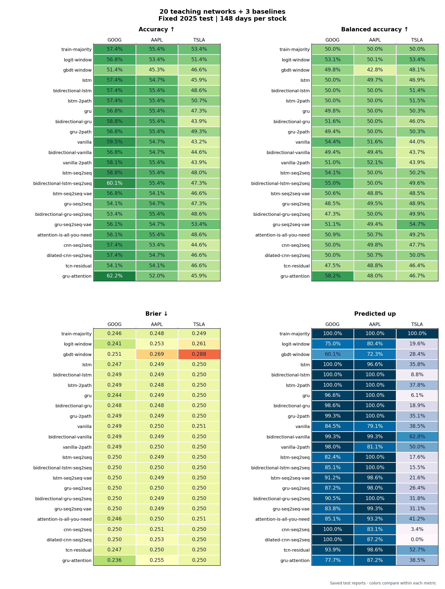

<details>
<summary>Show every 20 teaching networks + 3 baselines fixed-test model and metric</summary>

##### GOOG · actual up 57.4%

Source: [metrics.csv](runs/neural-classifiers/fixed-2025/goog/metrics.csv) · [predictions.csv](runs/neural-classifiers/fixed-2025/goog/predictions.csv) · [confusion.csv](runs/neural-classifiers/fixed-2025/goog/confusion.csv) · [calibration.csv](runs/neural-classifiers/fixed-2025/goog/calibration.csv)

| Model | Val. acc | Correct / days | Balanced acc | Brier ↓ | Pred. up | TN / FP / FN / TP | Chart |
| --- | ---: | ---: | ---: | ---: | ---: | ---: | --- |
| `train-majority` | 49.7% | 85/148 (57.4%) | 50.0% | 0.2460 | 100.0% | 0 / 63 / 0 / 85 | [View](runs/neural-classifiers/fixed-2025/goog/diagnostics/models/train-majority.png) |
| `logit-window` | 49.0% | 84/148 (56.8%) | 53.1% | 0.2405 | 75.0% | 18 / 45 / 19 / 66 | [View](runs/neural-classifiers/fixed-2025/goog/diagnostics/models/logit-window.png) |
| `gbdt-window` | 50.3% | 76/148 (51.4%) | 49.8% | 0.2514 | 60.1% | 25 / 38 / 34 / 51 | [View](runs/neural-classifiers/fixed-2025/goog/diagnostics/models/gbdt-window.png) |
| `lstm` | 49.7% | 85/148 (57.4%) | 50.0% | 0.2469 | 100.0% | 0 / 63 / 0 / 85 | [View](runs/neural-classifiers/fixed-2025/goog/diagnostics/models/lstm.png) |
| `bidirectional-lstm` | 49.7% | 85/148 (57.4%) | 50.0% | 0.2486 | 100.0% | 0 / 63 / 0 / 85 | [View](runs/neural-classifiers/fixed-2025/goog/diagnostics/models/bidirectional-lstm.png) |
| `lstm-2path` | 49.7% | 85/148 (57.4%) | 50.0% | 0.2488 | 100.0% | 0 / 63 / 0 / 85 | [View](runs/neural-classifiers/fixed-2025/goog/diagnostics/models/lstm-2path.png) |
| `gru` | 50.3% | 84/148 (56.8%) | 49.8% | 0.2443 | 96.6% | 2 / 61 / 3 / 82 | [View](runs/neural-classifiers/fixed-2025/goog/diagnostics/models/gru.png) |
| `bidirectional-gru` | 49.7% | 87/148 (58.8%) | 51.6% | 0.2482 | 98.6% | 2 / 61 / 0 / 85 | [View](runs/neural-classifiers/fixed-2025/goog/diagnostics/models/bidirectional-gru.png) |
| `gru-2path` | 51.0% | 84/148 (56.8%) | 49.4% | 0.2489 | 99.3% | 0 / 63 / 1 / 84 | [View](runs/neural-classifiers/fixed-2025/goog/diagnostics/models/gru-2path.png) |
| `vanilla` | 48.3% | 88/148 (59.5%) | 54.4% | 0.2490 | 84.5% | 13 / 50 / 10 / 75 | [View](runs/neural-classifiers/fixed-2025/goog/diagnostics/models/vanilla.png) |
| `bidirectional-vanilla` | 50.3% | 84/148 (56.8%) | 49.4% | 0.2488 | 99.3% | 0 / 63 / 1 / 84 | [View](runs/neural-classifiers/fixed-2025/goog/diagnostics/models/bidirectional-vanilla.png) |
| `vanilla-2path` | 49.0% | 86/148 (58.1%) | 51.0% | 0.2488 | 98.0% | 2 / 61 / 1 / 84 | [View](runs/neural-classifiers/fixed-2025/goog/diagnostics/models/vanilla-2path.png) |
| `lstm-seq2seq` | 45.6% | 87/148 (58.8%) | 54.1% | 0.2497 | 82.4% | 14 / 49 / 12 / 73 | [View](runs/neural-classifiers/fixed-2025/goog/diagnostics/models/lstm-seq2seq.png) |
| `bidirectional-lstm-seq2seq` | 44.9% | 89/148 (60.1%) | 55.0% | 0.2498 | 85.1% | 13 / 50 / 9 / 76 | [View](runs/neural-classifiers/fixed-2025/goog/diagnostics/models/bidirectional-lstm-seq2seq.png) |
| `lstm-seq2seq-vae` | 48.3% | 84/148 (56.8%) | 50.6% | 0.2498 | 91.2% | 6 / 57 / 7 / 78 | [View](runs/neural-classifiers/fixed-2025/goog/diagnostics/models/lstm-seq2seq-vae.png) |
| `gru-seq2seq` | 45.6% | 80/148 (54.1%) | 48.5% | 0.2495 | 87.2% | 7 / 56 / 12 / 73 | [View](runs/neural-classifiers/fixed-2025/goog/diagnostics/models/gru-seq2seq.png) |
| `bidirectional-gru-seq2seq` | 47.6% | 79/148 (53.4%) | 47.3% | 0.2495 | 90.5% | 4 / 59 / 10 / 75 | [View](runs/neural-classifiers/fixed-2025/goog/diagnostics/models/bidirectional-gru-seq2seq.png) |
| `gru-seq2seq-vae` | 47.6% | 83/148 (56.1%) | 51.1% | 0.2497 | 83.8% | 11 / 52 / 13 / 72 | [View](runs/neural-classifiers/fixed-2025/goog/diagnostics/models/gru-seq2seq-vae.png) |
| `attention-is-all-you-need` | 48.3% | 83/148 (56.1%) | 50.9% | 0.2461 | 85.1% | 10 / 53 / 12 / 73 | [View](runs/neural-classifiers/fixed-2025/goog/diagnostics/models/attention-is-all-you-need.png) |
| `cnn-seq2seq` | 49.7% | 85/148 (57.4%) | 50.0% | 0.2499 | 100.0% | 0 / 63 / 0 / 85 | [View](runs/neural-classifiers/fixed-2025/goog/diagnostics/models/cnn-seq2seq.png) |
| `dilated-cnn-seq2seq` | 49.7% | 85/148 (57.4%) | 50.0% | 0.2499 | 100.0% | 0 / 63 / 0 / 85 | [View](runs/neural-classifiers/fixed-2025/goog/diagnostics/models/dilated-cnn-seq2seq.png) |
| `tcn-residual` | 49.0% | 80/148 (54.1%) | 47.5% | 0.2468 | 93.9% | 2 / 61 / 7 / 78 | [View](runs/neural-classifiers/fixed-2025/goog/diagnostics/models/tcn-residual.png) |
| `gru-attention` | 53.7% | 92/148 (62.2%) | 58.2% | 0.2365 | 77.7% | 20 / 43 / 13 / 72 | [View](runs/neural-classifiers/fixed-2025/goog/diagnostics/models/gru-attention.png) |

##### AAPL · actual up 55.4%

Source: [metrics.csv](runs/neural-classifiers/fixed-2025/aapl/metrics.csv) · [predictions.csv](runs/neural-classifiers/fixed-2025/aapl/predictions.csv) · [confusion.csv](runs/neural-classifiers/fixed-2025/aapl/confusion.csv) · [calibration.csv](runs/neural-classifiers/fixed-2025/aapl/calibration.csv)

| Model | Val. acc | Correct / days | Balanced acc | Brier ↓ | Pred. up | TN / FP / FN / TP | Chart |
| --- | ---: | ---: | ---: | ---: | ---: | ---: | --- |
| `train-majority` | 52.4% | 82/148 (55.4%) | 50.0% | 0.2478 | 100.0% | 0 / 66 / 0 / 82 | [View](runs/neural-classifiers/fixed-2025/aapl/diagnostics/models/train-majority.png) |
| `logit-window` | 53.7% | 79/148 (53.4%) | 50.1% | 0.2532 | 80.4% | 13 / 53 / 16 / 66 | [View](runs/neural-classifiers/fixed-2025/aapl/diagnostics/models/logit-window.png) |
| `gbdt-window` | 55.8% | 67/148 (45.3%) | 42.8% | 0.2691 | 72.3% | 13 / 53 / 28 / 54 | [View](runs/neural-classifiers/fixed-2025/aapl/diagnostics/models/gbdt-window.png) |
| `lstm` | 53.1% | 81/148 (54.7%) | 49.7% | 0.2493 | 96.6% | 2 / 64 / 3 / 79 | [View](runs/neural-classifiers/fixed-2025/aapl/diagnostics/models/lstm.png) |
| `bidirectional-lstm` | 52.4% | 82/148 (55.4%) | 50.0% | 0.2490 | 100.0% | 0 / 66 / 0 / 82 | [View](runs/neural-classifiers/fixed-2025/aapl/diagnostics/models/bidirectional-lstm.png) |
| `lstm-2path` | 52.4% | 82/148 (55.4%) | 50.0% | 0.2482 | 100.0% | 0 / 66 / 0 / 82 | [View](runs/neural-classifiers/fixed-2025/aapl/diagnostics/models/lstm-2path.png) |
| `gru` | 51.7% | 82/148 (55.4%) | 50.0% | 0.2491 | 100.0% | 0 / 66 / 0 / 82 | [View](runs/neural-classifiers/fixed-2025/aapl/diagnostics/models/gru.png) |
| `bidirectional-gru` | 54.4% | 82/148 (55.4%) | 50.0% | 0.2484 | 100.0% | 0 / 66 / 0 / 82 | [View](runs/neural-classifiers/fixed-2025/aapl/diagnostics/models/bidirectional-gru.png) |
| `gru-2path` | 51.7% | 82/148 (55.4%) | 50.0% | 0.2487 | 100.0% | 0 / 66 / 0 / 82 | [View](runs/neural-classifiers/fixed-2025/aapl/diagnostics/models/gru-2path.png) |
| `vanilla` | 50.3% | 81/148 (54.7%) | 51.6% | 0.2496 | 79.1% | 15 / 51 / 16 / 66 | [View](runs/neural-classifiers/fixed-2025/aapl/diagnostics/models/vanilla.png) |
| `bidirectional-vanilla` | 53.7% | 81/148 (54.7%) | 49.4% | 0.2492 | 99.3% | 0 / 66 / 1 / 81 | [View](runs/neural-classifiers/fixed-2025/aapl/diagnostics/models/bidirectional-vanilla.png) |
| `vanilla-2path` | 47.6% | 82/148 (55.4%) | 52.1% | 0.2496 | 81.1% | 14 / 52 / 14 / 68 | [View](runs/neural-classifiers/fixed-2025/aapl/diagnostics/models/vanilla-2path.png) |
| `lstm-seq2seq` | 53.7% | 82/148 (55.4%) | 50.0% | 0.2490 | 100.0% | 0 / 66 / 0 / 82 | [View](runs/neural-classifiers/fixed-2025/aapl/diagnostics/models/lstm-seq2seq.png) |
| `bidirectional-lstm-seq2seq` | 53.7% | 82/148 (55.4%) | 50.0% | 0.2496 | 100.0% | 0 / 66 / 0 / 82 | [View](runs/neural-classifiers/fixed-2025/aapl/diagnostics/models/bidirectional-lstm-seq2seq.png) |
| `lstm-seq2seq-vae` | 53.1% | 80/148 (54.1%) | 48.8% | 0.2491 | 98.6% | 0 / 66 / 2 / 80 | [View](runs/neural-classifiers/fixed-2025/aapl/diagnostics/models/lstm-seq2seq-vae.png) |
| `gru-seq2seq` | 52.4% | 81/148 (54.7%) | 49.5% | 0.2497 | 98.0% | 1 / 65 / 2 / 80 | [View](runs/neural-classifiers/fixed-2025/aapl/diagnostics/models/gru-seq2seq.png) |
| `bidirectional-gru-seq2seq` | 52.4% | 82/148 (55.4%) | 50.0% | 0.2495 | 100.0% | 0 / 66 / 0 / 82 | [View](runs/neural-classifiers/fixed-2025/aapl/diagnostics/models/bidirectional-gru-seq2seq.png) |
| `gru-seq2seq-vae` | 53.1% | 81/148 (54.7%) | 49.4% | 0.2495 | 99.3% | 0 / 66 / 1 / 81 | [View](runs/neural-classifiers/fixed-2025/aapl/diagnostics/models/gru-seq2seq-vae.png) |
| `attention-is-all-you-need` | 54.4% | 82/148 (55.4%) | 50.7% | 0.2496 | 93.2% | 5 / 61 / 5 / 77 | [View](runs/neural-classifiers/fixed-2025/aapl/diagnostics/models/attention-is-all-you-need.png) |
| `cnn-seq2seq` | 57.1% | 79/148 (53.4%) | 49.8% | 0.2510 | 83.1% | 11 / 55 / 14 / 68 | [View](runs/neural-classifiers/fixed-2025/aapl/diagnostics/models/cnn-seq2seq.png) |
| `dilated-cnn-seq2seq` | 56.5% | 81/148 (54.7%) | 50.7% | 0.2529 | 87.2% | 9 / 57 / 10 / 72 | [View](runs/neural-classifiers/fixed-2025/aapl/diagnostics/models/dilated-cnn-seq2seq.png) |
| `tcn-residual` | 53.1% | 80/148 (54.1%) | 48.8% | 0.2496 | 98.6% | 0 / 66 / 2 / 80 | [View](runs/neural-classifiers/fixed-2025/aapl/diagnostics/models/tcn-residual.png) |
| `gru-attention` | 52.4% | 77/148 (52.0%) | 48.0% | 0.2547 | 87.2% | 7 / 59 / 12 / 70 | [View](runs/neural-classifiers/fixed-2025/aapl/diagnostics/models/gru-attention.png) |

##### TSLA · actual up 53.4%

Source: [metrics.csv](runs/neural-classifiers/fixed-2025/tsla/metrics.csv) · [predictions.csv](runs/neural-classifiers/fixed-2025/tsla/predictions.csv) · [confusion.csv](runs/neural-classifiers/fixed-2025/tsla/confusion.csv) · [calibration.csv](runs/neural-classifiers/fixed-2025/tsla/calibration.csv)

| Model | Val. acc | Correct / days | Balanced acc | Brier ↓ | Pred. up | TN / FP / FN / TP | Chart |
| --- | ---: | ---: | ---: | ---: | ---: | ---: | --- |
| `train-majority` | 47.6% | 79/148 (53.4%) | 50.0% | 0.2492 | 100.0% | 0 / 69 / 0 / 79 | [View](runs/neural-classifiers/fixed-2025/tsla/diagnostics/models/train-majority.png) |
| `logit-window` | 56.5% | 76/148 (51.4%) | 53.4% | 0.2609 | 19.6% | 58 / 11 / 61 / 18 | [View](runs/neural-classifiers/fixed-2025/tsla/diagnostics/models/logit-window.png) |
| `gbdt-window` | 53.1% | 69/148 (46.6%) | 48.1% | 0.2883 | 28.4% | 48 / 21 / 58 / 21 | [View](runs/neural-classifiers/fixed-2025/tsla/diagnostics/models/gbdt-window.png) |
| `lstm` | 55.8% | 68/148 (45.9%) | 46.9% | 0.2500 | 35.8% | 42 / 27 / 53 / 26 | [View](runs/neural-classifiers/fixed-2025/tsla/diagnostics/models/lstm.png) |
| `bidirectional-lstm` | 53.7% | 72/148 (48.6%) | 51.4% | 0.2501 | 8.8% | 64 / 5 / 71 / 8 | [View](runs/neural-classifiers/fixed-2025/tsla/diagnostics/models/bidirectional-lstm.png) |
| `lstm-2path` | 55.8% | 75/148 (50.7%) | 51.5% | 0.2500 | 37.8% | 44 / 25 / 48 / 31 | [View](runs/neural-classifiers/fixed-2025/tsla/diagnostics/models/lstm-2path.png) |
| `gru` | 51.7% | 70/148 (47.3%) | 50.3% | 0.2502 | 6.1% | 65 / 4 / 74 / 5 | [View](runs/neural-classifiers/fixed-2025/tsla/diagnostics/models/gru.png) |
| `bidirectional-gru` | 47.6% | 65/148 (43.9%) | 46.0% | 0.2504 | 18.9% | 53 / 16 / 67 / 12 | [View](runs/neural-classifiers/fixed-2025/tsla/diagnostics/models/bidirectional-gru.png) |
| `gru-2path` | 51.7% | 73/148 (49.3%) | 50.3% | 0.2500 | 35.1% | 45 / 24 / 51 / 28 | [View](runs/neural-classifiers/fixed-2025/tsla/diagnostics/models/gru-2path.png) |
| `vanilla` | 46.9% | 64/148 (43.2%) | 44.0% | 0.2506 | 38.5% | 38 / 31 / 53 / 26 | [View](runs/neural-classifiers/fixed-2025/tsla/diagnostics/models/vanilla.png) |
| `bidirectional-vanilla` | 53.7% | 66/148 (44.6%) | 43.7% | 0.2501 | 62.8% | 21 / 48 / 34 / 45 | [View](runs/neural-classifiers/fixed-2025/tsla/diagnostics/models/bidirectional-vanilla.png) |
| `vanilla-2path` | 49.7% | 65/148 (43.9%) | 43.9% | 0.2501 | 50.0% | 30 / 39 / 44 / 35 | [View](runs/neural-classifiers/fixed-2025/tsla/diagnostics/models/vanilla-2path.png) |
| `lstm-seq2seq` | 48.3% | 71/148 (48.0%) | 50.2% | 0.2500 | 17.6% | 57 / 12 / 65 / 14 | [View](runs/neural-classifiers/fixed-2025/tsla/diagnostics/models/lstm-seq2seq.png) |
| `bidirectional-lstm-seq2seq` | 48.3% | 70/148 (47.3%) | 49.6% | 0.2500 | 15.5% | 58 / 11 / 67 / 12 | [View](runs/neural-classifiers/fixed-2025/tsla/diagnostics/models/bidirectional-lstm-seq2seq.png) |
| `lstm-seq2seq-vae` | 53.1% | 69/148 (46.6%) | 48.5% | 0.2500 | 21.6% | 53 / 16 / 63 / 16 | [View](runs/neural-classifiers/fixed-2025/tsla/diagnostics/models/lstm-seq2seq-vae.png) |
| `gru-seq2seq` | 55.8% | 70/148 (47.3%) | 48.9% | 0.2500 | 26.4% | 50 / 19 / 59 / 20 | [View](runs/neural-classifiers/fixed-2025/tsla/diagnostics/models/gru-seq2seq.png) |
| `bidirectional-gru-seq2seq` | 57.1% | 72/148 (48.6%) | 49.9% | 0.2499 | 31.8% | 47 / 22 / 54 / 25 | [View](runs/neural-classifiers/fixed-2025/tsla/diagnostics/models/bidirectional-gru-seq2seq.png) |
| `gru-seq2seq-vae` | 53.1% | 79/148 (53.4%) | 54.7% | 0.2499 | 31.1% | 51 / 18 / 51 / 28 | [View](runs/neural-classifiers/fixed-2025/tsla/diagnostics/models/gru-seq2seq-vae.png) |
| `attention-is-all-you-need` | 53.1% | 72/148 (48.6%) | 49.2% | 0.2508 | 41.2% | 40 / 29 / 47 / 32 | [View](runs/neural-classifiers/fixed-2025/tsla/diagnostics/models/attention-is-all-you-need.png) |
| `cnn-seq2seq` | 57.1% | 66/148 (44.6%) | 47.7% | 0.2500 | 3.4% | 65 / 4 / 78 / 1 | [View](runs/neural-classifiers/fixed-2025/tsla/diagnostics/models/cnn-seq2seq.png) |
| `dilated-cnn-seq2seq` | 51.7% | 69/148 (46.6%) | 50.0% | 0.2500 | 0.0% | 69 / 0 / 79 / 0 | [View](runs/neural-classifiers/fixed-2025/tsla/diagnostics/models/dilated-cnn-seq2seq.png) |
| `tcn-residual` | 50.3% | 69/148 (46.6%) | 46.4% | 0.2502 | 52.7% | 30 / 39 / 40 / 39 | [View](runs/neural-classifiers/fixed-2025/tsla/diagnostics/models/tcn-residual.png) |
| `gru-attention` | 51.7% | 68/148 (45.9%) | 46.7% | 0.2502 | 38.5% | 40 / 29 / 51 / 28 | [View](runs/neural-classifiers/fixed-2025/tsla/diagnostics/models/gru-attention.png) |


</details>

#### 20 teaching networks + 3 baselines: rolling test

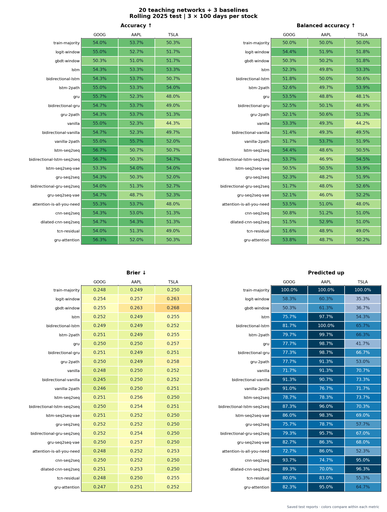

<details>
<summary>Show every 20 teaching networks + 3 baselines rolling aggregate model and metric</summary>

##### GOOG · 300 test days · actual up 54.0%

Source: [rolling_metrics.csv](runs/neural-classifiers/rolling-2025/goog/rolling_metrics.csv) · [fold_metrics.csv](runs/neural-classifiers/rolling-2025/goog/fold_metrics.csv)

| Model | Val. acc | Correct / days | Balanced acc | Brier ↓ | Pred. up | TN / FP / FN / TP | Chart |
| --- | ---: | ---: | ---: | ---: | ---: | ---: | --- |
| `train-majority` | 55.7% | 162/300 (54.0%) | 50.0% | 0.2484 | 100.0% | 0 / 138 / 0 / 162 | [F1](runs/neural-classifiers/rolling-2025/goog/fold-1/diagnostics/models/train-majority.png) [F2](runs/neural-classifiers/rolling-2025/goog/fold-2/diagnostics/models/train-majority.png) [F3](runs/neural-classifiers/rolling-2025/goog/fold-3/diagnostics/models/train-majority.png) |
| `logit-window` | 51.0% | 165/300 (55.0%) | 54.4% | 0.2538 | 58.3% | 64 / 74 / 61 / 101 | [F1](runs/neural-classifiers/rolling-2025/goog/fold-1/diagnostics/models/logit-window.png) [F2](runs/neural-classifiers/rolling-2025/goog/fold-2/diagnostics/models/logit-window.png) [F3](runs/neural-classifiers/rolling-2025/goog/fold-3/diagnostics/models/logit-window.png) |
| `gbdt-window` | 55.0% | 151/300 (50.3%) | 50.3% | 0.2549 | 50.3% | 69 / 69 / 80 / 82 | [F1](runs/neural-classifiers/rolling-2025/goog/fold-1/diagnostics/models/gbdt-window.png) [F2](runs/neural-classifiers/rolling-2025/goog/fold-2/diagnostics/models/gbdt-window.png) [F3](runs/neural-classifiers/rolling-2025/goog/fold-3/diagnostics/models/gbdt-window.png) |
| `lstm` | 58.7% | 163/300 (54.3%) | 52.3% | 0.2517 | 75.7% | 37 / 101 / 36 / 126 | [F1](runs/neural-classifiers/rolling-2025/goog/fold-1/diagnostics/models/lstm.png) [F2](runs/neural-classifiers/rolling-2025/goog/fold-2/diagnostics/models/lstm.png) [F3](runs/neural-classifiers/rolling-2025/goog/fold-3/diagnostics/models/lstm.png) |
| `bidirectional-lstm` | 54.3% | 163/300 (54.3%) | 51.8% | 0.2495 | 81.7% | 28 / 110 / 27 / 135 | [F1](runs/neural-classifiers/rolling-2025/goog/fold-1/diagnostics/models/bidirectional-lstm.png) [F2](runs/neural-classifiers/rolling-2025/goog/fold-2/diagnostics/models/bidirectional-lstm.png) [F3](runs/neural-classifiers/rolling-2025/goog/fold-3/diagnostics/models/bidirectional-lstm.png) |
| `lstm-2path` | 58.0% | 165/300 (55.0%) | 52.6% | 0.2506 | 79.7% | 32 / 106 / 29 / 133 | [F1](runs/neural-classifiers/rolling-2025/goog/fold-1/diagnostics/models/lstm-2path.png) [F2](runs/neural-classifiers/rolling-2025/goog/fold-2/diagnostics/models/lstm-2path.png) [F3](runs/neural-classifiers/rolling-2025/goog/fold-3/diagnostics/models/lstm-2path.png) |
| `gru` | 57.7% | 167/300 (55.7%) | 53.5% | 0.2496 | 77.7% | 36 / 102 / 31 / 131 | [F1](runs/neural-classifiers/rolling-2025/goog/fold-1/diagnostics/models/gru.png) [F2](runs/neural-classifiers/rolling-2025/goog/fold-2/diagnostics/models/gru.png) [F3](runs/neural-classifiers/rolling-2025/goog/fold-3/diagnostics/models/gru.png) |
| `bidirectional-gru` | 56.7% | 164/300 (54.7%) | 52.5% | 0.2514 | 77.3% | 35 / 103 / 33 / 129 | [F1](runs/neural-classifiers/rolling-2025/goog/fold-1/diagnostics/models/bidirectional-gru.png) [F2](runs/neural-classifiers/rolling-2025/goog/fold-2/diagnostics/models/bidirectional-gru.png) [F3](runs/neural-classifiers/rolling-2025/goog/fold-3/diagnostics/models/bidirectional-gru.png) |
| `gru-2path` | 56.7% | 163/300 (54.3%) | 52.1% | 0.2499 | 77.7% | 34 / 104 / 33 / 129 | [F1](runs/neural-classifiers/rolling-2025/goog/fold-1/diagnostics/models/gru-2path.png) [F2](runs/neural-classifiers/rolling-2025/goog/fold-2/diagnostics/models/gru-2path.png) [F3](runs/neural-classifiers/rolling-2025/goog/fold-3/diagnostics/models/gru-2path.png) |
| `vanilla` | 54.3% | 165/300 (55.0%) | 53.3% | 0.2480 | 71.7% | 44 / 94 / 41 / 121 | [F1](runs/neural-classifiers/rolling-2025/goog/fold-1/diagnostics/models/vanilla.png) [F2](runs/neural-classifiers/rolling-2025/goog/fold-2/diagnostics/models/vanilla.png) [F3](runs/neural-classifiers/rolling-2025/goog/fold-3/diagnostics/models/vanilla.png) |
| `bidirectional-vanilla` | 56.3% | 164/300 (54.7%) | 51.4% | 0.2455 | 91.3% | 14 / 124 / 12 / 150 | [F1](runs/neural-classifiers/rolling-2025/goog/fold-1/diagnostics/models/bidirectional-vanilla.png) [F2](runs/neural-classifiers/rolling-2025/goog/fold-2/diagnostics/models/bidirectional-vanilla.png) [F3](runs/neural-classifiers/rolling-2025/goog/fold-3/diagnostics/models/bidirectional-vanilla.png) |
| `vanilla-2path` | 56.7% | 165/300 (55.0%) | 51.7% | 0.2464 | 91.0% | 15 / 123 / 12 / 150 | [F1](runs/neural-classifiers/rolling-2025/goog/fold-1/diagnostics/models/vanilla-2path.png) [F2](runs/neural-classifiers/rolling-2025/goog/fold-2/diagnostics/models/vanilla-2path.png) [F3](runs/neural-classifiers/rolling-2025/goog/fold-3/diagnostics/models/vanilla-2path.png) |
| `lstm-seq2seq` | 59.0% | 170/300 (56.7%) | 54.4% | 0.2512 | 78.7% | 36 / 102 / 28 / 134 | [F1](runs/neural-classifiers/rolling-2025/goog/fold-1/diagnostics/models/lstm-seq2seq.png) [F2](runs/neural-classifiers/rolling-2025/goog/fold-2/diagnostics/models/lstm-seq2seq.png) [F3](runs/neural-classifiers/rolling-2025/goog/fold-3/diagnostics/models/lstm-seq2seq.png) |
| `bidirectional-lstm-seq2seq` | 55.0% | 170/300 (56.7%) | 53.7% | 0.2498 | 87.3% | 23 / 115 / 15 / 147 | [F1](runs/neural-classifiers/rolling-2025/goog/fold-1/diagnostics/models/bidirectional-lstm-seq2seq.png) [F2](runs/neural-classifiers/rolling-2025/goog/fold-2/diagnostics/models/bidirectional-lstm-seq2seq.png) [F3](runs/neural-classifiers/rolling-2025/goog/fold-3/diagnostics/models/bidirectional-lstm-seq2seq.png) |
| `lstm-seq2seq-vae` | 57.0% | 160/300 (53.3%) | 50.5% | 0.2507 | 86.0% | 20 / 118 / 22 / 140 | [F1](runs/neural-classifiers/rolling-2025/goog/fold-1/diagnostics/models/lstm-seq2seq-vae.png) [F2](runs/neural-classifiers/rolling-2025/goog/fold-2/diagnostics/models/lstm-seq2seq-vae.png) [F3](runs/neural-classifiers/rolling-2025/goog/fold-3/diagnostics/models/lstm-seq2seq-vae.png) |
| `gru-seq2seq` | 56.7% | 163/300 (54.3%) | 52.3% | 0.2517 | 75.7% | 37 / 101 / 36 / 126 | [F1](runs/neural-classifiers/rolling-2025/goog/fold-1/diagnostics/models/gru-seq2seq.png) [F2](runs/neural-classifiers/rolling-2025/goog/fold-2/diagnostics/models/gru-seq2seq.png) [F3](runs/neural-classifiers/rolling-2025/goog/fold-3/diagnostics/models/gru-seq2seq.png) |
| `bidirectional-gru-seq2seq` | 55.0% | 162/300 (54.0%) | 51.7% | 0.2516 | 79.3% | 31 / 107 / 31 / 131 | [F1](runs/neural-classifiers/rolling-2025/goog/fold-1/diagnostics/models/bidirectional-gru-seq2seq.png) [F2](runs/neural-classifiers/rolling-2025/goog/fold-2/diagnostics/models/bidirectional-gru-seq2seq.png) [F3](runs/neural-classifiers/rolling-2025/goog/fold-3/diagnostics/models/bidirectional-gru-seq2seq.png) |
| `gru-seq2seq-vae` | 56.7% | 164/300 (54.7%) | 52.1% | 0.2503 | 82.7% | 27 / 111 / 25 / 137 | [F1](runs/neural-classifiers/rolling-2025/goog/fold-1/diagnostics/models/gru-seq2seq-vae.png) [F2](runs/neural-classifiers/rolling-2025/goog/fold-2/diagnostics/models/gru-seq2seq-vae.png) [F3](runs/neural-classifiers/rolling-2025/goog/fold-3/diagnostics/models/gru-seq2seq-vae.png) |
| `attention-is-all-you-need` | 59.7% | 166/300 (55.3%) | 53.5% | 0.2480 | 72.7% | 43 / 95 / 39 / 123 | [F1](runs/neural-classifiers/rolling-2025/goog/fold-1/diagnostics/models/attention-is-all-you-need.png) [F2](runs/neural-classifiers/rolling-2025/goog/fold-2/diagnostics/models/attention-is-all-you-need.png) [F3](runs/neural-classifiers/rolling-2025/goog/fold-3/diagnostics/models/attention-is-all-you-need.png) |
| `cnn-seq2seq` | 57.3% | 163/300 (54.3%) | 50.8% | 0.2496 | 93.7% | 10 / 128 / 9 / 153 | [F1](runs/neural-classifiers/rolling-2025/goog/fold-1/diagnostics/models/cnn-seq2seq.png) [F2](runs/neural-classifiers/rolling-2025/goog/fold-2/diagnostics/models/cnn-seq2seq.png) [F3](runs/neural-classifiers/rolling-2025/goog/fold-3/diagnostics/models/cnn-seq2seq.png) |
| `dilated-cnn-seq2seq` | 56.7% | 164/300 (54.7%) | 51.5% | 0.2506 | 89.3% | 17 / 121 / 15 / 147 | [F1](runs/neural-classifiers/rolling-2025/goog/fold-1/diagnostics/models/dilated-cnn-seq2seq.png) [F2](runs/neural-classifiers/rolling-2025/goog/fold-2/diagnostics/models/dilated-cnn-seq2seq.png) [F3](runs/neural-classifiers/rolling-2025/goog/fold-3/diagnostics/models/dilated-cnn-seq2seq.png) |
| `tcn-residual` | 56.0% | 162/300 (54.0%) | 51.6% | 0.2479 | 80.0% | 30 / 108 / 30 / 132 | [F1](runs/neural-classifiers/rolling-2025/goog/fold-1/diagnostics/models/tcn-residual.png) [F2](runs/neural-classifiers/rolling-2025/goog/fold-2/diagnostics/models/tcn-residual.png) [F3](runs/neural-classifiers/rolling-2025/goog/fold-3/diagnostics/models/tcn-residual.png) |
| `gru-attention` | 57.7% | 169/300 (56.3%) | 53.8% | 0.2466 | 82.3% | 30 / 108 / 23 / 139 | [F1](runs/neural-classifiers/rolling-2025/goog/fold-1/diagnostics/models/gru-attention.png) [F2](runs/neural-classifiers/rolling-2025/goog/fold-2/diagnostics/models/gru-attention.png) [F3](runs/neural-classifiers/rolling-2025/goog/fold-3/diagnostics/models/gru-attention.png) |

##### AAPL · 300 test days · actual up 53.7%

Source: [rolling_metrics.csv](runs/neural-classifiers/rolling-2025/aapl/rolling_metrics.csv) · [fold_metrics.csv](runs/neural-classifiers/rolling-2025/aapl/fold_metrics.csv)

| Model | Val. acc | Correct / days | Balanced acc | Brier ↓ | Pred. up | TN / FP / FN / TP | Chart |
| --- | ---: | ---: | ---: | ---: | ---: | ---: | --- |
| `train-majority` | 57.3% | 161/300 (53.7%) | 50.0% | 0.2487 | 100.0% | 0 / 139 / 0 / 161 | [F1](runs/neural-classifiers/rolling-2025/aapl/fold-1/diagnostics/models/train-majority.png) [F2](runs/neural-classifiers/rolling-2025/aapl/fold-2/diagnostics/models/train-majority.png) [F3](runs/neural-classifiers/rolling-2025/aapl/fold-3/diagnostics/models/train-majority.png) |
| `logit-window` | 54.0% | 158/300 (52.7%) | 51.9% | 0.2573 | 60.3% | 58 / 81 / 61 / 100 | [F1](runs/neural-classifiers/rolling-2025/aapl/fold-1/diagnostics/models/logit-window.png) [F2](runs/neural-classifiers/rolling-2025/aapl/fold-2/diagnostics/models/logit-window.png) [F3](runs/neural-classifiers/rolling-2025/aapl/fold-3/diagnostics/models/logit-window.png) |
| `gbdt-window` | 50.0% | 153/300 (51.0%) | 50.2% | 0.2628 | 61.3% | 54 / 85 / 62 / 99 | [F1](runs/neural-classifiers/rolling-2025/aapl/fold-1/diagnostics/models/gbdt-window.png) [F2](runs/neural-classifiers/rolling-2025/aapl/fold-2/diagnostics/models/gbdt-window.png) [F3](runs/neural-classifiers/rolling-2025/aapl/fold-3/diagnostics/models/gbdt-window.png) |
| `lstm` | 57.0% | 160/300 (53.3%) | 49.8% | 0.2495 | 97.7% | 3 / 136 / 4 / 157 | [F1](runs/neural-classifiers/rolling-2025/aapl/fold-1/diagnostics/models/lstm.png) [F2](runs/neural-classifiers/rolling-2025/aapl/fold-2/diagnostics/models/lstm.png) [F3](runs/neural-classifiers/rolling-2025/aapl/fold-3/diagnostics/models/lstm.png) |
| `bidirectional-lstm` | 57.3% | 161/300 (53.7%) | 50.0% | 0.2489 | 100.0% | 0 / 139 / 0 / 161 | [F1](runs/neural-classifiers/rolling-2025/aapl/fold-1/diagnostics/models/bidirectional-lstm.png) [F2](runs/neural-classifiers/rolling-2025/aapl/fold-2/diagnostics/models/bidirectional-lstm.png) [F3](runs/neural-classifiers/rolling-2025/aapl/fold-3/diagnostics/models/bidirectional-lstm.png) |
| `lstm-2path` | 57.3% | 160/300 (53.3%) | 49.7% | 0.2487 | 99.7% | 0 / 139 / 1 / 160 | [F1](runs/neural-classifiers/rolling-2025/aapl/fold-1/diagnostics/models/lstm-2path.png) [F2](runs/neural-classifiers/rolling-2025/aapl/fold-2/diagnostics/models/lstm-2path.png) [F3](runs/neural-classifiers/rolling-2025/aapl/fold-3/diagnostics/models/lstm-2path.png) |
| `gru` | 57.0% | 157/300 (52.3%) | 48.8% | 0.2497 | 98.7% | 0 / 139 / 4 / 157 | [F1](runs/neural-classifiers/rolling-2025/aapl/fold-1/diagnostics/models/gru.png) [F2](runs/neural-classifiers/rolling-2025/aapl/fold-2/diagnostics/models/gru.png) [F3](runs/neural-classifiers/rolling-2025/aapl/fold-3/diagnostics/models/gru.png) |
| `bidirectional-gru` | 58.7% | 161/300 (53.7%) | 50.1% | 0.2486 | 98.7% | 2 / 137 / 2 / 159 | [F1](runs/neural-classifiers/rolling-2025/aapl/fold-1/diagnostics/models/bidirectional-gru.png) [F2](runs/neural-classifiers/rolling-2025/aapl/fold-2/diagnostics/models/bidirectional-gru.png) [F3](runs/neural-classifiers/rolling-2025/aapl/fold-3/diagnostics/models/bidirectional-gru.png) |
| `gru-2path` | 54.3% | 161/300 (53.7%) | 50.6% | 0.2488 | 91.3% | 13 / 126 / 13 / 148 | [F1](runs/neural-classifiers/rolling-2025/aapl/fold-1/diagnostics/models/gru-2path.png) [F2](runs/neural-classifiers/rolling-2025/aapl/fold-2/diagnostics/models/gru-2path.png) [F3](runs/neural-classifiers/rolling-2025/aapl/fold-3/diagnostics/models/gru-2path.png) |
| `vanilla` | 55.0% | 157/300 (52.3%) | 49.3% | 0.2495 | 91.3% | 11 / 128 / 15 / 146 | [F1](runs/neural-classifiers/rolling-2025/aapl/fold-1/diagnostics/models/vanilla.png) [F2](runs/neural-classifiers/rolling-2025/aapl/fold-2/diagnostics/models/vanilla.png) [F3](runs/neural-classifiers/rolling-2025/aapl/fold-3/diagnostics/models/vanilla.png) |
| `bidirectional-vanilla` | 53.0% | 157/300 (52.3%) | 49.3% | 0.2498 | 90.7% | 12 / 127 / 16 / 145 | [F1](runs/neural-classifiers/rolling-2025/aapl/fold-1/diagnostics/models/bidirectional-vanilla.png) [F2](runs/neural-classifiers/rolling-2025/aapl/fold-2/diagnostics/models/bidirectional-vanilla.png) [F3](runs/neural-classifiers/rolling-2025/aapl/fold-3/diagnostics/models/bidirectional-vanilla.png) |
| `vanilla-2path` | 49.3% | 167/300 (55.7%) | 53.7% | 0.2503 | 76.7% | 38 / 101 / 32 / 129 | [F1](runs/neural-classifiers/rolling-2025/aapl/fold-1/diagnostics/models/vanilla-2path.png) [F2](runs/neural-classifiers/rolling-2025/aapl/fold-2/diagnostics/models/vanilla-2path.png) [F3](runs/neural-classifiers/rolling-2025/aapl/fold-3/diagnostics/models/vanilla-2path.png) |
| `lstm-seq2seq` | 56.3% | 152/300 (50.7%) | 48.6% | 0.2562 | 78.3% | 28 / 111 / 37 / 124 | [F1](runs/neural-classifiers/rolling-2025/aapl/fold-1/diagnostics/models/lstm-seq2seq.png) [F2](runs/neural-classifiers/rolling-2025/aapl/fold-2/diagnostics/models/lstm-seq2seq.png) [F3](runs/neural-classifiers/rolling-2025/aapl/fold-3/diagnostics/models/lstm-seq2seq.png) |
| `bidirectional-lstm-seq2seq` | 56.3% | 151/300 (50.3%) | 46.9% | 0.2542 | 96.0% | 1 / 138 / 11 / 150 | [F1](runs/neural-classifiers/rolling-2025/aapl/fold-1/diagnostics/models/bidirectional-lstm-seq2seq.png) [F2](runs/neural-classifiers/rolling-2025/aapl/fold-2/diagnostics/models/bidirectional-lstm-seq2seq.png) [F3](runs/neural-classifiers/rolling-2025/aapl/fold-3/diagnostics/models/bidirectional-lstm-seq2seq.png) |
| `lstm-seq2seq-vae` | 57.7% | 162/300 (54.0%) | 50.5% | 0.2524 | 98.3% | 3 / 136 / 2 / 159 | [F1](runs/neural-classifiers/rolling-2025/aapl/fold-1/diagnostics/models/lstm-seq2seq-vae.png) [F2](runs/neural-classifiers/rolling-2025/aapl/fold-2/diagnostics/models/lstm-seq2seq-vae.png) [F3](runs/neural-classifiers/rolling-2025/aapl/fold-3/diagnostics/models/lstm-seq2seq-vae.png) |
| `gru-seq2seq` | 56.0% | 151/300 (50.3%) | 48.2% | 0.2523 | 78.7% | 27 / 112 / 37 / 124 | [F1](runs/neural-classifiers/rolling-2025/aapl/fold-1/diagnostics/models/gru-seq2seq.png) [F2](runs/neural-classifiers/rolling-2025/aapl/fold-2/diagnostics/models/gru-seq2seq.png) [F3](runs/neural-classifiers/rolling-2025/aapl/fold-3/diagnostics/models/gru-seq2seq.png) |
| `bidirectional-gru-seq2seq` | 57.3% | 154/300 (51.3%) | 48.0% | 0.2538 | 95.7% | 3 / 136 / 10 / 151 | [F1](runs/neural-classifiers/rolling-2025/aapl/fold-1/diagnostics/models/bidirectional-gru-seq2seq.png) [F2](runs/neural-classifiers/rolling-2025/aapl/fold-2/diagnostics/models/bidirectional-gru-seq2seq.png) [F3](runs/neural-classifiers/rolling-2025/aapl/fold-3/diagnostics/models/bidirectional-gru-seq2seq.png) |
| `gru-seq2seq-vae` | 58.0% | 146/300 (48.7%) | 46.0% | 0.2567 | 86.3% | 13 / 126 / 28 / 133 | [F1](runs/neural-classifiers/rolling-2025/aapl/fold-1/diagnostics/models/gru-seq2seq-vae.png) [F2](runs/neural-classifiers/rolling-2025/aapl/fold-2/diagnostics/models/gru-seq2seq-vae.png) [F3](runs/neural-classifiers/rolling-2025/aapl/fold-3/diagnostics/models/gru-seq2seq-vae.png) |
| `attention-is-all-you-need` | 55.3% | 161/300 (53.7%) | 51.0% | 0.2516 | 86.0% | 21 / 118 / 21 / 140 | [F1](runs/neural-classifiers/rolling-2025/aapl/fold-1/diagnostics/models/attention-is-all-you-need.png) [F2](runs/neural-classifiers/rolling-2025/aapl/fold-2/diagnostics/models/attention-is-all-you-need.png) [F3](runs/neural-classifiers/rolling-2025/aapl/fold-3/diagnostics/models/attention-is-all-you-need.png) |
| `cnn-seq2seq` | 60.3% | 159/300 (53.0%) | 51.2% | 0.2522 | 74.7% | 37 / 102 / 39 / 122 | [F1](runs/neural-classifiers/rolling-2025/aapl/fold-1/diagnostics/models/cnn-seq2seq.png) [F2](runs/neural-classifiers/rolling-2025/aapl/fold-2/diagnostics/models/cnn-seq2seq.png) [F3](runs/neural-classifiers/rolling-2025/aapl/fold-3/diagnostics/models/cnn-seq2seq.png) |
| `dilated-cnn-seq2seq` | 57.7% | 163/300 (54.3%) | 52.9% | 0.2532 | 70.0% | 46 / 93 / 44 / 117 | [F1](runs/neural-classifiers/rolling-2025/aapl/fold-1/diagnostics/models/dilated-cnn-seq2seq.png) [F2](runs/neural-classifiers/rolling-2025/aapl/fold-2/diagnostics/models/dilated-cnn-seq2seq.png) [F3](runs/neural-classifiers/rolling-2025/aapl/fold-3/diagnostics/models/dilated-cnn-seq2seq.png) |
| `tcn-residual` | 52.0% | 154/300 (51.3%) | 48.9% | 0.2505 | 83.0% | 22 / 117 / 29 / 132 | [F1](runs/neural-classifiers/rolling-2025/aapl/fold-1/diagnostics/models/tcn-residual.png) [F2](runs/neural-classifiers/rolling-2025/aapl/fold-2/diagnostics/models/tcn-residual.png) [F3](runs/neural-classifiers/rolling-2025/aapl/fold-3/diagnostics/models/tcn-residual.png) |
| `gru-attention` | 57.3% | 156/300 (52.0%) | 48.7% | 0.2507 | 95.0% | 5 / 134 / 10 / 151 | [F1](runs/neural-classifiers/rolling-2025/aapl/fold-1/diagnostics/models/gru-attention.png) [F2](runs/neural-classifiers/rolling-2025/aapl/fold-2/diagnostics/models/gru-attention.png) [F3](runs/neural-classifiers/rolling-2025/aapl/fold-3/diagnostics/models/gru-attention.png) |

##### TSLA · 300 test days · actual up 50.3%

Source: [rolling_metrics.csv](runs/neural-classifiers/rolling-2025/tsla/rolling_metrics.csv) · [fold_metrics.csv](runs/neural-classifiers/rolling-2025/tsla/fold_metrics.csv)

| Model | Val. acc | Correct / days | Balanced acc | Brier ↓ | Pred. up | TN / FP / FN / TP | Chart |
| --- | ---: | ---: | ---: | ---: | ---: | ---: | --- |
| `train-majority` | 51.0% | 151/300 (50.3%) | 50.0% | 0.2499 | 100.0% | 0 / 149 / 0 / 151 | [F1](runs/neural-classifiers/rolling-2025/tsla/fold-1/diagnostics/models/train-majority.png) [F2](runs/neural-classifiers/rolling-2025/tsla/fold-2/diagnostics/models/train-majority.png) [F3](runs/neural-classifiers/rolling-2025/tsla/fold-3/diagnostics/models/train-majority.png) |
| `logit-window` | 54.7% | 155/300 (51.7%) | 51.8% | 0.2627 | 35.3% | 99 / 50 / 95 / 56 | [F1](runs/neural-classifiers/rolling-2025/tsla/fold-1/diagnostics/models/logit-window.png) [F2](runs/neural-classifiers/rolling-2025/tsla/fold-2/diagnostics/models/logit-window.png) [F3](runs/neural-classifiers/rolling-2025/tsla/fold-3/diagnostics/models/logit-window.png) |
| `gbdt-window` | 53.3% | 155/300 (51.7%) | 51.8% | 0.2682 | 36.7% | 97 / 52 / 93 / 58 | [F1](runs/neural-classifiers/rolling-2025/tsla/fold-1/diagnostics/models/gbdt-window.png) [F2](runs/neural-classifiers/rolling-2025/tsla/fold-2/diagnostics/models/gbdt-window.png) [F3](runs/neural-classifiers/rolling-2025/tsla/fold-3/diagnostics/models/gbdt-window.png) |
| `lstm` | 54.3% | 160/300 (53.3%) | 53.3% | 0.2551 | 54.3% | 73 / 76 / 64 / 87 | [F1](runs/neural-classifiers/rolling-2025/tsla/fold-1/diagnostics/models/lstm.png) [F2](runs/neural-classifiers/rolling-2025/tsla/fold-2/diagnostics/models/lstm.png) [F3](runs/neural-classifiers/rolling-2025/tsla/fold-3/diagnostics/models/lstm.png) |
| `bidirectional-lstm` | 50.7% | 152/300 (50.7%) | 50.6% | 0.2522 | 65.7% | 52 / 97 / 51 / 100 | [F1](runs/neural-classifiers/rolling-2025/tsla/fold-1/diagnostics/models/bidirectional-lstm.png) [F2](runs/neural-classifiers/rolling-2025/tsla/fold-2/diagnostics/models/bidirectional-lstm.png) [F3](runs/neural-classifiers/rolling-2025/tsla/fold-3/diagnostics/models/bidirectional-lstm.png) |
| `lstm-2path` | 55.3% | 162/300 (54.0%) | 53.9% | 0.2554 | 66.3% | 56 / 93 / 45 / 106 | [F1](runs/neural-classifiers/rolling-2025/tsla/fold-1/diagnostics/models/lstm-2path.png) [F2](runs/neural-classifiers/rolling-2025/tsla/fold-2/diagnostics/models/lstm-2path.png) [F3](runs/neural-classifiers/rolling-2025/tsla/fold-3/diagnostics/models/lstm-2path.png) |
| `gru` | 54.3% | 144/300 (48.0%) | 48.1% | 0.2566 | 41.7% | 84 / 65 / 91 / 60 | [F1](runs/neural-classifiers/rolling-2025/tsla/fold-1/diagnostics/models/gru.png) [F2](runs/neural-classifiers/rolling-2025/tsla/fold-2/diagnostics/models/gru.png) [F3](runs/neural-classifiers/rolling-2025/tsla/fold-3/diagnostics/models/gru.png) |
| `bidirectional-gru` | 51.7% | 147/300 (49.0%) | 48.9% | 0.2515 | 66.7% | 48 / 101 / 52 / 99 | [F1](runs/neural-classifiers/rolling-2025/tsla/fold-1/diagnostics/models/bidirectional-gru.png) [F2](runs/neural-classifiers/rolling-2025/tsla/fold-2/diagnostics/models/bidirectional-gru.png) [F3](runs/neural-classifiers/rolling-2025/tsla/fold-3/diagnostics/models/bidirectional-gru.png) |
| `gru-2path` | 53.0% | 154/300 (51.3%) | 51.3% | 0.2578 | 53.0% | 72 / 77 / 69 / 82 | [F1](runs/neural-classifiers/rolling-2025/tsla/fold-1/diagnostics/models/gru-2path.png) [F2](runs/neural-classifiers/rolling-2025/tsla/fold-2/diagnostics/models/gru-2path.png) [F3](runs/neural-classifiers/rolling-2025/tsla/fold-3/diagnostics/models/gru-2path.png) |
| `vanilla` | 48.7% | 133/300 (44.3%) | 44.2% | 0.2517 | 70.7% | 35 / 114 / 53 / 98 | [F1](runs/neural-classifiers/rolling-2025/tsla/fold-1/diagnostics/models/vanilla.png) [F2](runs/neural-classifiers/rolling-2025/tsla/fold-2/diagnostics/models/vanilla.png) [F3](runs/neural-classifiers/rolling-2025/tsla/fold-3/diagnostics/models/vanilla.png) |
| `bidirectional-vanilla` | 50.0% | 149/300 (49.7%) | 49.5% | 0.2515 | 73.3% | 39 / 110 / 41 / 110 | [F1](runs/neural-classifiers/rolling-2025/tsla/fold-1/diagnostics/models/bidirectional-vanilla.png) [F2](runs/neural-classifiers/rolling-2025/tsla/fold-2/diagnostics/models/bidirectional-vanilla.png) [F3](runs/neural-classifiers/rolling-2025/tsla/fold-3/diagnostics/models/bidirectional-vanilla.png) |
| `vanilla-2path` | 52.0% | 156/300 (52.0%) | 51.9% | 0.2506 | 71.7% | 45 / 104 / 40 / 111 | [F1](runs/neural-classifiers/rolling-2025/tsla/fold-1/diagnostics/models/vanilla-2path.png) [F2](runs/neural-classifiers/rolling-2025/tsla/fold-2/diagnostics/models/vanilla-2path.png) [F3](runs/neural-classifiers/rolling-2025/tsla/fold-3/diagnostics/models/vanilla-2path.png) |
| `lstm-seq2seq` | 51.7% | 152/300 (50.7%) | 50.5% | 0.2498 | 73.7% | 40 / 109 / 39 / 112 | [F1](runs/neural-classifiers/rolling-2025/tsla/fold-1/diagnostics/models/lstm-seq2seq.png) [F2](runs/neural-classifiers/rolling-2025/tsla/fold-2/diagnostics/models/lstm-seq2seq.png) [F3](runs/neural-classifiers/rolling-2025/tsla/fold-3/diagnostics/models/lstm-seq2seq.png) |
| `bidirectional-lstm-seq2seq` | 51.0% | 164/300 (54.7%) | 54.5% | 0.2505 | 70.3% | 51 / 98 / 38 / 113 | [F1](runs/neural-classifiers/rolling-2025/tsla/fold-1/diagnostics/models/bidirectional-lstm-seq2seq.png) [F2](runs/neural-classifiers/rolling-2025/tsla/fold-2/diagnostics/models/bidirectional-lstm-seq2seq.png) [F3](runs/neural-classifiers/rolling-2025/tsla/fold-3/diagnostics/models/bidirectional-lstm-seq2seq.png) |
| `lstm-seq2seq-vae` | 51.7% | 162/300 (54.0%) | 53.9% | 0.2499 | 69.0% | 52 / 97 / 41 / 110 | [F1](runs/neural-classifiers/rolling-2025/tsla/fold-1/diagnostics/models/lstm-seq2seq-vae.png) [F2](runs/neural-classifiers/rolling-2025/tsla/fold-2/diagnostics/models/lstm-seq2seq-vae.png) [F3](runs/neural-classifiers/rolling-2025/tsla/fold-3/diagnostics/models/lstm-seq2seq-vae.png) |
| `gru-seq2seq` | 49.3% | 156/300 (52.0%) | 51.9% | 0.2498 | 57.7% | 66 / 83 / 61 / 90 | [F1](runs/neural-classifiers/rolling-2025/tsla/fold-1/diagnostics/models/gru-seq2seq.png) [F2](runs/neural-classifiers/rolling-2025/tsla/fold-2/diagnostics/models/gru-seq2seq.png) [F3](runs/neural-classifiers/rolling-2025/tsla/fold-3/diagnostics/models/gru-seq2seq.png) |
| `bidirectional-gru-seq2seq` | 50.7% | 158/300 (52.7%) | 52.6% | 0.2498 | 67.0% | 53 / 96 / 46 / 105 | [F1](runs/neural-classifiers/rolling-2025/tsla/fold-1/diagnostics/models/bidirectional-gru-seq2seq.png) [F2](runs/neural-classifiers/rolling-2025/tsla/fold-2/diagnostics/models/bidirectional-gru-seq2seq.png) [F3](runs/neural-classifiers/rolling-2025/tsla/fold-3/diagnostics/models/bidirectional-gru-seq2seq.png) |
| `gru-seq2seq-vae` | 56.0% | 157/300 (52.3%) | 52.2% | 0.2498 | 68.0% | 51 / 98 / 45 / 106 | [F1](runs/neural-classifiers/rolling-2025/tsla/fold-1/diagnostics/models/gru-seq2seq-vae.png) [F2](runs/neural-classifiers/rolling-2025/tsla/fold-2/diagnostics/models/gru-seq2seq-vae.png) [F3](runs/neural-classifiers/rolling-2025/tsla/fold-3/diagnostics/models/gru-seq2seq-vae.png) |
| `attention-is-all-you-need` | 50.3% | 144/300 (48.0%) | 48.0% | 0.2526 | 52.3% | 68 / 81 / 75 / 76 | [F1](runs/neural-classifiers/rolling-2025/tsla/fold-1/diagnostics/models/attention-is-all-you-need.png) [F2](runs/neural-classifiers/rolling-2025/tsla/fold-2/diagnostics/models/attention-is-all-you-need.png) [F3](runs/neural-classifiers/rolling-2025/tsla/fold-3/diagnostics/models/attention-is-all-you-need.png) |
| `cnn-seq2seq` | 49.7% | 154/300 (51.3%) | 51.0% | 0.2500 | 95.0% | 9 / 140 / 6 / 145 | [F1](runs/neural-classifiers/rolling-2025/tsla/fold-1/diagnostics/models/cnn-seq2seq.png) [F2](runs/neural-classifiers/rolling-2025/tsla/fold-2/diagnostics/models/cnn-seq2seq.png) [F3](runs/neural-classifiers/rolling-2025/tsla/fold-3/diagnostics/models/cnn-seq2seq.png) |
| `dilated-cnn-seq2seq` | 48.7% | 154/300 (51.3%) | 51.0% | 0.2500 | 96.3% | 7 / 142 / 4 / 147 | [F1](runs/neural-classifiers/rolling-2025/tsla/fold-1/diagnostics/models/dilated-cnn-seq2seq.png) [F2](runs/neural-classifiers/rolling-2025/tsla/fold-2/diagnostics/models/dilated-cnn-seq2seq.png) [F3](runs/neural-classifiers/rolling-2025/tsla/fold-3/diagnostics/models/dilated-cnn-seq2seq.png) |
| `tcn-residual` | 54.0% | 147/300 (49.0%) | 49.0% | 0.2552 | 55.3% | 65 / 84 / 69 / 82 | [F1](runs/neural-classifiers/rolling-2025/tsla/fold-1/diagnostics/models/tcn-residual.png) [F2](runs/neural-classifiers/rolling-2025/tsla/fold-2/diagnostics/models/tcn-residual.png) [F3](runs/neural-classifiers/rolling-2025/tsla/fold-3/diagnostics/models/tcn-residual.png) |
| `gru-attention` | 49.7% | 151/300 (50.3%) | 50.2% | 0.2519 | 64.7% | 53 / 96 / 53 / 98 | [F1](runs/neural-classifiers/rolling-2025/tsla/fold-1/diagnostics/models/gru-attention.png) [F2](runs/neural-classifiers/rolling-2025/tsla/fold-2/diagnostics/models/gru-attention.png) [F3](runs/neural-classifiers/rolling-2025/tsla/fold-3/diagnostics/models/gru-attention.png) |


</details>

<details>
<summary>Show all nine 20 teaching networks + 3 baselines rolling fold tables</summary>

##### GOOG · fold 1 · actual up 51.0%

Source: [metrics.csv](runs/neural-classifiers/rolling-2025/goog/fold-1/metrics.csv) · [predictions.csv](runs/neural-classifiers/rolling-2025/goog/fold-1/predictions.csv) · [confusion.csv](runs/neural-classifiers/rolling-2025/goog/fold-1/confusion.csv) · [calibration.csv](runs/neural-classifiers/rolling-2025/goog/fold-1/calibration.csv)

| Model | Val. acc | Correct / days | Balanced acc | Brier ↓ | Pred. up | TN / FP / FN / TP | Chart |
| --- | ---: | ---: | ---: | ---: | ---: | ---: | --- |
| `attention-is-all-you-need` | 65.0% | 52/100 (52.0%) | 51.8% | 0.2520 | 61.0% | 20 / 29 / 19 / 32 | [View](runs/neural-classifiers/rolling-2025/goog/fold-1/diagnostics/models/attention-is-all-you-need.png) |
| `dilated-cnn-seq2seq` | 63.0% | 52/100 (52.0%) | 51.3% | 0.2535 | 87.0% | 7 / 42 / 6 / 45 | [View](runs/neural-classifiers/rolling-2025/goog/fold-1/diagnostics/models/dilated-cnn-seq2seq.png) |
| `lstm-seq2seq` | 62.0% | 54/100 (54.0%) | 53.6% | 0.2526 | 69.0% | 17 / 32 / 14 / 37 | [View](runs/neural-classifiers/rolling-2025/goog/fold-1/diagnostics/models/lstm-seq2seq.png) |
| `bidirectional-gru` | 61.0% | 49/100 (49.0%) | 48.8% | 0.2645 | 58.0% | 20 / 29 / 22 / 29 | [View](runs/neural-classifiers/rolling-2025/goog/fold-1/diagnostics/models/bidirectional-gru.png) |
| `gru` | 61.0% | 54/100 (54.0%) | 53.8% | 0.2565 | 61.0% | 21 / 28 / 18 / 33 | [View](runs/neural-classifiers/rolling-2025/goog/fold-1/diagnostics/models/gru.png) |
| `bidirectional-lstm-seq2seq` | 60.0% | 56/100 (56.0%) | 55.4% | 0.2553 | 81.0% | 12 / 37 / 7 / 44 | [View](runs/neural-classifiers/rolling-2025/goog/fold-1/diagnostics/models/bidirectional-lstm-seq2seq.png) |
| `lstm-2path` | 60.0% | 53/100 (53.0%) | 52.7% | 0.2572 | 66.0% | 18 / 31 / 16 / 35 | [View](runs/neural-classifiers/rolling-2025/goog/fold-1/diagnostics/models/lstm-2path.png) |
| `lstm` | 60.0% | 51/100 (51.0%) | 50.8% | 0.2587 | 60.0% | 20 / 29 / 20 / 31 | [View](runs/neural-classifiers/rolling-2025/goog/fold-1/diagnostics/models/lstm.png) |
| `vanilla` | 60.0% | 50/100 (50.0%) | 49.7% | 0.2539 | 63.0% | 18 / 31 / 19 / 32 | [View](runs/neural-classifiers/rolling-2025/goog/fold-1/diagnostics/models/vanilla.png) |
| `cnn-seq2seq` | 60.0% | 51/100 (51.0%) | 50.0% | 0.2517 | 100.0% | 0 / 49 / 0 / 51 | [View](runs/neural-classifiers/rolling-2025/goog/fold-1/diagnostics/models/cnn-seq2seq.png) |
| `vanilla-2path` | 60.0% | 51/100 (51.0%) | 50.0% | 0.2503 | 100.0% | 0 / 49 / 0 / 51 | [View](runs/neural-classifiers/rolling-2025/goog/fold-1/diagnostics/models/vanilla-2path.png) |
| `train-majority` | 60.0% | 51/100 (51.0%) | 50.0% | 0.2500 | 100.0% | 0 / 49 / 0 / 51 | [View](runs/neural-classifiers/rolling-2025/goog/fold-1/diagnostics/models/train-majority.png) |
| `gru-2path` | 59.0% | 53/100 (53.0%) | 52.8% | 0.2573 | 62.0% | 20 / 29 / 18 / 33 | [View](runs/neural-classifiers/rolling-2025/goog/fold-1/diagnostics/models/gru-2path.png) |
| `bidirectional-gru-seq2seq` | 59.0% | 52/100 (52.0%) | 51.7% | 0.2586 | 63.0% | 19 / 30 / 18 / 33 | [View](runs/neural-classifiers/rolling-2025/goog/fold-1/diagnostics/models/bidirectional-gru-seq2seq.png) |
| `lstm-seq2seq-vae` | 59.0% | 51/100 (51.0%) | 50.4% | 0.2508 | 78.0% | 11 / 38 / 11 / 40 | [View](runs/neural-classifiers/rolling-2025/goog/fold-1/diagnostics/models/lstm-seq2seq-vae.png) |
| `bidirectional-vanilla` | 59.0% | 51/100 (51.0%) | 50.1% | 0.2506 | 94.0% | 3 / 46 / 3 / 48 | [View](runs/neural-classifiers/rolling-2025/goog/fold-1/diagnostics/models/bidirectional-vanilla.png) |
| `bidirectional-lstm` | 58.0% | 50/100 (50.0%) | 49.8% | 0.2582 | 59.0% | 20 / 29 / 21 / 30 | [View](runs/neural-classifiers/rolling-2025/goog/fold-1/diagnostics/models/bidirectional-lstm.png) |
| `gru-seq2seq` | 58.0% | 53/100 (53.0%) | 52.7% | 0.2552 | 64.0% | 19 / 30 / 17 / 34 | [View](runs/neural-classifiers/rolling-2025/goog/fold-1/diagnostics/models/gru-seq2seq.png) |
| `gru-attention` | 57.0% | 55/100 (55.0%) | 54.7% | 0.2529 | 66.0% | 19 / 30 / 15 / 36 | [View](runs/neural-classifiers/rolling-2025/goog/fold-1/diagnostics/models/gru-attention.png) |
| `gru-seq2seq-vae` | 56.0% | 55/100 (55.0%) | 54.6% | 0.2507 | 68.0% | 18 / 31 / 14 / 37 | [View](runs/neural-classifiers/rolling-2025/goog/fold-1/diagnostics/models/gru-seq2seq-vae.png) |
| `tcn-residual` | 55.0% | 49/100 (49.0%) | 48.4% | 0.2520 | 78.0% | 10 / 39 / 12 / 39 | [View](runs/neural-classifiers/rolling-2025/goog/fold-1/diagnostics/models/tcn-residual.png) |
| `logit-window` | 55.0% | 52/100 (52.0%) | 51.9% | 0.2646 | 55.0% | 23 / 26 / 22 / 29 | [View](runs/neural-classifiers/rolling-2025/goog/fold-1/diagnostics/models/logit-window.png) |
| `gbdt-window` | 55.0% | 50/100 (50.0%) | 49.9% | 0.2575 | 55.0% | 22 / 27 / 23 / 28 | [View](runs/neural-classifiers/rolling-2025/goog/fold-1/diagnostics/models/gbdt-window.png) |

##### GOOG · fold 2 · actual up 56.0%

Source: [metrics.csv](runs/neural-classifiers/rolling-2025/goog/fold-2/metrics.csv) · [predictions.csv](runs/neural-classifiers/rolling-2025/goog/fold-2/predictions.csv) · [confusion.csv](runs/neural-classifiers/rolling-2025/goog/fold-2/confusion.csv) · [calibration.csv](runs/neural-classifiers/rolling-2025/goog/fold-2/calibration.csv)

| Model | Val. acc | Correct / days | Balanced acc | Brier ↓ | Pred. up | TN / FP / FN / TP | Chart |
| --- | ---: | ---: | ---: | ---: | ---: | ---: | --- |
| `attention-is-all-you-need` | 54.0% | 58/100 (58.0%) | 54.2% | 0.2473 | 82.0% | 10 / 34 / 8 / 48 | [View](runs/neural-classifiers/rolling-2025/goog/fold-2/diagnostics/models/attention-is-all-you-need.png) |
| `gbdt-window` | 54.0% | 50/100 (50.0%) | 50.5% | 0.2507 | 46.0% | 24 / 20 / 30 / 26 | [View](runs/neural-classifiers/rolling-2025/goog/fold-2/diagnostics/models/gbdt-window.png) |
| `tcn-residual` | 52.0% | 58/100 (58.0%) | 53.7% | 0.2475 | 86.0% | 8 / 36 / 6 / 50 | [View](runs/neural-classifiers/rolling-2025/goog/fold-2/diagnostics/models/tcn-residual.png) |
| `lstm-seq2seq` | 52.0% | 59/100 (59.0%) | 54.1% | 0.2497 | 91.0% | 6 / 38 / 3 / 53 | [View](runs/neural-classifiers/rolling-2025/goog/fold-2/diagnostics/models/lstm-seq2seq.png) |
| `gru-attention` | 51.0% | 57/100 (57.0%) | 51.1% | 0.2411 | 99.0% | 1 / 43 / 0 / 56 | [View](runs/neural-classifiers/rolling-2025/goog/fold-2/diagnostics/models/gru-attention.png) |
| `lstm` | 51.0% | 56/100 (56.0%) | 50.0% | 0.2462 | 100.0% | 0 / 44 / 0 / 56 | [View](runs/neural-classifiers/rolling-2025/goog/fold-2/diagnostics/models/lstm.png) |
| `gru-2path` | 51.0% | 56/100 (56.0%) | 50.0% | 0.2458 | 100.0% | 0 / 44 / 0 / 56 | [View](runs/neural-classifiers/rolling-2025/goog/fold-2/diagnostics/models/gru-2path.png) |
| `bidirectional-lstm` | 51.0% | 56/100 (56.0%) | 50.0% | 0.2487 | 100.0% | 0 / 44 / 0 / 56 | [View](runs/neural-classifiers/rolling-2025/goog/fold-2/diagnostics/models/bidirectional-lstm.png) |
| `vanilla-2path` | 51.0% | 56/100 (56.0%) | 50.0% | 0.2490 | 100.0% | 0 / 44 / 0 / 56 | [View](runs/neural-classifiers/rolling-2025/goog/fold-2/diagnostics/models/vanilla-2path.png) |
| `vanilla` | 51.0% | 56/100 (56.0%) | 52.4% | 0.2493 | 80.0% | 10 / 34 / 10 / 46 | [View](runs/neural-classifiers/rolling-2025/goog/fold-2/diagnostics/models/vanilla.png) |
| `lstm-2path` | 51.0% | 56/100 (56.0%) | 50.0% | 0.2482 | 100.0% | 0 / 44 / 0 / 56 | [View](runs/neural-classifiers/rolling-2025/goog/fold-2/diagnostics/models/lstm-2path.png) |
| `dilated-cnn-seq2seq` | 51.0% | 56/100 (56.0%) | 50.0% | 0.2497 | 100.0% | 0 / 44 / 0 / 56 | [View](runs/neural-classifiers/rolling-2025/goog/fold-2/diagnostics/models/dilated-cnn-seq2seq.png) |
| `cnn-seq2seq` | 51.0% | 56/100 (56.0%) | 50.0% | 0.2497 | 100.0% | 0 / 44 / 0 / 56 | [View](runs/neural-classifiers/rolling-2025/goog/fold-2/diagnostics/models/cnn-seq2seq.png) |
| `bidirectional-lstm-seq2seq` | 51.0% | 55/100 (55.0%) | 49.4% | 0.2497 | 97.0% | 1 / 43 / 2 / 54 | [View](runs/neural-classifiers/rolling-2025/goog/fold-2/diagnostics/models/bidirectional-lstm-seq2seq.png) |
| `bidirectional-vanilla` | 51.0% | 55/100 (55.0%) | 49.4% | 0.2490 | 97.0% | 1 / 43 / 2 / 54 | [View](runs/neural-classifiers/rolling-2025/goog/fold-2/diagnostics/models/bidirectional-vanilla.png) |
| `gru-seq2seq` | 51.0% | 57/100 (57.0%) | 52.4% | 0.2495 | 89.0% | 6 / 38 / 5 / 51 | [View](runs/neural-classifiers/rolling-2025/goog/fold-2/diagnostics/models/gru-seq2seq.png) |
| `train-majority` | 51.0% | 56/100 (56.0%) | 50.0% | 0.2471 | 100.0% | 0 / 44 / 0 / 56 | [View](runs/neural-classifiers/rolling-2025/goog/fold-2/diagnostics/models/train-majority.png) |
| `logit-window` | 51.0% | 50/100 (50.0%) | 50.5% | 0.2606 | 46.0% | 24 / 20 / 30 / 26 | [View](runs/neural-classifiers/rolling-2025/goog/fold-2/diagnostics/models/logit-window.png) |
| `gru` | 50.0% | 56/100 (56.0%) | 50.2% | 0.2465 | 98.0% | 1 / 43 / 1 / 55 | [View](runs/neural-classifiers/rolling-2025/goog/fold-2/diagnostics/models/gru.png) |
| `gru-seq2seq-vae` | 50.0% | 55/100 (55.0%) | 49.4% | 0.2494 | 97.0% | 1 / 43 / 2 / 54 | [View](runs/neural-classifiers/rolling-2025/goog/fold-2/diagnostics/models/gru-seq2seq-vae.png) |
| `bidirectional-gru-seq2seq` | 50.0% | 56/100 (56.0%) | 50.7% | 0.2494 | 94.0% | 3 / 41 / 3 / 53 | [View](runs/neural-classifiers/rolling-2025/goog/fold-2/diagnostics/models/bidirectional-gru-seq2seq.png) |
| `bidirectional-gru` | 49.0% | 59/100 (59.0%) | 53.4% | 0.2456 | 97.0% | 3 / 41 / 0 / 56 | [View](runs/neural-classifiers/rolling-2025/goog/fold-2/diagnostics/models/bidirectional-gru.png) |
| `lstm-seq2seq-vae` | 49.0% | 57/100 (57.0%) | 51.1% | 0.2498 | 99.0% | 1 / 43 / 0 / 56 | [View](runs/neural-classifiers/rolling-2025/goog/fold-2/diagnostics/models/lstm-seq2seq-vae.png) |

##### GOOG · fold 3 · actual up 55.0%

Source: [metrics.csv](runs/neural-classifiers/rolling-2025/goog/fold-3/metrics.csv) · [predictions.csv](runs/neural-classifiers/rolling-2025/goog/fold-3/predictions.csv) · [confusion.csv](runs/neural-classifiers/rolling-2025/goog/fold-3/confusion.csv) · [calibration.csv](runs/neural-classifiers/rolling-2025/goog/fold-3/calibration.csv)

| Model | Val. acc | Correct / days | Balanced acc | Brier ↓ | Pred. up | TN / FP / FN / TP | Chart |
| --- | ---: | ---: | ---: | ---: | ---: | ---: | --- |
| `gru-attention` | 65.0% | 57/100 (57.0%) | 53.8% | 0.2459 | 82.0% | 10 / 35 / 8 / 47 | [View](runs/neural-classifiers/rolling-2025/goog/fold-3/diagnostics/models/gru-attention.png) |
| `lstm` | 65.0% | 56/100 (56.0%) | 54.3% | 0.2502 | 67.0% | 17 / 28 / 16 / 39 | [View](runs/neural-classifiers/rolling-2025/goog/fold-3/diagnostics/models/lstm.png) |
| `gru-seq2seq-vae` | 64.0% | 54/100 (54.0%) | 50.7% | 0.2507 | 83.0% | 8 / 37 / 9 / 46 | [View](runs/neural-classifiers/rolling-2025/goog/fold-3/diagnostics/models/gru-seq2seq-vae.png) |
| `lstm-2path` | 63.0% | 56/100 (56.0%) | 53.7% | 0.2464 | 73.0% | 14 / 31 / 13 / 42 | [View](runs/neural-classifiers/rolling-2025/goog/fold-3/diagnostics/models/lstm-2path.png) |
| `lstm-seq2seq` | 63.0% | 57/100 (57.0%) | 54.4% | 0.2513 | 76.0% | 13 / 32 / 11 / 44 | [View](runs/neural-classifiers/rolling-2025/goog/fold-3/diagnostics/models/lstm-seq2seq.png) |
| `lstm-seq2seq-vae` | 63.0% | 52/100 (52.0%) | 48.9% | 0.2515 | 81.0% | 8 / 37 / 11 / 44 | [View](runs/neural-classifiers/rolling-2025/goog/fold-3/diagnostics/models/lstm-seq2seq-vae.png) |
| `gru` | 62.0% | 57/100 (57.0%) | 54.6% | 0.2458 | 74.0% | 14 / 31 / 12 / 43 | [View](runs/neural-classifiers/rolling-2025/goog/fold-3/diagnostics/models/gru.png) |
| `gru-seq2seq` | 61.0% | 53/100 (53.0%) | 50.6% | 0.2505 | 74.0% | 12 / 33 / 14 / 41 | [View](runs/neural-classifiers/rolling-2025/goog/fold-3/diagnostics/models/gru-seq2seq.png) |
| `cnn-seq2seq` | 61.0% | 56/100 (56.0%) | 52.9% | 0.2473 | 81.0% | 10 / 35 / 9 / 46 | [View](runs/neural-classifiers/rolling-2025/goog/fold-3/diagnostics/models/cnn-seq2seq.png) |
| `tcn-residual` | 61.0% | 55/100 (55.0%) | 52.4% | 0.2440 | 76.0% | 12 / 33 / 12 / 43 | [View](runs/neural-classifiers/rolling-2025/goog/fold-3/diagnostics/models/tcn-residual.png) |
| `gru-2path` | 60.0% | 54/100 (54.0%) | 51.9% | 0.2466 | 71.0% | 14 / 31 / 15 / 40 | [View](runs/neural-classifiers/rolling-2025/goog/fold-3/diagnostics/models/gru-2path.png) |
| `attention-is-all-you-need` | 60.0% | 56/100 (56.0%) | 53.5% | 0.2447 | 75.0% | 13 / 32 / 12 / 43 | [View](runs/neural-classifiers/rolling-2025/goog/fold-3/diagnostics/models/attention-is-all-you-need.png) |
| `bidirectional-gru` | 60.0% | 56/100 (56.0%) | 53.3% | 0.2441 | 77.0% | 12 / 33 / 11 / 44 | [View](runs/neural-classifiers/rolling-2025/goog/fold-3/diagnostics/models/bidirectional-gru.png) |
| `vanilla-2path` | 59.0% | 58/100 (58.0%) | 55.8% | 0.2400 | 73.0% | 15 / 30 / 12 / 43 | [View](runs/neural-classifiers/rolling-2025/goog/fold-3/diagnostics/models/vanilla-2path.png) |
| `bidirectional-vanilla` | 59.0% | 58/100 (58.0%) | 54.7% | 0.2368 | 83.0% | 10 / 35 / 7 / 48 | [View](runs/neural-classifiers/rolling-2025/goog/fold-3/diagnostics/models/bidirectional-vanilla.png) |
| `bidirectional-gru-seq2seq` | 56.0% | 54/100 (54.0%) | 50.9% | 0.2468 | 81.0% | 9 / 36 / 10 / 45 | [View](runs/neural-classifiers/rolling-2025/goog/fold-3/diagnostics/models/bidirectional-gru-seq2seq.png) |
| `dilated-cnn-seq2seq` | 56.0% | 56/100 (56.0%) | 52.9% | 0.2484 | 81.0% | 10 / 35 / 9 / 46 | [View](runs/neural-classifiers/rolling-2025/goog/fold-3/diagnostics/models/dilated-cnn-seq2seq.png) |
| `gbdt-window` | 56.0% | 51/100 (51.0%) | 51.0% | 0.2565 | 50.0% | 23 / 22 / 27 / 28 | [View](runs/neural-classifiers/rolling-2025/goog/fold-3/diagnostics/models/gbdt-window.png) |
| `train-majority` | 56.0% | 55/100 (55.0%) | 50.0% | 0.2479 | 100.0% | 0 / 45 / 0 / 55 | [View](runs/neural-classifiers/rolling-2025/goog/fold-3/diagnostics/models/train-majority.png) |
| `bidirectional-lstm-seq2seq` | 54.0% | 59/100 (59.0%) | 55.7% | 0.2444 | 84.0% | 10 / 35 / 6 / 49 | [View](runs/neural-classifiers/rolling-2025/goog/fold-3/diagnostics/models/bidirectional-lstm-seq2seq.png) |
| `bidirectional-lstm` | 54.0% | 57/100 (57.0%) | 53.4% | 0.2415 | 86.0% | 8 / 37 / 6 / 49 | [View](runs/neural-classifiers/rolling-2025/goog/fold-3/diagnostics/models/bidirectional-lstm.png) |
| `vanilla` | 52.0% | 59/100 (59.0%) | 56.9% | 0.2409 | 72.0% | 16 / 29 / 12 / 43 | [View](runs/neural-classifiers/rolling-2025/goog/fold-3/diagnostics/models/vanilla.png) |
| `logit-window` | 47.0% | 63/100 (63.0%) | 60.7% | 0.2363 | 74.0% | 17 / 28 / 9 / 46 | [View](runs/neural-classifiers/rolling-2025/goog/fold-3/diagnostics/models/logit-window.png) |

##### AAPL · fold 1 · actual up 52.0%

Source: [metrics.csv](runs/neural-classifiers/rolling-2025/aapl/fold-1/metrics.csv) · [predictions.csv](runs/neural-classifiers/rolling-2025/aapl/fold-1/predictions.csv) · [confusion.csv](runs/neural-classifiers/rolling-2025/aapl/fold-1/confusion.csv) · [calibration.csv](runs/neural-classifiers/rolling-2025/aapl/fold-1/calibration.csv)

| Model | Val. acc | Correct / days | Balanced acc | Brier ↓ | Pred. up | TN / FP / FN / TP | Chart |
| --- | ---: | ---: | ---: | ---: | ---: | ---: | --- |
| `vanilla` | 66.0% | 44/100 (44.0%) | 42.4% | 0.2503 | 90.0% | 1 / 47 / 9 / 43 | [View](runs/neural-classifiers/rolling-2025/aapl/fold-1/diagnostics/models/vanilla.png) |
| `gru-seq2seq` | 64.0% | 44/100 (44.0%) | 44.3% | 0.2574 | 42.0% | 25 / 23 / 33 / 19 | [View](runs/neural-classifiers/rolling-2025/aapl/fold-1/diagnostics/models/gru-seq2seq.png) |
| `train-majority` | 64.0% | 52/100 (52.0%) | 50.0% | 0.2497 | 100.0% | 0 / 48 / 0 / 52 | [View](runs/neural-classifiers/rolling-2025/aapl/fold-1/diagnostics/models/train-majority.png) |
| `bidirectional-lstm` | 64.0% | 52/100 (52.0%) | 50.0% | 0.2496 | 100.0% | 0 / 48 / 0 / 52 | [View](runs/neural-classifiers/rolling-2025/aapl/fold-1/diagnostics/models/bidirectional-lstm.png) |
| `lstm-2path` | 64.0% | 52/100 (52.0%) | 50.0% | 0.2495 | 100.0% | 0 / 48 / 0 / 52 | [View](runs/neural-classifiers/rolling-2025/aapl/fold-1/diagnostics/models/lstm-2path.png) |
| `lstm` | 64.0% | 52/100 (52.0%) | 50.0% | 0.2496 | 100.0% | 0 / 48 / 0 / 52 | [View](runs/neural-classifiers/rolling-2025/aapl/fold-1/diagnostics/models/lstm.png) |
| `bidirectional-gru` | 64.0% | 52/100 (52.0%) | 50.0% | 0.2496 | 100.0% | 0 / 48 / 0 / 52 | [View](runs/neural-classifiers/rolling-2025/aapl/fold-1/diagnostics/models/bidirectional-gru.png) |
| `gru` | 64.0% | 52/100 (52.0%) | 50.0% | 0.2499 | 100.0% | 0 / 48 / 0 / 52 | [View](runs/neural-classifiers/rolling-2025/aapl/fold-1/diagnostics/models/gru.png) |
| `gru-attention` | 64.0% | 52/100 (52.0%) | 50.0% | 0.2498 | 100.0% | 0 / 48 / 0 / 52 | [View](runs/neural-classifiers/rolling-2025/aapl/fold-1/diagnostics/models/gru-attention.png) |
| `bidirectional-gru-seq2seq` | 64.0% | 52/100 (52.0%) | 50.0% | 0.2500 | 100.0% | 0 / 48 / 0 / 52 | [View](runs/neural-classifiers/rolling-2025/aapl/fold-1/diagnostics/models/bidirectional-gru-seq2seq.png) |
| `cnn-seq2seq` | 63.0% | 51/100 (51.0%) | 51.5% | 0.2500 | 37.0% | 31 / 17 / 32 / 20 | [View](runs/neural-classifiers/rolling-2025/aapl/fold-1/diagnostics/models/cnn-seq2seq.png) |
| `bidirectional-lstm-seq2seq` | 63.0% | 52/100 (52.0%) | 50.0% | 0.2500 | 100.0% | 0 / 48 / 0 / 52 | [View](runs/neural-classifiers/rolling-2025/aapl/fold-1/diagnostics/models/bidirectional-lstm-seq2seq.png) |
| `lstm-seq2seq-vae` | 63.0% | 51/100 (51.0%) | 49.0% | 0.2500 | 99.0% | 0 / 48 / 1 / 51 | [View](runs/neural-classifiers/rolling-2025/aapl/fold-1/diagnostics/models/lstm-seq2seq-vae.png) |
| `gru-seq2seq-vae` | 62.0% | 52/100 (52.0%) | 50.0% | 0.2502 | 100.0% | 0 / 48 / 0 / 52 | [View](runs/neural-classifiers/rolling-2025/aapl/fold-1/diagnostics/models/gru-seq2seq-vae.png) |
| `attention-is-all-you-need` | 61.0% | 53/100 (53.0%) | 51.9% | 0.2504 | 77.0% | 12 / 36 / 11 / 41 | [View](runs/neural-classifiers/rolling-2025/aapl/fold-1/diagnostics/models/attention-is-all-you-need.png) |
| `dilated-cnn-seq2seq` | 59.0% | 55/100 (55.0%) | 55.8% | 0.2505 | 29.0% | 37 / 11 / 34 / 18 | [View](runs/neural-classifiers/rolling-2025/aapl/fold-1/diagnostics/models/dilated-cnn-seq2seq.png) |
| `lstm-seq2seq` | 58.0% | 44/100 (44.0%) | 44.0% | 0.2552 | 50.0% | 21 / 27 / 29 / 23 | [View](runs/neural-classifiers/rolling-2025/aapl/fold-1/diagnostics/models/lstm-seq2seq.png) |
| `tcn-residual` | 58.0% | 49/100 (49.0%) | 48.4% | 0.2512 | 65.0% | 16 / 32 / 19 / 33 | [View](runs/neural-classifiers/rolling-2025/aapl/fold-1/diagnostics/models/tcn-residual.png) |
| `gru-2path` | 55.0% | 55/100 (55.0%) | 53.9% | 0.2495 | 77.0% | 13 / 35 / 10 / 42 | [View](runs/neural-classifiers/rolling-2025/aapl/fold-1/diagnostics/models/gru-2path.png) |
| `gbdt-window` | 53.0% | 51/100 (51.0%) | 51.8% | 0.2641 | 29.0% | 35 / 13 / 36 / 16 | [View](runs/neural-classifiers/rolling-2025/aapl/fold-1/diagnostics/models/gbdt-window.png) |
| `bidirectional-vanilla` | 51.0% | 49/100 (49.0%) | 48.1% | 0.2506 | 73.0% | 12 / 36 / 15 / 37 | [View](runs/neural-classifiers/rolling-2025/aapl/fold-1/diagnostics/models/bidirectional-vanilla.png) |
| `vanilla-2path` | 50.0% | 52/100 (52.0%) | 51.7% | 0.2514 | 58.0% | 21 / 27 / 21 / 31 | [View](runs/neural-classifiers/rolling-2025/aapl/fold-1/diagnostics/models/vanilla-2path.png) |
| `logit-window` | 49.0% | 51/100 (51.0%) | 52.0% | 0.2556 | 25.0% | 37 / 11 / 38 / 14 | [View](runs/neural-classifiers/rolling-2025/aapl/fold-1/diagnostics/models/logit-window.png) |

##### AAPL · fold 2 · actual up 56.0%

Source: [metrics.csv](runs/neural-classifiers/rolling-2025/aapl/fold-2/metrics.csv) · [predictions.csv](runs/neural-classifiers/rolling-2025/aapl/fold-2/predictions.csv) · [confusion.csv](runs/neural-classifiers/rolling-2025/aapl/fold-2/confusion.csv) · [calibration.csv](runs/neural-classifiers/rolling-2025/aapl/fold-2/calibration.csv)

| Model | Val. acc | Correct / days | Balanced acc | Brier ↓ | Pred. up | TN / FP / FN / TP | Chart |
| --- | ---: | ---: | ---: | ---: | ---: | ---: | --- |
| `lstm` | 53.0% | 56/100 (56.0%) | 50.5% | 0.2483 | 96.0% | 2 / 42 / 2 / 54 | [View](runs/neural-classifiers/rolling-2025/aapl/fold-2/diagnostics/models/lstm.png) |
| `lstm-seq2seq` | 53.0% | 57/100 (57.0%) | 51.1% | 0.2492 | 99.0% | 1 / 43 / 0 / 56 | [View](runs/neural-classifiers/rolling-2025/aapl/fold-2/diagnostics/models/lstm-seq2seq.png) |
| `logit-window` | 53.0% | 58/100 (58.0%) | 54.2% | 0.2564 | 82.0% | 10 / 34 / 8 / 48 | [View](runs/neural-classifiers/rolling-2025/aapl/fold-2/diagnostics/models/logit-window.png) |
| `gru-2path` | 52.0% | 55/100 (55.0%) | 49.1% | 0.2478 | 99.0% | 0 / 44 / 1 / 55 | [View](runs/neural-classifiers/rolling-2025/aapl/fold-2/diagnostics/models/gru-2path.png) |
| `lstm-2path` | 52.0% | 56/100 (56.0%) | 50.0% | 0.2473 | 100.0% | 0 / 44 / 0 / 56 | [View](runs/neural-classifiers/rolling-2025/aapl/fold-2/diagnostics/models/lstm-2path.png) |
| `gru` | 52.0% | 56/100 (56.0%) | 50.0% | 0.2486 | 100.0% | 0 / 44 / 0 / 56 | [View](runs/neural-classifiers/rolling-2025/aapl/fold-2/diagnostics/models/gru.png) |
| `bidirectional-lstm` | 52.0% | 56/100 (56.0%) | 50.0% | 0.2477 | 100.0% | 0 / 44 / 0 / 56 | [View](runs/neural-classifiers/rolling-2025/aapl/fold-2/diagnostics/models/bidirectional-lstm.png) |
| `gru-attention` | 52.0% | 56/100 (56.0%) | 50.0% | 0.2471 | 100.0% | 0 / 44 / 0 / 56 | [View](runs/neural-classifiers/rolling-2025/aapl/fold-2/diagnostics/models/gru-attention.png) |
| `bidirectional-gru` | 52.0% | 57/100 (57.0%) | 51.1% | 0.2472 | 99.0% | 1 / 43 / 0 / 56 | [View](runs/neural-classifiers/rolling-2025/aapl/fold-2/diagnostics/models/bidirectional-gru.png) |
| `train-majority` | 52.0% | 56/100 (56.0%) | 50.0% | 0.2474 | 100.0% | 0 / 44 / 0 / 56 | [View](runs/neural-classifiers/rolling-2025/aapl/fold-2/diagnostics/models/train-majority.png) |
| `gru-seq2seq-vae` | 52.0% | 56/100 (56.0%) | 50.0% | 0.2492 | 100.0% | 0 / 44 / 0 / 56 | [View](runs/neural-classifiers/rolling-2025/aapl/fold-2/diagnostics/models/gru-seq2seq-vae.png) |
| `dilated-cnn-seq2seq` | 52.0% | 56/100 (56.0%) | 50.0% | 0.2465 | 100.0% | 0 / 44 / 0 / 56 | [View](runs/neural-classifiers/rolling-2025/aapl/fold-2/diagnostics/models/dilated-cnn-seq2seq.png) |
| `lstm-seq2seq-vae` | 52.0% | 57/100 (57.0%) | 51.1% | 0.2492 | 99.0% | 1 / 43 / 0 / 56 | [View](runs/neural-classifiers/rolling-2025/aapl/fold-2/diagnostics/models/lstm-seq2seq-vae.png) |
| `cnn-seq2seq` | 52.0% | 56/100 (56.0%) | 50.0% | 0.2464 | 100.0% | 0 / 44 / 0 / 56 | [View](runs/neural-classifiers/rolling-2025/aapl/fold-2/diagnostics/models/cnn-seq2seq.png) |
| `bidirectional-lstm-seq2seq` | 52.0% | 56/100 (56.0%) | 50.0% | 0.2492 | 100.0% | 0 / 44 / 0 / 56 | [View](runs/neural-classifiers/rolling-2025/aapl/fold-2/diagnostics/models/bidirectional-lstm-seq2seq.png) |
| `bidirectional-gru-seq2seq` | 52.0% | 56/100 (56.0%) | 50.0% | 0.2495 | 100.0% | 0 / 44 / 0 / 56 | [View](runs/neural-classifiers/rolling-2025/aapl/fold-2/diagnostics/models/bidirectional-gru-seq2seq.png) |
| `bidirectional-vanilla` | 52.0% | 55/100 (55.0%) | 49.1% | 0.2497 | 99.0% | 0 / 44 / 1 / 55 | [View](runs/neural-classifiers/rolling-2025/aapl/fold-2/diagnostics/models/bidirectional-vanilla.png) |
| `vanilla-2path` | 52.0% | 56/100 (56.0%) | 50.0% | 0.2499 | 100.0% | 0 / 44 / 0 / 56 | [View](runs/neural-classifiers/rolling-2025/aapl/fold-2/diagnostics/models/vanilla-2path.png) |
| `gru-seq2seq` | 51.0% | 56/100 (56.0%) | 50.2% | 0.2498 | 98.0% | 1 / 43 / 1 / 55 | [View](runs/neural-classifiers/rolling-2025/aapl/fold-2/diagnostics/models/gru-seq2seq.png) |
| `attention-is-all-you-need` | 50.0% | 58/100 (58.0%) | 52.8% | 0.2502 | 94.0% | 4 / 40 / 2 / 54 | [View](runs/neural-classifiers/rolling-2025/aapl/fold-2/diagnostics/models/attention-is-all-you-need.png) |
| `gbdt-window` | 47.0% | 55/100 (55.0%) | 50.6% | 0.2457 | 87.0% | 6 / 38 / 7 / 49 | [View](runs/neural-classifiers/rolling-2025/aapl/fold-2/diagnostics/models/gbdt-window.png) |
| `tcn-residual` | 46.0% | 55/100 (55.0%) | 49.4% | 0.2495 | 97.0% | 1 / 43 / 2 / 54 | [View](runs/neural-classifiers/rolling-2025/aapl/fold-2/diagnostics/models/tcn-residual.png) |
| `vanilla` | 45.0% | 57/100 (57.0%) | 51.9% | 0.2498 | 93.0% | 4 / 40 / 3 / 53 | [View](runs/neural-classifiers/rolling-2025/aapl/fold-2/diagnostics/models/vanilla.png) |

##### AAPL · fold 3 · actual up 53.0%

Source: [metrics.csv](runs/neural-classifiers/rolling-2025/aapl/fold-3/metrics.csv) · [predictions.csv](runs/neural-classifiers/rolling-2025/aapl/fold-3/predictions.csv) · [confusion.csv](runs/neural-classifiers/rolling-2025/aapl/fold-3/confusion.csv) · [calibration.csv](runs/neural-classifiers/rolling-2025/aapl/fold-3/calibration.csv)

| Model | Val. acc | Correct / days | Balanced acc | Brier ↓ | Pred. up | TN / FP / FN / TP | Chart |
| --- | ---: | ---: | ---: | ---: | ---: | ---: | --- |
| `cnn-seq2seq` | 66.0% | 52/100 (52.0%) | 49.8% | 0.2601 | 87.0% | 6 / 41 / 7 / 46 | [View](runs/neural-classifiers/rolling-2025/aapl/fold-3/diagnostics/models/cnn-seq2seq.png) |
| `dilated-cnn-seq2seq` | 62.0% | 52/100 (52.0%) | 50.1% | 0.2625 | 81.0% | 9 / 38 / 10 / 43 | [View](runs/neural-classifiers/rolling-2025/aapl/fold-3/diagnostics/models/dilated-cnn-seq2seq.png) |
| `gru-seq2seq-vae` | 60.0% | 38/100 (38.0%) | 37.4% | 0.2707 | 59.0% | 13 / 34 / 28 / 25 | [View](runs/neural-classifiers/rolling-2025/aapl/fold-3/diagnostics/models/gru-seq2seq-vae.png) |
| `bidirectional-gru` | 60.0% | 52/100 (52.0%) | 49.2% | 0.2491 | 97.0% | 1 / 46 / 2 / 51 | [View](runs/neural-classifiers/rolling-2025/aapl/fold-3/diagnostics/models/bidirectional-gru.png) |
| `logit-window` | 60.0% | 49/100 (49.0%) | 47.6% | 0.2599 | 74.0% | 11 / 36 / 15 / 38 | [View](runs/neural-classifiers/rolling-2025/aapl/fold-3/diagnostics/models/logit-window.png) |
| `lstm-seq2seq` | 58.0% | 51/100 (51.0%) | 48.8% | 0.2643 | 86.0% | 6 / 41 / 8 / 45 | [View](runs/neural-classifiers/rolling-2025/aapl/fold-3/diagnostics/models/lstm-seq2seq.png) |
| `lstm-seq2seq-vae` | 58.0% | 54/100 (54.0%) | 51.2% | 0.2578 | 97.0% | 2 / 45 / 1 / 52 | [View](runs/neural-classifiers/rolling-2025/aapl/fold-3/diagnostics/models/lstm-seq2seq-vae.png) |
| `gru-attention` | 56.0% | 48/100 (48.0%) | 45.9% | 0.2552 | 85.0% | 5 / 42 / 10 / 43 | [View](runs/neural-classifiers/rolling-2025/aapl/fold-3/diagnostics/models/gru-attention.png) |
| `bidirectional-gru-seq2seq` | 56.0% | 46/100 (46.0%) | 43.8% | 0.2621 | 87.0% | 3 / 44 / 10 / 43 | [View](runs/neural-classifiers/rolling-2025/aapl/fold-3/diagnostics/models/bidirectional-gru-seq2seq.png) |
| `lstm-2path` | 56.0% | 52/100 (52.0%) | 49.1% | 0.2493 | 99.0% | 0 / 47 / 1 / 52 | [View](runs/neural-classifiers/rolling-2025/aapl/fold-3/diagnostics/models/lstm-2path.png) |
| `bidirectional-lstm` | 56.0% | 53/100 (53.0%) | 50.0% | 0.2493 | 100.0% | 0 / 47 / 0 / 53 | [View](runs/neural-classifiers/rolling-2025/aapl/fold-3/diagnostics/models/bidirectional-lstm.png) |
| `gru-2path` | 56.0% | 51/100 (51.0%) | 48.1% | 0.2491 | 98.0% | 0 / 47 / 2 / 51 | [View](runs/neural-classifiers/rolling-2025/aapl/fold-3/diagnostics/models/gru-2path.png) |
| `train-majority` | 56.0% | 53/100 (53.0%) | 50.0% | 0.2491 | 100.0% | 0 / 47 / 0 / 53 | [View](runs/neural-classifiers/rolling-2025/aapl/fold-3/diagnostics/models/train-majority.png) |
| `bidirectional-vanilla` | 56.0% | 53/100 (53.0%) | 50.0% | 0.2491 | 100.0% | 0 / 47 / 0 / 53 | [View](runs/neural-classifiers/rolling-2025/aapl/fold-3/diagnostics/models/bidirectional-vanilla.png) |
| `attention-is-all-you-need` | 55.0% | 50/100 (50.0%) | 47.8% | 0.2542 | 87.0% | 5 / 42 / 8 / 45 | [View](runs/neural-classifiers/rolling-2025/aapl/fold-3/diagnostics/models/attention-is-all-you-need.png) |
| `gru` | 55.0% | 49/100 (49.0%) | 46.2% | 0.2505 | 96.0% | 0 / 47 / 4 / 49 | [View](runs/neural-classifiers/rolling-2025/aapl/fold-3/diagnostics/models/gru.png) |
| `bidirectional-lstm-seq2seq` | 54.0% | 43/100 (43.0%) | 40.7% | 0.2634 | 88.0% | 1 / 46 / 11 / 42 | [View](runs/neural-classifiers/rolling-2025/aapl/fold-3/diagnostics/models/bidirectional-lstm-seq2seq.png) |
| `lstm` | 54.0% | 52/100 (52.0%) | 49.2% | 0.2505 | 97.0% | 1 / 46 / 2 / 51 | [View](runs/neural-classifiers/rolling-2025/aapl/fold-3/diagnostics/models/lstm.png) |
| `vanilla` | 54.0% | 56/100 (56.0%) | 53.6% | 0.2485 | 91.0% | 6 / 41 / 3 / 50 | [View](runs/neural-classifiers/rolling-2025/aapl/fold-3/diagnostics/models/vanilla.png) |
| `gru-seq2seq` | 53.0% | 51/100 (51.0%) | 48.2% | 0.2497 | 96.0% | 1 / 46 / 3 / 50 | [View](runs/neural-classifiers/rolling-2025/aapl/fold-3/diagnostics/models/gru-seq2seq.png) |
| `tcn-residual` | 52.0% | 50/100 (50.0%) | 47.8% | 0.2507 | 87.0% | 5 / 42 / 8 / 45 | [View](runs/neural-classifiers/rolling-2025/aapl/fold-3/diagnostics/models/tcn-residual.png) |
| `gbdt-window` | 50.0% | 47/100 (47.0%) | 45.9% | 0.2787 | 68.0% | 13 / 34 / 19 / 34 | [View](runs/neural-classifiers/rolling-2025/aapl/fold-3/diagnostics/models/gbdt-window.png) |
| `vanilla-2path` | 46.0% | 59/100 (59.0%) | 57.7% | 0.2495 | 72.0% | 17 / 30 / 11 / 42 | [View](runs/neural-classifiers/rolling-2025/aapl/fold-3/diagnostics/models/vanilla-2path.png) |

##### TSLA · fold 1 · actual up 43.0%

Source: [metrics.csv](runs/neural-classifiers/rolling-2025/tsla/fold-1/metrics.csv) · [predictions.csv](runs/neural-classifiers/rolling-2025/tsla/fold-1/predictions.csv) · [confusion.csv](runs/neural-classifiers/rolling-2025/tsla/fold-1/confusion.csv) · [calibration.csv](runs/neural-classifiers/rolling-2025/tsla/fold-1/calibration.csv)

| Model | Val. acc | Correct / days | Balanced acc | Brier ↓ | Pred. up | TN / FP / FN / TP | Chart |
| --- | ---: | ---: | ---: | ---: | ---: | ---: | --- |
| `vanilla-2path` | 58.0% | 47/100 (47.0%) | 48.9% | 0.2521 | 64.0% | 20 / 37 / 16 / 27 | [View](runs/neural-classifiers/rolling-2025/tsla/fold-1/diagnostics/models/vanilla-2path.png) |
| `bidirectional-gru` | 57.0% | 43/100 (43.0%) | 45.7% | 0.2543 | 70.0% | 15 / 42 / 15 / 28 | [View](runs/neural-classifiers/rolling-2025/tsla/fold-1/diagnostics/models/bidirectional-gru.png) |
| `lstm-2path` | 56.0% | 48/100 (48.0%) | 50.7% | 0.2513 | 69.0% | 18 / 39 / 13 / 30 | [View](runs/neural-classifiers/rolling-2025/tsla/fold-1/diagnostics/models/lstm-2path.png) |
| `train-majority` | 56.0% | 43/100 (43.0%) | 50.0% | 0.2511 | 100.0% | 0 / 57 / 0 / 43 | [View](runs/neural-classifiers/rolling-2025/tsla/fold-1/diagnostics/models/train-majority.png) |
| `gru-seq2seq-vae` | 56.0% | 50/100 (50.0%) | 52.1% | 0.2495 | 65.0% | 21 / 36 / 14 / 29 | [View](runs/neural-classifiers/rolling-2025/tsla/fold-1/diagnostics/models/gru-seq2seq-vae.png) |
| `lstm` | 55.0% | 51/100 (51.0%) | 52.4% | 0.2506 | 60.0% | 24 / 33 / 16 / 27 | [View](runs/neural-classifiers/rolling-2025/tsla/fold-1/diagnostics/models/lstm.png) |
| `gbdt-window` | 55.0% | 57/100 (57.0%) | 55.4% | 0.2427 | 38.0% | 38 / 19 / 24 / 19 | [View](runs/neural-classifiers/rolling-2025/tsla/fold-1/diagnostics/models/gbdt-window.png) |
| `bidirectional-gru-seq2seq` | 55.0% | 53/100 (53.0%) | 54.2% | 0.2496 | 58.0% | 26 / 31 / 16 / 27 | [View](runs/neural-classifiers/rolling-2025/tsla/fold-1/diagnostics/models/bidirectional-gru-seq2seq.png) |
| `gru-seq2seq` | 55.0% | 54/100 (54.0%) | 55.1% | 0.2495 | 57.0% | 27 / 30 / 16 / 27 | [View](runs/neural-classifiers/rolling-2025/tsla/fold-1/diagnostics/models/gru-seq2seq.png) |
| `bidirectional-lstm-seq2seq` | 54.0% | 55/100 (55.0%) | 56.8% | 0.2517 | 62.0% | 25 / 32 / 13 / 30 | [View](runs/neural-classifiers/rolling-2025/tsla/fold-1/diagnostics/models/bidirectional-lstm-seq2seq.png) |
| `lstm-seq2seq` | 54.0% | 49/100 (49.0%) | 51.3% | 0.2498 | 66.0% | 20 / 37 / 14 / 29 | [View](runs/neural-classifiers/rolling-2025/tsla/fold-1/diagnostics/models/lstm-seq2seq.png) |
| `gru-2path` | 53.0% | 50/100 (50.0%) | 51.6% | 0.2528 | 61.0% | 23 / 34 / 16 / 27 | [View](runs/neural-classifiers/rolling-2025/tsla/fold-1/diagnostics/models/gru-2path.png) |
| `gru` | 53.0% | 52/100 (52.0%) | 52.8% | 0.2494 | 55.0% | 27 / 30 / 18 / 25 | [View](runs/neural-classifiers/rolling-2025/tsla/fold-1/diagnostics/models/gru.png) |
| `tcn-residual` | 53.0% | 45/100 (45.0%) | 46.6% | 0.2630 | 62.0% | 20 / 37 / 18 / 25 | [View](runs/neural-classifiers/rolling-2025/tsla/fold-1/diagnostics/models/tcn-residual.png) |
| `lstm-seq2seq-vae` | 53.0% | 56/100 (56.0%) | 56.8% | 0.2499 | 55.0% | 29 / 28 / 16 / 27 | [View](runs/neural-classifiers/rolling-2025/tsla/fold-1/diagnostics/models/lstm-seq2seq-vae.png) |
| `logit-window` | 53.0% | 54/100 (54.0%) | 51.7% | 0.2606 | 33.0% | 39 / 18 / 28 / 15 | [View](runs/neural-classifiers/rolling-2025/tsla/fold-1/diagnostics/models/logit-window.png) |
| `bidirectional-lstm` | 52.0% | 44/100 (44.0%) | 46.6% | 0.2567 | 69.0% | 16 / 41 / 15 / 28 | [View](runs/neural-classifiers/rolling-2025/tsla/fold-1/diagnostics/models/bidirectional-lstm.png) |
| `bidirectional-vanilla` | 52.0% | 47/100 (47.0%) | 49.8% | 0.2546 | 70.0% | 17 / 40 / 13 / 30 | [View](runs/neural-classifiers/rolling-2025/tsla/fold-1/diagnostics/models/bidirectional-vanilla.png) |
| `cnn-seq2seq` | 52.0% | 46/100 (46.0%) | 50.9% | 0.2500 | 85.0% | 9 / 48 / 6 / 37 | [View](runs/neural-classifiers/rolling-2025/tsla/fold-1/diagnostics/models/cnn-seq2seq.png) |
| `vanilla` | 51.0% | 43/100 (43.0%) | 45.1% | 0.2546 | 66.0% | 17 / 40 / 17 / 26 | [View](runs/neural-classifiers/rolling-2025/tsla/fold-1/diagnostics/models/vanilla.png) |
| `gru-attention` | 50.0% | 45/100 (45.0%) | 47.5% | 0.2557 | 68.0% | 17 / 40 / 15 / 28 | [View](runs/neural-classifiers/rolling-2025/tsla/fold-1/diagnostics/models/gru-attention.png) |
| `dilated-cnn-seq2seq` | 49.0% | 46/100 (46.0%) | 51.5% | 0.2501 | 89.0% | 7 / 50 / 4 / 39 | [View](runs/neural-classifiers/rolling-2025/tsla/fold-1/diagnostics/models/dilated-cnn-seq2seq.png) |
| `attention-is-all-you-need` | 46.0% | 48/100 (48.0%) | 48.7% | 0.2500 | 55.0% | 25 / 32 / 20 / 23 | [View](runs/neural-classifiers/rolling-2025/tsla/fold-1/diagnostics/models/attention-is-all-you-need.png) |

##### TSLA · fold 2 · actual up 54.0%

Source: [metrics.csv](runs/neural-classifiers/rolling-2025/tsla/fold-2/metrics.csv) · [predictions.csv](runs/neural-classifiers/rolling-2025/tsla/fold-2/predictions.csv) · [confusion.csv](runs/neural-classifiers/rolling-2025/tsla/fold-2/confusion.csv) · [calibration.csv](runs/neural-classifiers/rolling-2025/tsla/fold-2/calibration.csv)

| Model | Val. acc | Correct / days | Balanced acc | Brier ↓ | Pred. up | TN / FP / FN / TP | Chart |
| --- | ---: | ---: | ---: | ---: | ---: | ---: | --- |
| `gru` | 59.0% | 52/100 (52.0%) | 51.5% | 0.2701 | 56.0% | 21 / 25 / 23 / 31 | [View](runs/neural-classifiers/rolling-2025/tsla/fold-2/diagnostics/models/gru.png) |
| `logit-window` | 58.0% | 51/100 (51.0%) | 51.4% | 0.2710 | 45.0% | 26 / 20 / 29 / 25 | [View](runs/neural-classifiers/rolling-2025/tsla/fold-2/diagnostics/models/logit-window.png) |
| `gru-seq2seq-vae` | 58.0% | 54/100 (54.0%) | 52.9% | 0.2500 | 64.0% | 18 / 28 / 18 / 36 | [View](runs/neural-classifiers/rolling-2025/tsla/fold-2/diagnostics/models/gru-seq2seq-vae.png) |
| `gbdt-window` | 56.0% | 47/100 (47.0%) | 47.7% | 0.2947 | 41.0% | 26 / 20 / 33 / 21 | [View](runs/neural-classifiers/rolling-2025/tsla/fold-2/diagnostics/models/gbdt-window.png) |
| `lstm` | 56.0% | 53/100 (53.0%) | 52.8% | 0.2648 | 53.0% | 23 / 23 / 24 / 30 | [View](runs/neural-classifiers/rolling-2025/tsla/fold-2/diagnostics/models/lstm.png) |
| `attention-is-all-you-need` | 56.0% | 48/100 (48.0%) | 46.5% | 0.2572 | 68.0% | 13 / 33 / 19 / 35 | [View](runs/neural-classifiers/rolling-2025/tsla/fold-2/diagnostics/models/attention-is-all-you-need.png) |
| `gru-2path` | 55.0% | 48/100 (48.0%) | 48.5% | 0.2709 | 44.0% | 25 / 21 / 31 / 23 | [View](runs/neural-classifiers/rolling-2025/tsla/fold-2/diagnostics/models/gru-2path.png) |
| `lstm-2path` | 54.0% | 54/100 (54.0%) | 54.2% | 0.2652 | 48.0% | 26 / 20 / 26 / 28 | [View](runs/neural-classifiers/rolling-2025/tsla/fold-2/diagnostics/models/lstm-2path.png) |
| `tcn-residual` | 51.0% | 52/100 (52.0%) | 50.6% | 0.2499 | 68.0% | 15 / 31 / 17 / 37 | [View](runs/neural-classifiers/rolling-2025/tsla/fold-2/diagnostics/models/tcn-residual.png) |
| `bidirectional-gru` | 49.0% | 51/100 (51.0%) | 48.7% | 0.2501 | 79.0% | 9 / 37 / 12 / 42 | [View](runs/neural-classifiers/rolling-2025/tsla/fold-2/diagnostics/models/bidirectional-gru.png) |
| `bidirectional-lstm` | 48.0% | 50/100 (50.0%) | 47.3% | 0.2501 | 84.0% | 6 / 40 / 10 / 44 | [View](runs/neural-classifiers/rolling-2025/tsla/fold-2/diagnostics/models/bidirectional-lstm.png) |
| `lstm-seq2seq-vae` | 47.0% | 54/100 (54.0%) | 51.3% | 0.2500 | 84.0% | 8 / 38 / 8 / 46 | [View](runs/neural-classifiers/rolling-2025/tsla/fold-2/diagnostics/models/lstm-seq2seq-vae.png) |
| `vanilla` | 47.0% | 48/100 (48.0%) | 45.4% | 0.2502 | 82.0% | 6 / 40 / 12 / 42 | [View](runs/neural-classifiers/rolling-2025/tsla/fold-2/diagnostics/models/vanilla.png) |
| `lstm-seq2seq` | 46.0% | 53/100 (53.0%) | 49.6% | 0.2499 | 93.0% | 3 / 43 / 4 / 50 | [View](runs/neural-classifiers/rolling-2025/tsla/fold-2/diagnostics/models/lstm-seq2seq.png) |
| `vanilla-2path` | 46.0% | 56/100 (56.0%) | 53.3% | 0.2499 | 84.0% | 9 / 37 / 7 / 47 | [View](runs/neural-classifiers/rolling-2025/tsla/fold-2/diagnostics/models/vanilla-2path.png) |
| `gru-attention` | 46.0% | 56/100 (56.0%) | 53.8% | 0.2500 | 78.0% | 12 / 34 / 10 / 44 | [View](runs/neural-classifiers/rolling-2025/tsla/fold-2/diagnostics/models/gru-attention.png) |
| `bidirectional-gru-seq2seq` | 45.0% | 52/100 (52.0%) | 49.3% | 0.2499 | 84.0% | 7 / 39 / 9 / 45 | [View](runs/neural-classifiers/rolling-2025/tsla/fold-2/diagnostics/models/bidirectional-gru-seq2seq.png) |
| `bidirectional-lstm-seq2seq` | 43.0% | 56/100 (56.0%) | 53.3% | 0.2500 | 84.0% | 9 / 37 / 7 / 47 | [View](runs/neural-classifiers/rolling-2025/tsla/fold-2/diagnostics/models/bidirectional-lstm-seq2seq.png) |
| `cnn-seq2seq` | 43.0% | 54/100 (54.0%) | 50.0% | 0.2499 | 100.0% | 0 / 46 / 0 / 54 | [View](runs/neural-classifiers/rolling-2025/tsla/fold-2/diagnostics/models/cnn-seq2seq.png) |
| `dilated-cnn-seq2seq` | 43.0% | 54/100 (54.0%) | 50.0% | 0.2499 | 100.0% | 0 / 46 / 0 / 54 | [View](runs/neural-classifiers/rolling-2025/tsla/fold-2/diagnostics/models/dilated-cnn-seq2seq.png) |
| `bidirectional-vanilla` | 43.0% | 53/100 (53.0%) | 50.0% | 0.2498 | 87.0% | 6 / 40 / 7 / 47 | [View](runs/neural-classifiers/rolling-2025/tsla/fold-2/diagnostics/models/bidirectional-vanilla.png) |
| `train-majority` | 43.0% | 54/100 (54.0%) | 50.0% | 0.2490 | 100.0% | 0 / 46 / 0 / 54 | [View](runs/neural-classifiers/rolling-2025/tsla/fold-2/diagnostics/models/train-majority.png) |
| `gru-seq2seq` | 40.0% | 50/100 (50.0%) | 48.1% | 0.2500 | 74.0% | 11 / 35 / 15 / 39 | [View](runs/neural-classifiers/rolling-2025/tsla/fold-2/diagnostics/models/gru-seq2seq.png) |

##### TSLA · fold 3 · actual up 54.0%

Source: [metrics.csv](runs/neural-classifiers/rolling-2025/tsla/fold-3/metrics.csv) · [predictions.csv](runs/neural-classifiers/rolling-2025/tsla/fold-3/predictions.csv) · [confusion.csv](runs/neural-classifiers/rolling-2025/tsla/fold-3/confusion.csv) · [calibration.csv](runs/neural-classifiers/rolling-2025/tsla/fold-3/calibration.csv)

| Model | Val. acc | Correct / days | Balanced acc | Brier ↓ | Pred. up | TN / FP / FN / TP | Chart |
| --- | ---: | ---: | ---: | ---: | ---: | ---: | --- |
| `tcn-residual` | 58.0% | 50/100 (50.0%) | 51.1% | 0.2529 | 36.0% | 30 / 16 / 34 / 20 | [View](runs/neural-classifiers/rolling-2025/tsla/fold-3/diagnostics/models/tcn-residual.png) |
| `lstm-2path` | 56.0% | 60/100 (60.0%) | 57.5% | 0.2499 | 82.0% | 12 / 34 / 6 / 48 | [View](runs/neural-classifiers/rolling-2025/tsla/fold-3/diagnostics/models/lstm-2path.png) |
| `bidirectional-lstm-seq2seq` | 56.0% | 53/100 (53.0%) | 51.8% | 0.2499 | 65.0% | 17 / 29 / 18 / 36 | [View](runs/neural-classifiers/rolling-2025/tsla/fold-3/diagnostics/models/bidirectional-lstm-seq2seq.png) |
| `bidirectional-vanilla` | 55.0% | 49/100 (49.0%) | 47.9% | 0.2500 | 63.0% | 16 / 30 / 21 / 33 | [View](runs/neural-classifiers/rolling-2025/tsla/fold-3/diagnostics/models/bidirectional-vanilla.png) |
| `lstm-seq2seq` | 55.0% | 50/100 (50.0%) | 49.0% | 0.2498 | 62.0% | 17 / 29 / 21 / 33 | [View](runs/neural-classifiers/rolling-2025/tsla/fold-3/diagnostics/models/lstm-seq2seq.png) |
| `lstm-seq2seq-vae` | 55.0% | 52/100 (52.0%) | 50.6% | 0.2499 | 68.0% | 15 / 31 / 17 / 37 | [View](runs/neural-classifiers/rolling-2025/tsla/fold-3/diagnostics/models/lstm-seq2seq-vae.png) |
| `train-majority` | 54.0% | 54/100 (54.0%) | 50.0% | 0.2497 | 100.0% | 0 / 46 / 0 / 54 | [View](runs/neural-classifiers/rolling-2025/tsla/fold-3/diagnostics/models/train-majority.png) |
| `dilated-cnn-seq2seq` | 54.0% | 54/100 (54.0%) | 50.0% | 0.2499 | 100.0% | 0 / 46 / 0 / 54 | [View](runs/neural-classifiers/rolling-2025/tsla/fold-3/diagnostics/models/dilated-cnn-seq2seq.png) |
| `cnn-seq2seq` | 54.0% | 54/100 (54.0%) | 50.0% | 0.2499 | 100.0% | 0 / 46 / 0 / 54 | [View](runs/neural-classifiers/rolling-2025/tsla/fold-3/diagnostics/models/cnn-seq2seq.png) |
| `gru-seq2seq-vae` | 54.0% | 53/100 (53.0%) | 51.0% | 0.2498 | 75.0% | 12 / 34 / 13 / 41 | [View](runs/neural-classifiers/rolling-2025/tsla/fold-3/diagnostics/models/gru-seq2seq-vae.png) |
| `gru-seq2seq` | 53.0% | 52/100 (52.0%) | 52.7% | 0.2499 | 42.0% | 28 / 18 / 30 / 24 | [View](runs/neural-classifiers/rolling-2025/tsla/fold-3/diagnostics/models/gru-seq2seq.png) |
| `gru-attention` | 53.0% | 50/100 (50.0%) | 50.2% | 0.2500 | 48.0% | 24 / 22 / 28 / 26 | [View](runs/neural-classifiers/rolling-2025/tsla/fold-3/diagnostics/models/gru-attention.png) |
| `logit-window` | 53.0% | 50/100 (50.0%) | 51.8% | 0.2565 | 28.0% | 34 / 12 / 38 / 16 | [View](runs/neural-classifiers/rolling-2025/tsla/fold-3/diagnostics/models/logit-window.png) |
| `vanilla-2path` | 52.0% | 53/100 (53.0%) | 51.7% | 0.2498 | 67.0% | 16 / 30 / 17 / 37 | [View](runs/neural-classifiers/rolling-2025/tsla/fold-3/diagnostics/models/vanilla-2path.png) |
| `bidirectional-gru-seq2seq` | 52.0% | 53/100 (53.0%) | 52.3% | 0.2499 | 59.0% | 20 / 26 / 21 / 33 | [View](runs/neural-classifiers/rolling-2025/tsla/fold-3/diagnostics/models/bidirectional-gru-seq2seq.png) |
| `bidirectional-lstm` | 52.0% | 58/100 (58.0%) | 58.5% | 0.2497 | 44.0% | 30 / 16 / 26 / 28 | [View](runs/neural-classifiers/rolling-2025/tsla/fold-3/diagnostics/models/bidirectional-lstm.png) |
| `lstm` | 52.0% | 56/100 (56.0%) | 56.0% | 0.2499 | 50.0% | 26 / 20 / 24 / 30 | [View](runs/neural-classifiers/rolling-2025/tsla/fold-3/diagnostics/models/lstm.png) |
| `gru-2path` | 51.0% | 56/100 (56.0%) | 55.7% | 0.2499 | 54.0% | 24 / 22 / 22 / 32 | [View](runs/neural-classifiers/rolling-2025/tsla/fold-3/diagnostics/models/gru-2path.png) |
| `gru` | 51.0% | 40/100 (40.0%) | 42.8% | 0.2502 | 14.0% | 36 / 10 / 50 / 4 | [View](runs/neural-classifiers/rolling-2025/tsla/fold-3/diagnostics/models/gru.png) |
| `bidirectional-gru` | 49.0% | 53/100 (53.0%) | 52.9% | 0.2500 | 51.0% | 24 / 22 / 25 / 29 | [View](runs/neural-classifiers/rolling-2025/tsla/fold-3/diagnostics/models/bidirectional-gru.png) |
| `attention-is-all-you-need` | 49.0% | 48/100 (48.0%) | 49.3% | 0.2507 | 34.0% | 30 / 16 / 36 / 18 | [View](runs/neural-classifiers/rolling-2025/tsla/fold-3/diagnostics/models/attention-is-all-you-need.png) |
| `gbdt-window` | 49.0% | 51/100 (51.0%) | 52.5% | 0.2670 | 31.0% | 33 / 13 / 36 / 18 | [View](runs/neural-classifiers/rolling-2025/tsla/fold-3/diagnostics/models/gbdt-window.png) |
| `vanilla` | 48.0% | 42/100 (42.0%) | 40.8% | 0.2504 | 64.0% | 12 / 34 / 24 / 30 | [View](runs/neural-classifiers/rolling-2025/tsla/fold-3/diagnostics/models/vanilla.png) |


</details>

#### 8 modern adaptations + baseline: fixed test

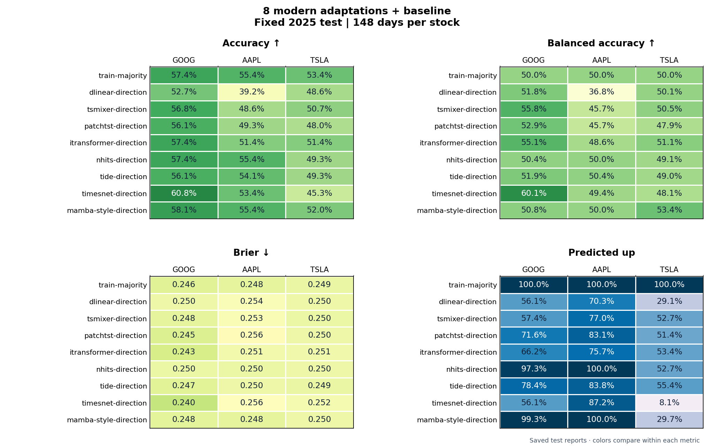

<details>
<summary>Show every 8 modern adaptations + baseline fixed-test model and metric</summary>

##### GOOG · actual up 57.4%

Source: [metrics.csv](runs/modern-direction/fixed-2025/goog/metrics.csv) · [predictions.csv](runs/modern-direction/fixed-2025/goog/predictions.csv) · [confusion.csv](runs/modern-direction/fixed-2025/goog/confusion.csv) · [calibration.csv](runs/modern-direction/fixed-2025/goog/calibration.csv)

| Model | Val. acc | Correct / days | Balanced acc | Brier ↓ | Pred. up | TN / FP / FN / TP | Chart |
| --- | ---: | ---: | ---: | ---: | ---: | ---: | --- |
| `train-majority` | 49.7% | 85/148 (57.4%) | 50.0% | 0.2460 | 100.0% | 0 / 63 / 0 / 85 | [View](runs/modern-direction/fixed-2025/goog/diagnostics/models/train-majority.png) |
| `dlinear-direction` | 49.7% | 78/148 (52.7%) | 51.8% | 0.2499 | 56.1% | 29 / 34 / 36 / 49 | [View](runs/modern-direction/fixed-2025/goog/diagnostics/models/dlinear-direction.png) |
| `tsmixer-direction` | 46.9% | 84/148 (56.8%) | 55.8% | 0.2480 | 57.4% | 31 / 32 / 32 / 53 | [View](runs/modern-direction/fixed-2025/goog/diagnostics/models/tsmixer-direction.png) |
| `patchtst-direction` | 54.4% | 83/148 (56.1%) | 52.9% | 0.2454 | 71.6% | 20 / 43 / 22 / 63 | [View](runs/modern-direction/fixed-2025/goog/diagnostics/models/patchtst-direction.png) |
| `itransformer-direction` | 47.6% | 85/148 (57.4%) | 55.1% | 0.2434 | 66.2% | 25 / 38 / 25 / 60 | [View](runs/modern-direction/fixed-2025/goog/diagnostics/models/itransformer-direction.png) |
| `nhits-direction` | 47.6% | 85/148 (57.4%) | 50.4% | 0.2497 | 97.3% | 2 / 61 / 2 / 83 | [View](runs/modern-direction/fixed-2025/goog/diagnostics/models/nhits-direction.png) |
| `tide-direction` | 44.2% | 83/148 (56.1%) | 51.9% | 0.2466 | 78.4% | 15 / 48 / 17 / 68 | [View](runs/modern-direction/fixed-2025/goog/diagnostics/models/tide-direction.png) |
| `timesnet-direction` | 55.1% | 90/148 (60.8%) | 60.1% | 0.2396 | 56.1% | 35 / 28 / 30 / 55 | [View](runs/modern-direction/fixed-2025/goog/diagnostics/models/timesnet-direction.png) |
| `mamba-style-direction` | 50.3% | 86/148 (58.1%) | 50.8% | 0.2477 | 99.3% | 1 / 62 / 0 / 85 | [View](runs/modern-direction/fixed-2025/goog/diagnostics/models/mamba-style-direction.png) |

##### AAPL · actual up 55.4%

Source: [metrics.csv](runs/modern-direction/fixed-2025/aapl/metrics.csv) · [predictions.csv](runs/modern-direction/fixed-2025/aapl/predictions.csv) · [confusion.csv](runs/modern-direction/fixed-2025/aapl/confusion.csv) · [calibration.csv](runs/modern-direction/fixed-2025/aapl/calibration.csv)

| Model | Val. acc | Correct / days | Balanced acc | Brier ↓ | Pred. up | TN / FP / FN / TP | Chart |
| --- | ---: | ---: | ---: | ---: | ---: | ---: | --- |
| `train-majority` | 52.4% | 82/148 (55.4%) | 50.0% | 0.2478 | 100.0% | 0 / 66 / 0 / 82 | [View](runs/modern-direction/fixed-2025/aapl/diagnostics/models/train-majority.png) |
| `dlinear-direction` | 49.7% | 58/148 (39.2%) | 36.8% | 0.2537 | 70.3% | 10 / 56 / 34 / 48 | [View](runs/modern-direction/fixed-2025/aapl/diagnostics/models/dlinear-direction.png) |
| `tsmixer-direction` | 50.3% | 72/148 (48.6%) | 45.7% | 0.2530 | 77.0% | 12 / 54 / 22 / 60 | [View](runs/modern-direction/fixed-2025/aapl/diagnostics/models/tsmixer-direction.png) |
| `patchtst-direction` | 50.3% | 73/148 (49.3%) | 45.7% | 0.2564 | 83.1% | 8 / 58 / 17 / 65 | [View](runs/modern-direction/fixed-2025/aapl/diagnostics/models/patchtst-direction.png) |
| `itransformer-direction` | 49.0% | 76/148 (51.4%) | 48.6% | 0.2515 | 75.7% | 15 / 51 / 21 / 61 | [View](runs/modern-direction/fixed-2025/aapl/diagnostics/models/itransformer-direction.png) |
| `nhits-direction` | 52.4% | 82/148 (55.4%) | 50.0% | 0.2498 | 100.0% | 0 / 66 / 0 / 82 | [View](runs/modern-direction/fixed-2025/aapl/diagnostics/models/nhits-direction.png) |
| `tide-direction` | 48.3% | 80/148 (54.1%) | 50.4% | 0.2501 | 83.8% | 11 / 55 / 13 / 69 | [View](runs/modern-direction/fixed-2025/aapl/diagnostics/models/tide-direction.png) |
| `timesnet-direction` | 55.1% | 79/148 (53.4%) | 49.4% | 0.2556 | 87.2% | 8 / 58 / 11 / 71 | [View](runs/modern-direction/fixed-2025/aapl/diagnostics/models/timesnet-direction.png) |
| `mamba-style-direction` | 54.4% | 82/148 (55.4%) | 50.0% | 0.2478 | 100.0% | 0 / 66 / 0 / 82 | [View](runs/modern-direction/fixed-2025/aapl/diagnostics/models/mamba-style-direction.png) |

##### TSLA · actual up 53.4%

Source: [metrics.csv](runs/modern-direction/fixed-2025/tsla/metrics.csv) · [predictions.csv](runs/modern-direction/fixed-2025/tsla/predictions.csv) · [confusion.csv](runs/modern-direction/fixed-2025/tsla/confusion.csv) · [calibration.csv](runs/modern-direction/fixed-2025/tsla/calibration.csv)

| Model | Val. acc | Correct / days | Balanced acc | Brier ↓ | Pred. up | TN / FP / FN / TP | Chart |
| --- | ---: | ---: | ---: | ---: | ---: | ---: | --- |
| `train-majority` | 47.6% | 79/148 (53.4%) | 50.0% | 0.2492 | 100.0% | 0 / 69 / 0 / 79 | [View](runs/modern-direction/fixed-2025/tsla/diagnostics/models/train-majority.png) |
| `dlinear-direction` | 46.3% | 72/148 (48.6%) | 50.1% | 0.2502 | 29.1% | 49 / 20 / 56 / 23 | [View](runs/modern-direction/fixed-2025/tsla/diagnostics/models/dlinear-direction.png) |
| `tsmixer-direction` | 53.1% | 75/148 (50.7%) | 50.5% | 0.2498 | 52.7% | 33 / 36 / 37 / 42 | [View](runs/modern-direction/fixed-2025/tsla/diagnostics/models/tsmixer-direction.png) |
| `patchtst-direction` | 49.0% | 71/148 (48.0%) | 47.9% | 0.2499 | 51.4% | 32 / 37 / 40 / 39 | [View](runs/modern-direction/fixed-2025/tsla/diagnostics/models/patchtst-direction.png) |
| `itransformer-direction` | 51.0% | 76/148 (51.4%) | 51.1% | 0.2509 | 53.4% | 33 / 36 / 36 / 43 | [View](runs/modern-direction/fixed-2025/tsla/diagnostics/models/itransformer-direction.png) |
| `nhits-direction` | 49.7% | 73/148 (49.3%) | 49.1% | 0.2500 | 52.7% | 32 / 37 / 38 / 41 | [View](runs/modern-direction/fixed-2025/tsla/diagnostics/models/nhits-direction.png) |
| `tide-direction` | 49.7% | 73/148 (49.3%) | 49.0% | 0.2492 | 55.4% | 30 / 39 / 36 / 43 | [View](runs/modern-direction/fixed-2025/tsla/diagnostics/models/tide-direction.png) |
| `timesnet-direction` | 53.1% | 67/148 (45.3%) | 48.1% | 0.2524 | 8.1% | 62 / 7 / 74 / 5 | [View](runs/modern-direction/fixed-2025/tsla/diagnostics/models/timesnet-direction.png) |
| `mamba-style-direction` | 48.3% | 77/148 (52.0%) | 53.4% | 0.2500 | 29.7% | 51 / 18 / 53 / 26 | [View](runs/modern-direction/fixed-2025/tsla/diagnostics/models/mamba-style-direction.png) |


</details>

#### 8 modern adaptations + baseline: rolling test

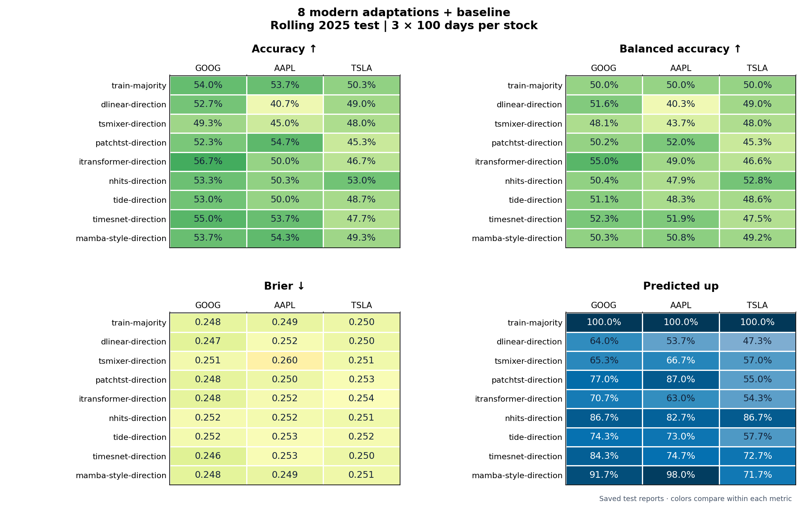

<details>
<summary>Show every 8 modern adaptations + baseline rolling aggregate model and metric</summary>

##### GOOG · 300 test days · actual up 54.0%

Source: [rolling_metrics.csv](runs/modern-direction/rolling-2025/goog/rolling_metrics.csv) · [fold_metrics.csv](runs/modern-direction/rolling-2025/goog/fold_metrics.csv)

| Model | Val. acc | Correct / days | Balanced acc | Brier ↓ | Pred. up | TN / FP / FN / TP | Chart |
| --- | ---: | ---: | ---: | ---: | ---: | ---: | --- |
| `train-majority` | 55.7% | 162/300 (54.0%) | 50.0% | 0.2484 | 100.0% | 0 / 138 / 0 / 162 | [F1](runs/modern-direction/rolling-2025/goog/fold-1/diagnostics/models/train-majority.png) [F2](runs/modern-direction/rolling-2025/goog/fold-2/diagnostics/models/train-majority.png) [F3](runs/modern-direction/rolling-2025/goog/fold-3/diagnostics/models/train-majority.png) |
| `dlinear-direction` | 52.3% | 158/300 (52.7%) | 51.6% | 0.2470 | 64.0% | 52 / 86 / 56 / 106 | [F1](runs/modern-direction/rolling-2025/goog/fold-1/diagnostics/models/dlinear-direction.png) [F2](runs/modern-direction/rolling-2025/goog/fold-2/diagnostics/models/dlinear-direction.png) [F3](runs/modern-direction/rolling-2025/goog/fold-3/diagnostics/models/dlinear-direction.png) |
| `tsmixer-direction` | 50.7% | 148/300 (49.3%) | 48.1% | 0.2514 | 65.3% | 45 / 93 / 59 / 103 | [F1](runs/modern-direction/rolling-2025/goog/fold-1/diagnostics/models/tsmixer-direction.png) [F2](runs/modern-direction/rolling-2025/goog/fold-2/diagnostics/models/tsmixer-direction.png) [F3](runs/modern-direction/rolling-2025/goog/fold-3/diagnostics/models/tsmixer-direction.png) |
| `patchtst-direction` | 57.7% | 157/300 (52.3%) | 50.2% | 0.2479 | 77.0% | 32 / 106 / 37 / 125 | [F1](runs/modern-direction/rolling-2025/goog/fold-1/diagnostics/models/patchtst-direction.png) [F2](runs/modern-direction/rolling-2025/goog/fold-2/diagnostics/models/patchtst-direction.png) [F3](runs/modern-direction/rolling-2025/goog/fold-3/diagnostics/models/patchtst-direction.png) |
| `itransformer-direction` | 56.3% | 170/300 (56.7%) | 55.0% | 0.2481 | 70.7% | 48 / 90 / 40 / 122 | [F1](runs/modern-direction/rolling-2025/goog/fold-1/diagnostics/models/itransformer-direction.png) [F2](runs/modern-direction/rolling-2025/goog/fold-2/diagnostics/models/itransformer-direction.png) [F3](runs/modern-direction/rolling-2025/goog/fold-3/diagnostics/models/itransformer-direction.png) |
| `nhits-direction` | 54.3% | 160/300 (53.3%) | 50.4% | 0.2523 | 86.7% | 19 / 119 / 21 / 141 | [F1](runs/modern-direction/rolling-2025/goog/fold-1/diagnostics/models/nhits-direction.png) [F2](runs/modern-direction/rolling-2025/goog/fold-2/diagnostics/models/nhits-direction.png) [F3](runs/modern-direction/rolling-2025/goog/fold-3/diagnostics/models/nhits-direction.png) |
| `tide-direction` | 53.7% | 159/300 (53.0%) | 51.1% | 0.2519 | 74.3% | 37 / 101 / 40 / 122 | [F1](runs/modern-direction/rolling-2025/goog/fold-1/diagnostics/models/tide-direction.png) [F2](runs/modern-direction/rolling-2025/goog/fold-2/diagnostics/models/tide-direction.png) [F3](runs/modern-direction/rolling-2025/goog/fold-3/diagnostics/models/tide-direction.png) |
| `timesnet-direction` | 57.0% | 165/300 (55.0%) | 52.3% | 0.2461 | 84.3% | 25 / 113 / 22 / 140 | [F1](runs/modern-direction/rolling-2025/goog/fold-1/diagnostics/models/timesnet-direction.png) [F2](runs/modern-direction/rolling-2025/goog/fold-2/diagnostics/models/timesnet-direction.png) [F3](runs/modern-direction/rolling-2025/goog/fold-3/diagnostics/models/timesnet-direction.png) |
| `mamba-style-direction` | 56.7% | 161/300 (53.7%) | 50.3% | 0.2476 | 91.7% | 12 / 126 / 13 / 149 | [F1](runs/modern-direction/rolling-2025/goog/fold-1/diagnostics/models/mamba-style-direction.png) [F2](runs/modern-direction/rolling-2025/goog/fold-2/diagnostics/models/mamba-style-direction.png) [F3](runs/modern-direction/rolling-2025/goog/fold-3/diagnostics/models/mamba-style-direction.png) |

##### AAPL · 300 test days · actual up 53.7%

Source: [rolling_metrics.csv](runs/modern-direction/rolling-2025/aapl/rolling_metrics.csv) · [fold_metrics.csv](runs/modern-direction/rolling-2025/aapl/fold_metrics.csv)

| Model | Val. acc | Correct / days | Balanced acc | Brier ↓ | Pred. up | TN / FP / FN / TP | Chart |
| --- | ---: | ---: | ---: | ---: | ---: | ---: | --- |
| `train-majority` | 57.3% | 161/300 (53.7%) | 50.0% | 0.2487 | 100.0% | 0 / 139 / 0 / 161 | [F1](runs/modern-direction/rolling-2025/aapl/fold-1/diagnostics/models/train-majority.png) [F2](runs/modern-direction/rolling-2025/aapl/fold-2/diagnostics/models/train-majority.png) [F3](runs/modern-direction/rolling-2025/aapl/fold-3/diagnostics/models/train-majority.png) |
| `dlinear-direction` | 50.3% | 122/300 (40.7%) | 40.3% | 0.2524 | 53.7% | 50 / 89 / 89 / 72 | [F1](runs/modern-direction/rolling-2025/aapl/fold-1/diagnostics/models/dlinear-direction.png) [F2](runs/modern-direction/rolling-2025/aapl/fold-2/diagnostics/models/dlinear-direction.png) [F3](runs/modern-direction/rolling-2025/aapl/fold-3/diagnostics/models/dlinear-direction.png) |
| `tsmixer-direction` | 50.3% | 135/300 (45.0%) | 43.7% | 0.2599 | 66.7% | 37 / 102 / 63 / 98 | [F1](runs/modern-direction/rolling-2025/aapl/fold-1/diagnostics/models/tsmixer-direction.png) [F2](runs/modern-direction/rolling-2025/aapl/fold-2/diagnostics/models/tsmixer-direction.png) [F3](runs/modern-direction/rolling-2025/aapl/fold-3/diagnostics/models/tsmixer-direction.png) |
| `patchtst-direction` | 58.7% | 164/300 (54.7%) | 52.0% | 0.2501 | 87.0% | 21 / 118 / 18 / 143 | [F1](runs/modern-direction/rolling-2025/aapl/fold-1/diagnostics/models/patchtst-direction.png) [F2](runs/modern-direction/rolling-2025/aapl/fold-2/diagnostics/models/patchtst-direction.png) [F3](runs/modern-direction/rolling-2025/aapl/fold-3/diagnostics/models/patchtst-direction.png) |
| `itransformer-direction` | 50.3% | 150/300 (50.0%) | 49.0% | 0.2522 | 63.0% | 50 / 89 / 61 / 100 | [F1](runs/modern-direction/rolling-2025/aapl/fold-1/diagnostics/models/itransformer-direction.png) [F2](runs/modern-direction/rolling-2025/aapl/fold-2/diagnostics/models/itransformer-direction.png) [F3](runs/modern-direction/rolling-2025/aapl/fold-3/diagnostics/models/itransformer-direction.png) |
| `nhits-direction` | 55.0% | 151/300 (50.3%) | 47.9% | 0.2516 | 82.7% | 21 / 118 / 31 / 130 | [F1](runs/modern-direction/rolling-2025/aapl/fold-1/diagnostics/models/nhits-direction.png) [F2](runs/modern-direction/rolling-2025/aapl/fold-2/diagnostics/models/nhits-direction.png) [F3](runs/modern-direction/rolling-2025/aapl/fold-3/diagnostics/models/nhits-direction.png) |
| `tide-direction` | 50.3% | 150/300 (50.0%) | 48.3% | 0.2535 | 73.0% | 35 / 104 / 46 / 115 | [F1](runs/modern-direction/rolling-2025/aapl/fold-1/diagnostics/models/tide-direction.png) [F2](runs/modern-direction/rolling-2025/aapl/fold-2/diagnostics/models/tide-direction.png) [F3](runs/modern-direction/rolling-2025/aapl/fold-3/diagnostics/models/tide-direction.png) |
| `timesnet-direction` | 57.3% | 161/300 (53.7%) | 51.9% | 0.2532 | 74.7% | 38 / 101 / 38 / 123 | [F1](runs/modern-direction/rolling-2025/aapl/fold-1/diagnostics/models/timesnet-direction.png) [F2](runs/modern-direction/rolling-2025/aapl/fold-2/diagnostics/models/timesnet-direction.png) [F3](runs/modern-direction/rolling-2025/aapl/fold-3/diagnostics/models/timesnet-direction.png) |
| `mamba-style-direction` | 56.3% | 163/300 (54.3%) | 50.8% | 0.2486 | 98.0% | 4 / 135 / 2 / 159 | [F1](runs/modern-direction/rolling-2025/aapl/fold-1/diagnostics/models/mamba-style-direction.png) [F2](runs/modern-direction/rolling-2025/aapl/fold-2/diagnostics/models/mamba-style-direction.png) [F3](runs/modern-direction/rolling-2025/aapl/fold-3/diagnostics/models/mamba-style-direction.png) |

##### TSLA · 300 test days · actual up 50.3%

Source: [rolling_metrics.csv](runs/modern-direction/rolling-2025/tsla/rolling_metrics.csv) · [fold_metrics.csv](runs/modern-direction/rolling-2025/tsla/fold_metrics.csv)

| Model | Val. acc | Correct / days | Balanced acc | Brier ↓ | Pred. up | TN / FP / FN / TP | Chart |
| --- | ---: | ---: | ---: | ---: | ---: | ---: | --- |
| `train-majority` | 51.0% | 151/300 (50.3%) | 50.0% | 0.2499 | 100.0% | 0 / 149 / 0 / 151 | [F1](runs/modern-direction/rolling-2025/tsla/fold-1/diagnostics/models/train-majority.png) [F2](runs/modern-direction/rolling-2025/tsla/fold-2/diagnostics/models/train-majority.png) [F3](runs/modern-direction/rolling-2025/tsla/fold-3/diagnostics/models/train-majority.png) |
| `dlinear-direction` | 53.3% | 147/300 (49.0%) | 49.0% | 0.2503 | 47.3% | 77 / 72 / 81 / 70 | [F1](runs/modern-direction/rolling-2025/tsla/fold-1/diagnostics/models/dlinear-direction.png) [F2](runs/modern-direction/rolling-2025/tsla/fold-2/diagnostics/models/dlinear-direction.png) [F3](runs/modern-direction/rolling-2025/tsla/fold-3/diagnostics/models/dlinear-direction.png) |
| `tsmixer-direction` | 50.7% | 144/300 (48.0%) | 48.0% | 0.2510 | 57.0% | 61 / 88 / 68 / 83 | [F1](runs/modern-direction/rolling-2025/tsla/fold-1/diagnostics/models/tsmixer-direction.png) [F2](runs/modern-direction/rolling-2025/tsla/fold-2/diagnostics/models/tsmixer-direction.png) [F3](runs/modern-direction/rolling-2025/tsla/fold-3/diagnostics/models/tsmixer-direction.png) |
| `patchtst-direction` | 53.7% | 136/300 (45.3%) | 45.3% | 0.2532 | 55.0% | 60 / 89 / 75 / 76 | [F1](runs/modern-direction/rolling-2025/tsla/fold-1/diagnostics/models/patchtst-direction.png) [F2](runs/modern-direction/rolling-2025/tsla/fold-2/diagnostics/models/patchtst-direction.png) [F3](runs/modern-direction/rolling-2025/tsla/fold-3/diagnostics/models/patchtst-direction.png) |
| `itransformer-direction` | 54.3% | 140/300 (46.7%) | 46.6% | 0.2541 | 54.3% | 63 / 86 / 74 / 77 | [F1](runs/modern-direction/rolling-2025/tsla/fold-1/diagnostics/models/itransformer-direction.png) [F2](runs/modern-direction/rolling-2025/tsla/fold-2/diagnostics/models/itransformer-direction.png) [F3](runs/modern-direction/rolling-2025/tsla/fold-3/diagnostics/models/itransformer-direction.png) |
| `nhits-direction` | 50.7% | 159/300 (53.0%) | 52.8% | 0.2510 | 86.7% | 24 / 125 / 16 / 135 | [F1](runs/modern-direction/rolling-2025/tsla/fold-1/diagnostics/models/nhits-direction.png) [F2](runs/modern-direction/rolling-2025/tsla/fold-2/diagnostics/models/nhits-direction.png) [F3](runs/modern-direction/rolling-2025/tsla/fold-3/diagnostics/models/nhits-direction.png) |
| `tide-direction` | 49.0% | 146/300 (48.7%) | 48.6% | 0.2521 | 57.7% | 61 / 88 / 66 / 85 | [F1](runs/modern-direction/rolling-2025/tsla/fold-1/diagnostics/models/tide-direction.png) [F2](runs/modern-direction/rolling-2025/tsla/fold-2/diagnostics/models/tide-direction.png) [F3](runs/modern-direction/rolling-2025/tsla/fold-3/diagnostics/models/tide-direction.png) |
| `timesnet-direction` | 55.7% | 143/300 (47.7%) | 47.5% | 0.2503 | 72.7% | 37 / 112 / 45 / 106 | [F1](runs/modern-direction/rolling-2025/tsla/fold-1/diagnostics/models/timesnet-direction.png) [F2](runs/modern-direction/rolling-2025/tsla/fold-2/diagnostics/models/timesnet-direction.png) [F3](runs/modern-direction/rolling-2025/tsla/fold-3/diagnostics/models/timesnet-direction.png) |
| `mamba-style-direction` | 51.0% | 148/300 (49.3%) | 49.2% | 0.2506 | 71.7% | 41 / 108 / 44 / 107 | [F1](runs/modern-direction/rolling-2025/tsla/fold-1/diagnostics/models/mamba-style-direction.png) [F2](runs/modern-direction/rolling-2025/tsla/fold-2/diagnostics/models/mamba-style-direction.png) [F3](runs/modern-direction/rolling-2025/tsla/fold-3/diagnostics/models/mamba-style-direction.png) |


</details>

<details>
<summary>Show all nine 8 modern adaptations + baseline rolling fold tables</summary>

##### GOOG · fold 1 · actual up 51.0%

Source: [metrics.csv](runs/modern-direction/rolling-2025/goog/fold-1/metrics.csv) · [predictions.csv](runs/modern-direction/rolling-2025/goog/fold-1/predictions.csv) · [confusion.csv](runs/modern-direction/rolling-2025/goog/fold-1/confusion.csv) · [calibration.csv](runs/modern-direction/rolling-2025/goog/fold-1/calibration.csv)

| Model | Val. acc | Correct / days | Balanced acc | Brier ↓ | Pred. up | TN / FP / FN / TP | Chart |
| --- | ---: | ---: | ---: | ---: | ---: | ---: | --- |
| `patchtst-direction` | 62.0% | 51/100 (51.0%) | 50.4% | 0.2527 | 80.0% | 10 / 39 / 10 / 41 | [View](runs/modern-direction/rolling-2025/goog/fold-1/diagnostics/models/patchtst-direction.png) |
| `mamba-style-direction` | 60.0% | 52/100 (52.0%) | 51.0% | 0.2503 | 99.0% | 1 / 48 / 0 / 51 | [View](runs/modern-direction/rolling-2025/goog/fold-1/diagnostics/models/mamba-style-direction.png) |
| `timesnet-direction` | 60.0% | 51/100 (51.0%) | 50.0% | 0.2505 | 100.0% | 0 / 49 / 0 / 51 | [View](runs/modern-direction/rolling-2025/goog/fold-1/diagnostics/models/timesnet-direction.png) |
| `train-majority` | 60.0% | 51/100 (51.0%) | 50.0% | 0.2500 | 100.0% | 0 / 49 / 0 / 51 | [View](runs/modern-direction/rolling-2025/goog/fold-1/diagnostics/models/train-majority.png) |
| `tide-direction` | 58.0% | 46/100 (46.0%) | 45.5% | 0.2603 | 75.0% | 10 / 39 / 15 / 36 | [View](runs/modern-direction/rolling-2025/goog/fold-1/diagnostics/models/tide-direction.png) |
| `tsmixer-direction` | 55.0% | 45/100 (45.0%) | 44.7% | 0.2594 | 66.0% | 14 / 35 / 20 / 31 | [View](runs/modern-direction/rolling-2025/goog/fold-1/diagnostics/models/tsmixer-direction.png) |
| `nhits-direction` | 54.0% | 46/100 (46.0%) | 45.4% | 0.2615 | 79.0% | 8 / 41 / 13 / 38 | [View](runs/modern-direction/rolling-2025/goog/fold-1/diagnostics/models/nhits-direction.png) |
| `itransformer-direction` | 52.0% | 54/100 (54.0%) | 53.5% | 0.2575 | 75.0% | 14 / 35 / 11 / 40 | [View](runs/modern-direction/rolling-2025/goog/fold-1/diagnostics/models/itransformer-direction.png) |
| `dlinear-direction` | 43.0% | 46/100 (46.0%) | 45.8% | 0.2503 | 59.0% | 18 / 31 / 23 / 28 | [View](runs/modern-direction/rolling-2025/goog/fold-1/diagnostics/models/dlinear-direction.png) |

##### GOOG · fold 2 · actual up 56.0%

Source: [metrics.csv](runs/modern-direction/rolling-2025/goog/fold-2/metrics.csv) · [predictions.csv](runs/modern-direction/rolling-2025/goog/fold-2/predictions.csv) · [confusion.csv](runs/modern-direction/rolling-2025/goog/fold-2/confusion.csv) · [calibration.csv](runs/modern-direction/rolling-2025/goog/fold-2/calibration.csv)

| Model | Val. acc | Correct / days | Balanced acc | Brier ↓ | Pred. up | TN / FP / FN / TP | Chart |
| --- | ---: | ---: | ---: | ---: | ---: | ---: | --- |
| `itransformer-direction` | 57.0% | 59/100 (59.0%) | 57.1% | 0.2455 | 67.0% | 18 / 26 / 15 / 41 | [View](runs/modern-direction/rolling-2025/goog/fold-2/diagnostics/models/itransformer-direction.png) |
| `timesnet-direction` | 55.0% | 55/100 (55.0%) | 53.0% | 0.2456 | 67.0% | 16 / 28 / 17 / 39 | [View](runs/modern-direction/rolling-2025/goog/fold-2/diagnostics/models/timesnet-direction.png) |
| `patchtst-direction` | 55.0% | 55/100 (55.0%) | 51.1% | 0.2431 | 83.0% | 8 / 36 / 9 / 47 | [View](runs/modern-direction/rolling-2025/goog/fold-2/diagnostics/models/patchtst-direction.png) |
| `dlinear-direction` | 55.0% | 59/100 (59.0%) | 57.3% | 0.2498 | 65.0% | 19 / 25 / 16 / 40 | [View](runs/modern-direction/rolling-2025/goog/fold-2/diagnostics/models/dlinear-direction.png) |
| `mamba-style-direction` | 51.0% | 56/100 (56.0%) | 50.0% | 0.2480 | 100.0% | 0 / 44 / 0 / 56 | [View](runs/modern-direction/rolling-2025/goog/fold-2/diagnostics/models/mamba-style-direction.png) |
| `nhits-direction` | 51.0% | 56/100 (56.0%) | 50.0% | 0.2494 | 100.0% | 0 / 44 / 0 / 56 | [View](runs/modern-direction/rolling-2025/goog/fold-2/diagnostics/models/nhits-direction.png) |
| `train-majority` | 51.0% | 56/100 (56.0%) | 50.0% | 0.2471 | 100.0% | 0 / 44 / 0 / 56 | [View](runs/modern-direction/rolling-2025/goog/fold-2/diagnostics/models/train-majority.png) |
| `tide-direction` | 48.0% | 51/100 (51.0%) | 48.0% | 0.2504 | 75.0% | 10 / 34 / 15 / 41 | [View](runs/modern-direction/rolling-2025/goog/fold-2/diagnostics/models/tide-direction.png) |
| `tsmixer-direction` | 47.0% | 44/100 (44.0%) | 42.2% | 0.2509 | 64.0% | 12 / 32 / 24 / 32 | [View](runs/modern-direction/rolling-2025/goog/fold-2/diagnostics/models/tsmixer-direction.png) |

##### GOOG · fold 3 · actual up 55.0%

Source: [metrics.csv](runs/modern-direction/rolling-2025/goog/fold-3/metrics.csv) · [predictions.csv](runs/modern-direction/rolling-2025/goog/fold-3/predictions.csv) · [confusion.csv](runs/modern-direction/rolling-2025/goog/fold-3/confusion.csv) · [calibration.csv](runs/modern-direction/rolling-2025/goog/fold-3/calibration.csv)

| Model | Val. acc | Correct / days | Balanced acc | Brier ↓ | Pred. up | TN / FP / FN / TP | Chart |
| --- | ---: | ---: | ---: | ---: | ---: | ---: | --- |
| `itransformer-direction` | 60.0% | 57/100 (57.0%) | 55.1% | 0.2413 | 70.0% | 16 / 29 / 14 / 41 | [View](runs/modern-direction/rolling-2025/goog/fold-3/diagnostics/models/itransformer-direction.png) |
| `mamba-style-direction` | 59.0% | 53/100 (53.0%) | 50.4% | 0.2445 | 76.0% | 11 / 34 / 13 / 42 | [View](runs/modern-direction/rolling-2025/goog/fold-3/diagnostics/models/mamba-style-direction.png) |
| `dlinear-direction` | 59.0% | 53/100 (53.0%) | 51.2% | 0.2410 | 68.0% | 15 / 30 / 17 / 38 | [View](runs/modern-direction/rolling-2025/goog/fold-3/diagnostics/models/dlinear-direction.png) |
| `nhits-direction` | 58.0% | 58/100 (58.0%) | 54.9% | 0.2458 | 81.0% | 11 / 34 / 8 / 47 | [View](runs/modern-direction/rolling-2025/goog/fold-3/diagnostics/models/nhits-direction.png) |
| `timesnet-direction` | 56.0% | 59/100 (59.0%) | 55.5% | 0.2423 | 86.0% | 9 / 36 / 5 / 50 | [View](runs/modern-direction/rolling-2025/goog/fold-3/diagnostics/models/timesnet-direction.png) |
| `patchtst-direction` | 56.0% | 51/100 (51.0%) | 49.2% | 0.2479 | 68.0% | 14 / 31 / 18 / 37 | [View](runs/modern-direction/rolling-2025/goog/fold-3/diagnostics/models/patchtst-direction.png) |
| `train-majority` | 56.0% | 55/100 (55.0%) | 50.0% | 0.2479 | 100.0% | 0 / 45 / 0 / 55 | [View](runs/modern-direction/rolling-2025/goog/fold-3/diagnostics/models/train-majority.png) |
| `tide-direction` | 55.0% | 62/100 (62.0%) | 59.8% | 0.2449 | 73.0% | 17 / 28 / 10 / 45 | [View](runs/modern-direction/rolling-2025/goog/fold-3/diagnostics/models/tide-direction.png) |
| `tsmixer-direction` | 50.0% | 59/100 (59.0%) | 57.5% | 0.2438 | 66.0% | 19 / 26 / 15 / 40 | [View](runs/modern-direction/rolling-2025/goog/fold-3/diagnostics/models/tsmixer-direction.png) |

##### AAPL · fold 1 · actual up 52.0%

Source: [metrics.csv](runs/modern-direction/rolling-2025/aapl/fold-1/metrics.csv) · [predictions.csv](runs/modern-direction/rolling-2025/aapl/fold-1/predictions.csv) · [confusion.csv](runs/modern-direction/rolling-2025/aapl/fold-1/confusion.csv) · [calibration.csv](runs/modern-direction/rolling-2025/aapl/fold-1/calibration.csv)

| Model | Val. acc | Correct / days | Balanced acc | Brier ↓ | Pred. up | TN / FP / FN / TP | Chart |
| --- | ---: | ---: | ---: | ---: | ---: | ---: | --- |
| `patchtst-direction` | 65.0% | 55/100 (55.0%) | 54.6% | 0.2492 | 61.0% | 21 / 27 / 18 / 34 | [View](runs/modern-direction/rolling-2025/aapl/fold-1/diagnostics/models/patchtst-direction.png) |
| `train-majority` | 64.0% | 52/100 (52.0%) | 50.0% | 0.2497 | 100.0% | 0 / 48 / 0 / 52 | [View](runs/modern-direction/rolling-2025/aapl/fold-1/diagnostics/models/train-majority.png) |
| `mamba-style-direction` | 63.0% | 52/100 (52.0%) | 50.1% | 0.2501 | 98.0% | 1 / 47 / 1 / 51 | [View](runs/modern-direction/rolling-2025/aapl/fold-1/diagnostics/models/mamba-style-direction.png) |
| `timesnet-direction` | 61.0% | 50/100 (50.0%) | 49.6% | 0.2529 | 60.0% | 19 / 29 / 21 / 31 | [View](runs/modern-direction/rolling-2025/aapl/fold-1/diagnostics/models/timesnet-direction.png) |
| `tide-direction` | 57.0% | 44/100 (44.0%) | 43.8% | 0.2578 | 56.0% | 18 / 30 / 26 / 26 | [View](runs/modern-direction/rolling-2025/aapl/fold-1/diagnostics/models/tide-direction.png) |
| `nhits-direction` | 57.0% | 42/100 (42.0%) | 42.1% | 0.2551 | 48.0% | 21 / 27 / 31 / 21 | [View](runs/modern-direction/rolling-2025/aapl/fold-1/diagnostics/models/nhits-direction.png) |
| `dlinear-direction` | 55.0% | 40/100 (40.0%) | 40.4% | 0.2503 | 40.0% | 24 / 24 / 36 / 16 | [View](runs/modern-direction/rolling-2025/aapl/fold-1/diagnostics/models/dlinear-direction.png) |
| `itransformer-direction` | 55.0% | 46/100 (46.0%) | 46.1% | 0.2533 | 48.0% | 23 / 25 / 29 / 23 | [View](runs/modern-direction/rolling-2025/aapl/fold-1/diagnostics/models/itransformer-direction.png) |
| `tsmixer-direction` | 54.0% | 39/100 (39.0%) | 38.5% | 0.2749 | 61.0% | 13 / 35 / 26 / 26 | [View](runs/modern-direction/rolling-2025/aapl/fold-1/diagnostics/models/tsmixer-direction.png) |

##### AAPL · fold 2 · actual up 56.0%

Source: [metrics.csv](runs/modern-direction/rolling-2025/aapl/fold-2/metrics.csv) · [predictions.csv](runs/modern-direction/rolling-2025/aapl/fold-2/predictions.csv) · [confusion.csv](runs/modern-direction/rolling-2025/aapl/fold-2/confusion.csv) · [calibration.csv](runs/modern-direction/rolling-2025/aapl/fold-2/calibration.csv)

| Model | Val. acc | Correct / days | Balanced acc | Brier ↓ | Pred. up | TN / FP / FN / TP | Chart |
| --- | ---: | ---: | ---: | ---: | ---: | ---: | --- |
| `patchtst-direction` | 55.0% | 56/100 (56.0%) | 50.0% | 0.2458 | 100.0% | 0 / 44 / 0 / 56 | [View](runs/modern-direction/rolling-2025/aapl/fold-2/diagnostics/models/patchtst-direction.png) |
| `dlinear-direction` | 52.0% | 41/100 (41.0%) | 38.1% | 0.2566 | 73.0% | 6 / 38 / 21 / 35 | [View](runs/modern-direction/rolling-2025/aapl/fold-2/diagnostics/models/dlinear-direction.png) |
| `train-majority` | 52.0% | 56/100 (56.0%) | 50.0% | 0.2474 | 100.0% | 0 / 44 / 0 / 56 | [View](runs/modern-direction/rolling-2025/aapl/fold-2/diagnostics/models/train-majority.png) |
| `mamba-style-direction` | 52.0% | 56/100 (56.0%) | 50.0% | 0.2476 | 100.0% | 0 / 44 / 0 / 56 | [View](runs/modern-direction/rolling-2025/aapl/fold-2/diagnostics/models/mamba-style-direction.png) |
| `nhits-direction` | 52.0% | 56/100 (56.0%) | 50.0% | 0.2488 | 100.0% | 0 / 44 / 0 / 56 | [View](runs/modern-direction/rolling-2025/aapl/fold-2/diagnostics/models/nhits-direction.png) |
| `tsmixer-direction` | 51.0% | 50/100 (50.0%) | 46.3% | 0.2526 | 80.0% | 7 / 37 / 13 / 43 | [View](runs/modern-direction/rolling-2025/aapl/fold-2/diagnostics/models/tsmixer-direction.png) |
| `timesnet-direction` | 50.0% | 57/100 (57.0%) | 53.3% | 0.2504 | 81.0% | 10 / 34 / 9 / 47 | [View](runs/modern-direction/rolling-2025/aapl/fold-2/diagnostics/models/timesnet-direction.png) |
| `tide-direction` | 46.0% | 56/100 (56.0%) | 51.2% | 0.2501 | 90.0% | 5 / 39 / 5 / 51 | [View](runs/modern-direction/rolling-2025/aapl/fold-2/diagnostics/models/tide-direction.png) |
| `itransformer-direction` | 45.0% | 52/100 (52.0%) | 48.4% | 0.2524 | 80.0% | 8 / 36 / 12 / 44 | [View](runs/modern-direction/rolling-2025/aapl/fold-2/diagnostics/models/itransformer-direction.png) |

##### AAPL · fold 3 · actual up 53.0%

Source: [metrics.csv](runs/modern-direction/rolling-2025/aapl/fold-3/metrics.csv) · [predictions.csv](runs/modern-direction/rolling-2025/aapl/fold-3/predictions.csv) · [confusion.csv](runs/modern-direction/rolling-2025/aapl/fold-3/confusion.csv) · [calibration.csv](runs/modern-direction/rolling-2025/aapl/fold-3/calibration.csv)

| Model | Val. acc | Correct / days | Balanced acc | Brier ↓ | Pred. up | TN / FP / FN / TP | Chart |
| --- | ---: | ---: | ---: | ---: | ---: | ---: | --- |
| `timesnet-direction` | 61.0% | 54/100 (54.0%) | 52.0% | 0.2564 | 83.0% | 9 / 38 / 8 / 45 | [View](runs/modern-direction/rolling-2025/aapl/fold-3/diagnostics/models/timesnet-direction.png) |
| `train-majority` | 56.0% | 53/100 (53.0%) | 50.0% | 0.2491 | 100.0% | 0 / 47 / 0 / 53 | [View](runs/modern-direction/rolling-2025/aapl/fold-3/diagnostics/models/train-majority.png) |
| `nhits-direction` | 56.0% | 53/100 (53.0%) | 50.0% | 0.2509 | 100.0% | 0 / 47 / 0 / 53 | [View](runs/modern-direction/rolling-2025/aapl/fold-3/diagnostics/models/nhits-direction.png) |
| `patchtst-direction` | 56.0% | 53/100 (53.0%) | 50.0% | 0.2554 | 100.0% | 0 / 47 / 0 / 53 | [View](runs/modern-direction/rolling-2025/aapl/fold-3/diagnostics/models/patchtst-direction.png) |
| `mamba-style-direction` | 54.0% | 55/100 (55.0%) | 52.2% | 0.2482 | 96.0% | 3 / 44 / 1 / 52 | [View](runs/modern-direction/rolling-2025/aapl/fold-3/diagnostics/models/mamba-style-direction.png) |
| `itransformer-direction` | 51.0% | 52/100 (52.0%) | 51.3% | 0.2511 | 61.0% | 19 / 28 / 20 / 33 | [View](runs/modern-direction/rolling-2025/aapl/fold-3/diagnostics/models/itransformer-direction.png) |
| `tide-direction` | 48.0% | 50/100 (50.0%) | 48.6% | 0.2525 | 73.0% | 12 / 35 / 15 / 38 | [View](runs/modern-direction/rolling-2025/aapl/fold-3/diagnostics/models/tide-direction.png) |
| `tsmixer-direction` | 46.0% | 46/100 (46.0%) | 45.4% | 0.2522 | 59.0% | 17 / 30 / 24 / 29 | [View](runs/modern-direction/rolling-2025/aapl/fold-3/diagnostics/models/tsmixer-direction.png) |
| `dlinear-direction` | 44.0% | 41/100 (41.0%) | 41.1% | 0.2504 | 48.0% | 20 / 27 / 32 / 21 | [View](runs/modern-direction/rolling-2025/aapl/fold-3/diagnostics/models/dlinear-direction.png) |

##### TSLA · fold 1 · actual up 43.0%

Source: [metrics.csv](runs/modern-direction/rolling-2025/tsla/fold-1/metrics.csv) · [predictions.csv](runs/modern-direction/rolling-2025/tsla/fold-1/predictions.csv) · [confusion.csv](runs/modern-direction/rolling-2025/tsla/fold-1/confusion.csv) · [calibration.csv](runs/modern-direction/rolling-2025/tsla/fold-1/calibration.csv)

| Model | Val. acc | Correct / days | Balanced acc | Brier ↓ | Pred. up | TN / FP / FN / TP | Chart |
| --- | ---: | ---: | ---: | ---: | ---: | ---: | --- |
| `itransformer-direction` | 61.0% | 52/100 (52.0%) | 54.2% | 0.2570 | 65.0% | 22 / 35 / 13 / 30 | [View](runs/modern-direction/rolling-2025/tsla/fold-1/diagnostics/models/itransformer-direction.png) |
| `dlinear-direction` | 59.0% | 51/100 (51.0%) | 51.6% | 0.2504 | 54.0% | 27 / 30 / 19 / 24 | [View](runs/modern-direction/rolling-2025/tsla/fold-1/diagnostics/models/dlinear-direction.png) |
| `timesnet-direction` | 57.0% | 44/100 (44.0%) | 50.6% | 0.2510 | 97.0% | 2 / 55 / 1 / 42 | [View](runs/modern-direction/rolling-2025/tsla/fold-1/diagnostics/models/timesnet-direction.png) |
| `train-majority` | 56.0% | 43/100 (43.0%) | 50.0% | 0.2511 | 100.0% | 0 / 57 / 0 / 43 | [View](runs/modern-direction/rolling-2025/tsla/fold-1/diagnostics/models/train-majority.png) |
| `nhits-direction` | 54.0% | 51/100 (51.0%) | 52.4% | 0.2534 | 60.0% | 24 / 33 / 16 / 27 | [View](runs/modern-direction/rolling-2025/tsla/fold-1/diagnostics/models/nhits-direction.png) |
| `tide-direction` | 54.0% | 52/100 (52.0%) | 52.5% | 0.2525 | 53.0% | 28 / 29 / 19 / 24 | [View](runs/modern-direction/rolling-2025/tsla/fold-1/diagnostics/models/tide-direction.png) |
| `patchtst-direction` | 54.0% | 45/100 (45.0%) | 51.8% | 0.2555 | 98.0% | 2 / 55 / 0 / 43 | [View](runs/modern-direction/rolling-2025/tsla/fold-1/diagnostics/models/patchtst-direction.png) |
| `tsmixer-direction` | 53.0% | 55/100 (55.0%) | 56.0% | 0.2511 | 56.0% | 28 / 29 / 16 / 27 | [View](runs/modern-direction/rolling-2025/tsla/fold-1/diagnostics/models/tsmixer-direction.png) |
| `mamba-style-direction` | 49.0% | 40/100 (40.0%) | 41.7% | 0.2522 | 63.0% | 17 / 40 / 20 / 23 | [View](runs/modern-direction/rolling-2025/tsla/fold-1/diagnostics/models/mamba-style-direction.png) |

##### TSLA · fold 2 · actual up 54.0%

Source: [metrics.csv](runs/modern-direction/rolling-2025/tsla/fold-2/metrics.csv) · [predictions.csv](runs/modern-direction/rolling-2025/tsla/fold-2/predictions.csv) · [confusion.csv](runs/modern-direction/rolling-2025/tsla/fold-2/confusion.csv) · [calibration.csv](runs/modern-direction/rolling-2025/tsla/fold-2/calibration.csv)

| Model | Val. acc | Correct / days | Balanced acc | Brier ↓ | Pred. up | TN / FP / FN / TP | Chart |
| --- | ---: | ---: | ---: | ---: | ---: | ---: | --- |
| `patchtst-direction` | 56.0% | 47/100 (47.0%) | 48.5% | 0.2516 | 31.0% | 31 / 15 / 38 / 16 | [View](runs/modern-direction/rolling-2025/tsla/fold-2/diagnostics/models/patchtst-direction.png) |
| `itransformer-direction` | 55.0% | 44/100 (44.0%) | 43.6% | 0.2519 | 54.0% | 18 / 28 / 28 / 26 | [View](runs/modern-direction/rolling-2025/tsla/fold-2/diagnostics/models/itransformer-direction.png) |
| `tsmixer-direction` | 54.0% | 41/100 (41.0%) | 40.7% | 0.2514 | 53.0% | 17 / 29 / 30 / 24 | [View](runs/modern-direction/rolling-2025/tsla/fold-2/diagnostics/models/tsmixer-direction.png) |
| `timesnet-direction` | 54.0% | 48/100 (48.0%) | 48.1% | 0.2498 | 48.0% | 23 / 23 / 29 / 25 | [View](runs/modern-direction/rolling-2025/tsla/fold-2/diagnostics/models/timesnet-direction.png) |
| `dlinear-direction` | 51.0% | 51/100 (51.0%) | 50.8% | 0.2500 | 53.0% | 22 / 24 / 25 / 29 | [View](runs/modern-direction/rolling-2025/tsla/fold-2/diagnostics/models/dlinear-direction.png) |
| `mamba-style-direction` | 48.0% | 50/100 (50.0%) | 47.6% | 0.2500 | 80.0% | 8 / 38 / 12 / 42 | [View](runs/modern-direction/rolling-2025/tsla/fold-2/diagnostics/models/mamba-style-direction.png) |
| `tide-direction` | 47.0% | 48/100 (48.0%) | 46.2% | 0.2522 | 72.0% | 11 / 35 / 17 / 37 | [View](runs/modern-direction/rolling-2025/tsla/fold-2/diagnostics/models/tide-direction.png) |
| `nhits-direction` | 44.0% | 54/100 (54.0%) | 50.0% | 0.2498 | 100.0% | 0 / 46 / 0 / 54 | [View](runs/modern-direction/rolling-2025/tsla/fold-2/diagnostics/models/nhits-direction.png) |
| `train-majority` | 43.0% | 54/100 (54.0%) | 50.0% | 0.2490 | 100.0% | 0 / 46 / 0 / 54 | [View](runs/modern-direction/rolling-2025/tsla/fold-2/diagnostics/models/train-majority.png) |

##### TSLA · fold 3 · actual up 54.0%

Source: [metrics.csv](runs/modern-direction/rolling-2025/tsla/fold-3/metrics.csv) · [predictions.csv](runs/modern-direction/rolling-2025/tsla/fold-3/predictions.csv) · [confusion.csv](runs/modern-direction/rolling-2025/tsla/fold-3/confusion.csv) · [calibration.csv](runs/modern-direction/rolling-2025/tsla/fold-3/calibration.csv)

| Model | Val. acc | Correct / days | Balanced acc | Brier ↓ | Pred. up | TN / FP / FN / TP | Chart |
| --- | ---: | ---: | ---: | ---: | ---: | ---: | --- |
| `mamba-style-direction` | 56.0% | 58/100 (58.0%) | 56.3% | 0.2496 | 72.0% | 16 / 30 / 12 / 42 | [View](runs/modern-direction/rolling-2025/tsla/fold-3/diagnostics/models/mamba-style-direction.png) |
| `timesnet-direction` | 56.0% | 51/100 (51.0%) | 49.2% | 0.2500 | 73.0% | 12 / 34 / 15 / 39 | [View](runs/modern-direction/rolling-2025/tsla/fold-3/diagnostics/models/timesnet-direction.png) |
| `train-majority` | 54.0% | 54/100 (54.0%) | 50.0% | 0.2497 | 100.0% | 0 / 46 / 0 / 54 | [View](runs/modern-direction/rolling-2025/tsla/fold-3/diagnostics/models/train-majority.png) |
| `nhits-direction` | 54.0% | 54/100 (54.0%) | 50.0% | 0.2499 | 100.0% | 0 / 46 / 0 / 54 | [View](runs/modern-direction/rolling-2025/tsla/fold-3/diagnostics/models/nhits-direction.png) |
| `patchtst-direction` | 51.0% | 44/100 (44.0%) | 45.1% | 0.2524 | 36.0% | 27 / 19 / 37 / 17 | [View](runs/modern-direction/rolling-2025/tsla/fold-3/diagnostics/models/patchtst-direction.png) |
| `dlinear-direction` | 50.0% | 45/100 (45.0%) | 46.2% | 0.2504 | 35.0% | 28 / 18 / 37 / 17 | [View](runs/modern-direction/rolling-2025/tsla/fold-3/diagnostics/models/dlinear-direction.png) |
| `itransformer-direction` | 47.0% | 44/100 (44.0%) | 44.4% | 0.2534 | 44.0% | 23 / 23 / 33 / 21 | [View](runs/modern-direction/rolling-2025/tsla/fold-3/diagnostics/models/itransformer-direction.png) |
| `tide-direction` | 46.0% | 46/100 (46.0%) | 46.1% | 0.2515 | 48.0% | 22 / 24 / 30 / 24 | [View](runs/modern-direction/rolling-2025/tsla/fold-3/diagnostics/models/tide-direction.png) |
| `tsmixer-direction` | 45.0% | 48/100 (48.0%) | 47.0% | 0.2504 | 62.0% | 16 / 30 / 22 / 32 | [View](runs/modern-direction/rolling-2025/tsla/fold-3/diagnostics/models/tsmixer-direction.png) |


</details>

#### External stock check

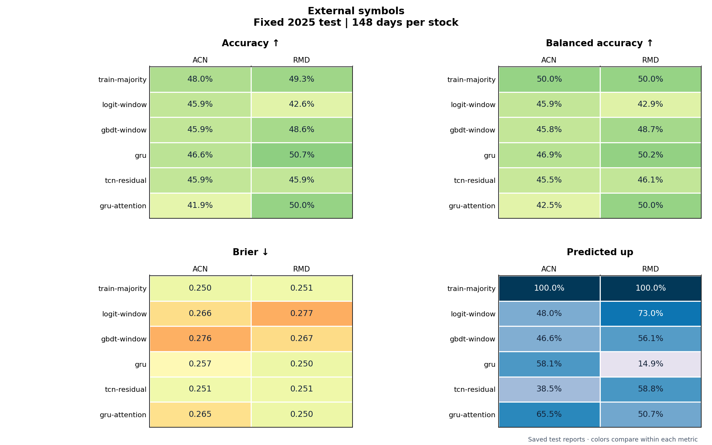

<details>
<summary>Show all external-check models and metrics</summary>

##### ACN · actual up 48.0%

Source: [metrics.csv](runs/external-symbol-check/acn/metrics.csv) · [predictions.csv](runs/external-symbol-check/acn/predictions.csv) · [confusion.csv](runs/external-symbol-check/acn/confusion.csv) · [calibration.csv](runs/external-symbol-check/acn/calibration.csv)

| Model | Val. acc | Correct / days | Balanced acc | Brier ↓ | Pred. up | TN / FP / FN / TP | Chart |
| --- | ---: | ---: | ---: | ---: | ---: | ---: | --- |
| `train-majority` | 51.7% | 71/148 (48.0%) | 50.0% | 0.2501 | 100.0% | 0 / 77 / 0 / 71 | [View](runs/external-symbol-check/acn/diagnostics/models/train-majority.png) |
| `logit-window` | 53.1% | 68/148 (45.9%) | 45.9% | 0.2663 | 48.0% | 37 / 40 / 40 / 31 | [View](runs/external-symbol-check/acn/diagnostics/models/logit-window.png) |
| `gbdt-window` | 57.8% | 68/148 (45.9%) | 45.8% | 0.2762 | 46.6% | 38 / 39 / 41 / 30 | [View](runs/external-symbol-check/acn/diagnostics/models/gbdt-window.png) |
| `gru` | 53.7% | 69/148 (46.6%) | 46.9% | 0.2568 | 58.1% | 30 / 47 / 32 / 39 | [View](runs/external-symbol-check/acn/diagnostics/models/gru.png) |
| `tcn-residual` | 48.3% | 68/148 (45.9%) | 45.5% | 0.2508 | 38.5% | 44 / 33 / 47 / 24 | [View](runs/external-symbol-check/acn/diagnostics/models/tcn-residual.png) |
| `gru-attention` | 57.1% | 62/148 (41.9%) | 42.5% | 0.2654 | 65.5% | 21 / 56 / 30 / 41 | [View](runs/external-symbol-check/acn/diagnostics/models/gru-attention.png) |

##### RMD · actual up 49.3%

Source: [metrics.csv](runs/external-symbol-check/rmd/metrics.csv) · [predictions.csv](runs/external-symbol-check/rmd/predictions.csv) · [confusion.csv](runs/external-symbol-check/rmd/confusion.csv) · [calibration.csv](runs/external-symbol-check/rmd/calibration.csv)

| Model | Val. acc | Correct / days | Balanced acc | Brier ↓ | Pred. up | TN / FP / FN / TP | Chart |
| --- | ---: | ---: | ---: | ---: | ---: | ---: | --- |
| `train-majority` | 49.0% | 73/148 (49.3%) | 50.0% | 0.2509 | 100.0% | 0 / 75 / 0 / 73 | [View](runs/external-symbol-check/rmd/diagnostics/models/train-majority.png) |
| `logit-window` | 50.3% | 63/148 (42.6%) | 42.9% | 0.2766 | 73.0% | 15 / 60 / 25 / 48 | [View](runs/external-symbol-check/rmd/diagnostics/models/logit-window.png) |
| `gbdt-window` | 46.9% | 72/148 (48.6%) | 48.7% | 0.2668 | 56.1% | 32 / 43 / 33 / 40 | [View](runs/external-symbol-check/rmd/diagnostics/models/gbdt-window.png) |
| `gru` | 50.3% | 75/148 (50.7%) | 50.2% | 0.2499 | 14.9% | 64 / 11 / 62 / 11 | [View](runs/external-symbol-check/rmd/diagnostics/models/gru.png) |
| `tcn-residual` | 45.6% | 68/148 (45.9%) | 46.1% | 0.2505 | 58.8% | 28 / 47 / 33 / 40 | [View](runs/external-symbol-check/rmd/diagnostics/models/tcn-residual.png) |
| `gru-attention` | 51.7% | 74/148 (50.0%) | 50.0% | 0.2500 | 50.7% | 37 / 38 / 36 / 37 | [View](runs/external-symbol-check/rmd/diagnostics/models/gru-attention.png) |


</details>

#### Archived next-close price task

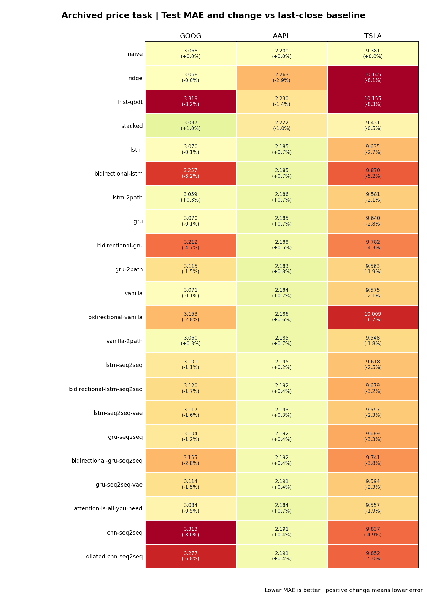

The chart shows all 18 networks and four baselines on the separate next-close price task. GOOG/AAPL/TSLA last-close baselines are 3.068/2.200/9.381 MAE. Sources: [GOOG](runs/goog-all/metrics.csv) · [AAPL](runs/aapl-all/metrics.csv) · [TSLA](runs/tsla-all/metrics.csv).

<details>
<summary>Show all 66 archived price-model test rows</summary>

| Stock | Model | Selected on validation | Val. MAE | Test MAE | RMSE | MAPE | vs last-close MAE |
| --- | --- | --- | ---: | ---: | ---: | ---: | ---: |
| GOOG | `naive` | No | 2.954 | 3.068 | 4.344 | 1.27% | +0.00% |
| GOOG | `ridge` | No | 2.968 | 3.068 | 4.414 | 1.27% | -0.01% |
| GOOG | `hist-gbdt` | No | 2.936 | 3.319 | 4.706 | 1.36% | -8.17% |
| GOOG | `stacked` | No | 2.970 | 3.037 | 4.306 | 1.25% | +0.99% |
| GOOG | `lstm` | No | 2.950 | 3.070 | 4.354 | 1.27% | -0.06% |
| GOOG | `bidirectional-lstm` | No | 2.930 | 3.257 | 4.617 | 1.34% | -6.15% |
| GOOG | `lstm-2path` | No | 2.954 | 3.059 | 4.336 | 1.26% | +0.30% |
| GOOG | `gru` | No | 2.949 | 3.070 | 4.353 | 1.27% | -0.07% |
| GOOG | `bidirectional-gru` | Yes | 2.928 | 3.212 | 4.558 | 1.32% | -4.71% |
| GOOG | `gru-2path` | No | 2.944 | 3.115 | 4.428 | 1.29% | -1.54% |
| GOOG | `vanilla` | No | 2.949 | 3.071 | 4.354 | 1.27% | -0.11% |
| GOOG | `bidirectional-vanilla` | No | 2.931 | 3.153 | 4.481 | 1.30% | -2.76% |
| GOOG | `vanilla-2path` | No | 2.953 | 3.060 | 4.335 | 1.26% | +0.26% |
| GOOG | `lstm-seq2seq` | No | 2.947 | 3.101 | 4.404 | 1.28% | -1.09% |
| GOOG | `bidirectional-lstm-seq2seq` | No | 2.945 | 3.120 | 4.438 | 1.29% | -1.70% |
| GOOG | `lstm-seq2seq-vae` | No | 2.946 | 3.117 | 4.430 | 1.29% | -1.61% |
| GOOG | `gru-seq2seq` | No | 2.947 | 3.104 | 4.411 | 1.28% | -1.18% |
| GOOG | `bidirectional-gru-seq2seq` | No | 2.939 | 3.155 | 4.485 | 1.30% | -2.83% |
| GOOG | `gru-seq2seq-vae` | No | 2.948 | 3.114 | 4.421 | 1.29% | -1.50% |
| GOOG | `attention-is-all-you-need` | No | 2.942 | 3.084 | 4.374 | 1.27% | -0.52% |
| GOOG | `cnn-seq2seq` | No | 2.942 | 3.313 | 4.683 | 1.35% | -7.99% |
| GOOG | `dilated-cnn-seq2seq` | No | 2.944 | 3.277 | 4.635 | 1.34% | -6.81% |
| AAPL | `naive` | No | 3.240 | 2.200 | 3.113 | 0.93% | +0.00% |
| AAPL | `ridge` | No | 3.273 | 2.263 | 3.152 | 0.95% | -2.87% |
| AAPL | `hist-gbdt` | No | 3.335 | 2.230 | 3.161 | 0.94% | -1.36% |
| AAPL | `stacked` | No | 3.238 | 2.222 | 3.109 | 0.94% | -1.02% |
| AAPL | `lstm` | No | 3.235 | 2.185 | 3.089 | 0.92% | +0.68% |
| AAPL | `bidirectional-lstm` | Yes | 3.229 | 2.185 | 3.090 | 0.92% | +0.70% |
| AAPL | `lstm-2path` | No | 3.234 | 2.186 | 3.088 | 0.92% | +0.66% |
| AAPL | `gru` | No | 3.234 | 2.185 | 3.091 | 0.92% | +0.67% |
| AAPL | `bidirectional-gru` | No | 3.234 | 2.188 | 3.096 | 0.92% | +0.53% |
| AAPL | `gru-2path` | No | 3.235 | 2.183 | 3.081 | 0.92% | +0.79% |
| AAPL | `vanilla` | No | 3.233 | 2.184 | 3.088 | 0.92% | +0.72% |
| AAPL | `bidirectional-vanilla` | No | 3.235 | 2.186 | 3.092 | 0.92% | +0.63% |
| AAPL | `vanilla-2path` | No | 3.235 | 2.185 | 3.089 | 0.92% | +0.67% |
| AAPL | `lstm-seq2seq` | No | 3.238 | 2.195 | 3.107 | 0.92% | +0.24% |
| AAPL | `bidirectional-lstm-seq2seq` | No | 3.237 | 2.192 | 3.103 | 0.92% | +0.35% |
| AAPL | `lstm-seq2seq-vae` | No | 3.237 | 2.193 | 3.104 | 0.92% | +0.33% |
| AAPL | `gru-seq2seq` | No | 3.237 | 2.192 | 3.102 | 0.92% | +0.37% |
| AAPL | `bidirectional-gru-seq2seq` | No | 3.237 | 2.192 | 3.102 | 0.92% | +0.38% |
| AAPL | `gru-seq2seq-vae` | No | 3.237 | 2.191 | 3.100 | 0.92% | +0.43% |
| AAPL | `attention-is-all-you-need` | No | 3.236 | 2.184 | 3.085 | 0.92% | +0.71% |
| AAPL | `cnn-seq2seq` | No | 3.238 | 2.191 | 3.101 | 0.92% | +0.40% |
| AAPL | `dilated-cnn-seq2seq` | No | 3.238 | 2.191 | 3.101 | 0.92% | +0.39% |
| TSLA | `naive` | No | 11.426 | 9.381 | 12.163 | 2.46% | +0.00% |
| TSLA | `ridge` | No | 11.570 | 10.145 | 13.073 | 2.64% | -8.15% |
| TSLA | `hist-gbdt` | No | 11.437 | 10.155 | 12.962 | 2.66% | -8.25% |
| TSLA | `stacked` | No | 11.447 | 9.431 | 12.229 | 2.47% | -0.53% |
| TSLA | `lstm` | No | 11.343 | 9.635 | 12.450 | 2.51% | -2.71% |
| TSLA | `bidirectional-lstm` | Yes | 11.297 | 9.870 | 12.766 | 2.57% | -5.21% |
| TSLA | `lstm-2path` | No | 11.353 | 9.581 | 12.380 | 2.50% | -2.13% |
| TSLA | `gru` | No | 11.352 | 9.640 | 12.449 | 2.51% | -2.77% |
| TSLA | `bidirectional-gru` | No | 11.320 | 9.782 | 12.652 | 2.55% | -4.28% |
| TSLA | `gru-2path` | No | 11.349 | 9.563 | 12.359 | 2.50% | -1.94% |
| TSLA | `vanilla` | No | 11.356 | 9.575 | 12.365 | 2.50% | -2.07% |
| TSLA | `bidirectional-vanilla` | No | 11.303 | 10.009 | 12.914 | 2.60% | -6.69% |
| TSLA | `vanilla-2path` | No | 11.352 | 9.548 | 12.335 | 2.49% | -1.78% |
| TSLA | `lstm-seq2seq` | No | 11.340 | 9.618 | 12.433 | 2.51% | -2.53% |
| TSLA | `bidirectional-lstm-seq2seq` | No | 11.337 | 9.679 | 12.512 | 2.52% | -3.17% |
| TSLA | `lstm-seq2seq-vae` | No | 11.351 | 9.597 | 12.400 | 2.50% | -2.30% |
| TSLA | `gru-seq2seq` | No | 11.341 | 9.689 | 12.527 | 2.52% | -3.28% |
| TSLA | `bidirectional-gru-seq2seq` | No | 11.343 | 9.741 | 12.592 | 2.54% | -3.84% |
| TSLA | `gru-seq2seq-vae` | No | 11.350 | 9.594 | 12.397 | 2.50% | -2.27% |
| TSLA | `attention-is-all-you-need` | No | 11.369 | 9.557 | 12.334 | 2.50% | -1.87% |
| TSLA | `cnn-seq2seq` | No | 11.333 | 9.837 | 12.726 | 2.56% | -4.86% |
| TSLA | `dilated-cnn-seq2seq` | No | 11.336 | 9.852 | 12.742 | 2.56% | -5.02% |

</details>

#### GRU feature/window/seed ablation

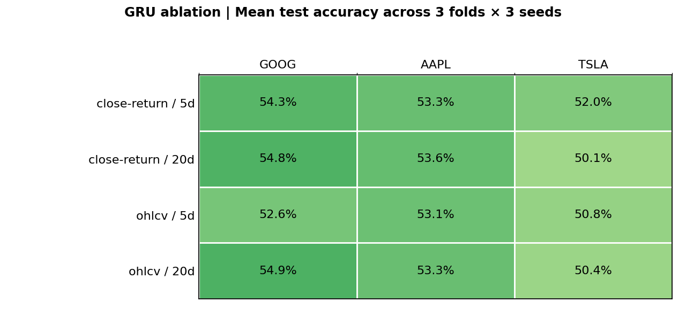

Means are descriptive: the folds and seeds reuse historical periods. Source: [metrics.csv](runs/ablation-study/gru/metrics.csv).

<details>
<summary>Show all 108 GRU ablation rows</summary>

| Stock | Fold | Features | Window | Seed | Val. acc | Test correct | Brier ↓ | Pred. up | Baseline correct |
| --- | ---: | --- | ---: | ---: | ---: | ---: | ---: | ---: | ---: |
| GOOG | 1 | `close-return` | 5 | 42 | 60.0% | 52/100 (52.0%) | 0.2494 | 99.0% | 51/100 |
| GOOG | 1 | `close-return` | 5 | 123 | 60.0% | 51/100 (51.0%) | 0.2503 | 100.0% | 51/100 |
| GOOG | 1 | `close-return` | 5 | 2026 | 60.0% | 53/100 (53.0%) | 0.2475 | 76.0% | 51/100 |
| GOOG | 1 | `close-return` | 20 | 42 | 60.0% | 52/100 (52.0%) | 0.2494 | 99.0% | 51/100 |
| GOOG | 1 | `close-return` | 20 | 123 | 60.0% | 51/100 (51.0%) | 0.2502 | 100.0% | 51/100 |
| GOOG | 1 | `close-return` | 20 | 2026 | 61.0% | 56/100 (56.0%) | 0.2474 | 77.0% | 51/100 |
| GOOG | 1 | `ohlcv` | 5 | 42 | 56.0% | 49/100 (49.0%) | 0.2616 | 56.0% | 51/100 |
| GOOG | 1 | `ohlcv` | 5 | 123 | 61.0% | 47/100 (47.0%) | 0.2595 | 58.0% | 51/100 |
| GOOG | 1 | `ohlcv` | 5 | 2026 | 51.0% | 49/100 (49.0%) | 0.2643 | 60.0% | 51/100 |
| GOOG | 1 | `ohlcv` | 20 | 42 | 61.0% | 54/100 (54.0%) | 0.2565 | 61.0% | 51/100 |
| GOOG | 1 | `ohlcv` | 20 | 123 | 61.0% | 51/100 (51.0%) | 0.2554 | 64.0% | 51/100 |
| GOOG | 1 | `ohlcv` | 20 | 2026 | 57.0% | 51/100 (51.0%) | 0.2621 | 64.0% | 51/100 |
| GOOG | 2 | `close-return` | 5 | 42 | 61.0% | 56/100 (56.0%) | 0.2414 | 58.0% | 56/100 |
| GOOG | 2 | `close-return` | 5 | 123 | 56.0% | 62/100 (62.0%) | 0.2414 | 72.0% | 56/100 |
| GOOG | 2 | `close-return` | 5 | 2026 | 60.0% | 60/100 (60.0%) | 0.2410 | 58.0% | 56/100 |
| GOOG | 2 | `close-return` | 20 | 42 | 60.0% | 57/100 (57.0%) | 0.2417 | 57.0% | 56/100 |
| GOOG | 2 | `close-return` | 20 | 123 | 59.0% | 63/100 (63.0%) | 0.2423 | 69.0% | 56/100 |
| GOOG | 2 | `close-return` | 20 | 2026 | 61.0% | 62/100 (62.0%) | 0.2421 | 64.0% | 56/100 |
| GOOG | 2 | `ohlcv` | 5 | 42 | 51.0% | 56/100 (56.0%) | 0.2465 | 98.0% | 56/100 |
| GOOG | 2 | `ohlcv` | 5 | 123 | 55.0% | 57/100 (57.0%) | 0.2472 | 85.0% | 56/100 |
| GOOG | 2 | `ohlcv` | 5 | 2026 | 52.0% | 56/100 (56.0%) | 0.2477 | 100.0% | 56/100 |
| GOOG | 2 | `ohlcv` | 20 | 42 | 50.0% | 56/100 (56.0%) | 0.2465 | 98.0% | 56/100 |
| GOOG | 2 | `ohlcv` | 20 | 123 | 56.0% | 58/100 (58.0%) | 0.2472 | 86.0% | 56/100 |
| GOOG | 2 | `ohlcv` | 20 | 2026 | 52.0% | 56/100 (56.0%) | 0.2475 | 100.0% | 56/100 |
| GOOG | 3 | `close-return` | 5 | 42 | 60.0% | 54/100 (54.0%) | 0.2470 | 69.0% | 55/100 |
| GOOG | 3 | `close-return` | 5 | 123 | 66.0% | 49/100 (49.0%) | 0.2504 | 68.0% | 55/100 |
| GOOG | 3 | `close-return` | 5 | 2026 | 62.0% | 52/100 (52.0%) | 0.2487 | 61.0% | 55/100 |
| GOOG | 3 | `close-return` | 20 | 42 | 63.0% | 52/100 (52.0%) | 0.2466 | 71.0% | 55/100 |
| GOOG | 3 | `close-return` | 20 | 123 | 64.0% | 49/100 (49.0%) | 0.2503 | 64.0% | 55/100 |
| GOOG | 3 | `close-return` | 20 | 2026 | 64.0% | 51/100 (51.0%) | 0.2474 | 68.0% | 55/100 |
| GOOG | 3 | `ohlcv` | 5 | 42 | 59.0% | 56/100 (56.0%) | 0.2455 | 75.0% | 55/100 |
| GOOG | 3 | `ohlcv` | 5 | 123 | 63.0% | 50/100 (50.0%) | 0.2566 | 75.0% | 55/100 |
| GOOG | 3 | `ohlcv` | 5 | 2026 | 62.0% | 53/100 (53.0%) | 0.2539 | 70.0% | 55/100 |
| GOOG | 3 | `ohlcv` | 20 | 42 | 62.0% | 57/100 (57.0%) | 0.2458 | 74.0% | 55/100 |
| GOOG | 3 | `ohlcv` | 20 | 123 | 64.0% | 56/100 (56.0%) | 0.2467 | 83.0% | 55/100 |
| GOOG | 3 | `ohlcv` | 20 | 2026 | 67.0% | 55/100 (55.0%) | 0.2534 | 72.0% | 55/100 |
| AAPL | 1 | `close-return` | 5 | 42 | 62.0% | 51/100 (51.0%) | 0.2499 | 99.0% | 52/100 |
| AAPL | 1 | `close-return` | 5 | 123 | 64.0% | 52/100 (52.0%) | 0.2496 | 100.0% | 52/100 |
| AAPL | 1 | `close-return` | 5 | 2026 | 63.0% | 51/100 (51.0%) | 0.2502 | 99.0% | 52/100 |
| AAPL | 1 | `close-return` | 20 | 42 | 62.0% | 52/100 (52.0%) | 0.2499 | 100.0% | 52/100 |
| AAPL | 1 | `close-return` | 20 | 123 | 64.0% | 52/100 (52.0%) | 0.2497 | 100.0% | 52/100 |
| AAPL | 1 | `close-return` | 20 | 2026 | 63.0% | 51/100 (51.0%) | 0.2502 | 99.0% | 52/100 |
| AAPL | 1 | `ohlcv` | 5 | 42 | 64.0% | 52/100 (52.0%) | 0.2499 | 100.0% | 52/100 |
| AAPL | 1 | `ohlcv` | 5 | 123 | 50.0% | 51/100 (51.0%) | 0.2475 | 77.0% | 52/100 |
| AAPL | 1 | `ohlcv` | 5 | 2026 | 50.0% | 57/100 (57.0%) | 0.2481 | 79.0% | 52/100 |
| AAPL | 1 | `ohlcv` | 20 | 42 | 64.0% | 52/100 (52.0%) | 0.2499 | 100.0% | 52/100 |
| AAPL | 1 | `ohlcv` | 20 | 123 | 62.0% | 54/100 (54.0%) | 0.2498 | 96.0% | 52/100 |
| AAPL | 1 | `ohlcv` | 20 | 2026 | 53.0% | 57/100 (57.0%) | 0.2480 | 79.0% | 52/100 |
| AAPL | 2 | `close-return` | 5 | 42 | 52.0% | 56/100 (56.0%) | 0.2488 | 100.0% | 56/100 |
| AAPL | 2 | `close-return` | 5 | 123 | 52.0% | 56/100 (56.0%) | 0.2488 | 100.0% | 56/100 |
| AAPL | 2 | `close-return` | 5 | 2026 | 52.0% | 56/100 (56.0%) | 0.2476 | 100.0% | 56/100 |
| AAPL | 2 | `close-return` | 20 | 42 | 52.0% | 56/100 (56.0%) | 0.2489 | 100.0% | 56/100 |
| AAPL | 2 | `close-return` | 20 | 123 | 52.0% | 56/100 (56.0%) | 0.2488 | 100.0% | 56/100 |
| AAPL | 2 | `close-return` | 20 | 2026 | 52.0% | 56/100 (56.0%) | 0.2476 | 100.0% | 56/100 |
| AAPL | 2 | `ohlcv` | 5 | 42 | 52.0% | 55/100 (55.0%) | 0.2489 | 99.0% | 56/100 |
| AAPL | 2 | `ohlcv` | 5 | 123 | 53.0% | 54/100 (54.0%) | 0.2521 | 82.0% | 56/100 |
| AAPL | 2 | `ohlcv` | 5 | 2026 | 54.0% | 55/100 (55.0%) | 0.2477 | 89.0% | 56/100 |
| AAPL | 2 | `ohlcv` | 20 | 42 | 52.0% | 56/100 (56.0%) | 0.2486 | 100.0% | 56/100 |
| AAPL | 2 | `ohlcv` | 20 | 123 | 54.0% | 54/100 (54.0%) | 0.2519 | 82.0% | 56/100 |
| AAPL | 2 | `ohlcv` | 20 | 2026 | 53.0% | 54/100 (54.0%) | 0.2477 | 88.0% | 56/100 |
| AAPL | 3 | `close-return` | 5 | 42 | 56.0% | 53/100 (53.0%) | 0.2489 | 100.0% | 53/100 |
| AAPL | 3 | `close-return` | 5 | 123 | 58.0% | 52/100 (52.0%) | 0.2493 | 99.0% | 53/100 |
| AAPL | 3 | `close-return` | 5 | 2026 | 56.0% | 53/100 (53.0%) | 0.2492 | 100.0% | 53/100 |
| AAPL | 3 | `close-return` | 20 | 42 | 56.0% | 53/100 (53.0%) | 0.2489 | 100.0% | 53/100 |
| AAPL | 3 | `close-return` | 20 | 123 | 56.0% | 53/100 (53.0%) | 0.2493 | 100.0% | 53/100 |
| AAPL | 3 | `close-return` | 20 | 2026 | 56.0% | 53/100 (53.0%) | 0.2492 | 100.0% | 53/100 |
| AAPL | 3 | `ohlcv` | 5 | 42 | 55.0% | 50/100 (50.0%) | 0.2505 | 95.0% | 53/100 |
| AAPL | 3 | `ohlcv` | 5 | 123 | 55.0% | 50/100 (50.0%) | 0.2502 | 95.0% | 53/100 |
| AAPL | 3 | `ohlcv` | 5 | 2026 | 58.0% | 54/100 (54.0%) | 0.2506 | 89.0% | 53/100 |
| AAPL | 3 | `ohlcv` | 20 | 42 | 55.0% | 49/100 (49.0%) | 0.2505 | 96.0% | 53/100 |
| AAPL | 3 | `ohlcv` | 20 | 123 | 55.0% | 50/100 (50.0%) | 0.2502 | 95.0% | 53/100 |
| AAPL | 3 | `ohlcv` | 20 | 2026 | 57.0% | 54/100 (54.0%) | 0.2508 | 89.0% | 53/100 |
| TSLA | 1 | `close-return` | 5 | 42 | 53.0% | 48/100 (48.0%) | 0.2526 | 85.0% | 43/100 |
| TSLA | 1 | `close-return` | 5 | 123 | 52.0% | 52/100 (52.0%) | 0.2501 | 73.0% | 43/100 |
| TSLA | 1 | `close-return` | 5 | 2026 | 56.0% | 43/100 (43.0%) | 0.2529 | 100.0% | 43/100 |
| TSLA | 1 | `close-return` | 20 | 42 | 55.0% | 44/100 (44.0%) | 0.2528 | 87.0% | 43/100 |
| TSLA | 1 | `close-return` | 20 | 123 | 52.0% | 45/100 (45.0%) | 0.2505 | 78.0% | 43/100 |
| TSLA | 1 | `close-return` | 20 | 2026 | 56.0% | 43/100 (43.0%) | 0.2529 | 100.0% | 43/100 |
| TSLA | 1 | `ohlcv` | 5 | 42 | 50.0% | 53/100 (53.0%) | 0.2490 | 54.0% | 43/100 |
| TSLA | 1 | `ohlcv` | 5 | 123 | 54.0% | 56/100 (56.0%) | 0.2472 | 45.0% | 43/100 |
| TSLA | 1 | `ohlcv` | 5 | 2026 | 56.0% | 45/100 (45.0%) | 0.2508 | 82.0% | 43/100 |
| TSLA | 1 | `ohlcv` | 20 | 42 | 53.0% | 52/100 (52.0%) | 0.2494 | 55.0% | 43/100 |
| TSLA | 1 | `ohlcv` | 20 | 123 | 55.0% | 53/100 (53.0%) | 0.2476 | 44.0% | 43/100 |
| TSLA | 1 | `ohlcv` | 20 | 2026 | 52.0% | 50/100 (50.0%) | 0.2548 | 57.0% | 43/100 |
| TSLA | 2 | `close-return` | 5 | 42 | 42.0% | 55/100 (55.0%) | 0.2499 | 99.0% | 54/100 |
| TSLA | 2 | `close-return` | 5 | 123 | 54.0% | 50/100 (50.0%) | 0.2501 | 18.0% | 54/100 |
| TSLA | 2 | `close-return` | 5 | 2026 | 43.0% | 54/100 (54.0%) | 0.2497 | 100.0% | 54/100 |
| TSLA | 2 | `close-return` | 20 | 42 | 43.0% | 54/100 (54.0%) | 0.2499 | 100.0% | 54/100 |
| TSLA | 2 | `close-return` | 20 | 123 | 55.0% | 49/100 (49.0%) | 0.2501 | 19.0% | 54/100 |
| TSLA | 2 | `close-return` | 20 | 2026 | 43.0% | 54/100 (54.0%) | 0.2497 | 100.0% | 54/100 |
| TSLA | 2 | `ohlcv` | 5 | 42 | 58.0% | 47/100 (47.0%) | 0.2760 | 45.0% | 54/100 |
| TSLA | 2 | `ohlcv` | 5 | 123 | 53.0% | 54/100 (54.0%) | 0.2529 | 54.0% | 54/100 |
| TSLA | 2 | `ohlcv` | 5 | 2026 | 52.0% | 51/100 (51.0%) | 0.2551 | 61.0% | 54/100 |
| TSLA | 2 | `ohlcv` | 20 | 42 | 59.0% | 52/100 (52.0%) | 0.2701 | 56.0% | 54/100 |
| TSLA | 2 | `ohlcv` | 20 | 123 | 53.0% | 47/100 (47.0%) | 0.2720 | 51.0% | 54/100 |
| TSLA | 2 | `ohlcv` | 20 | 2026 | 57.0% | 51/100 (51.0%) | 0.2752 | 49.0% | 54/100 |
| TSLA | 3 | `close-return` | 5 | 42 | 45.0% | 58/100 (58.0%) | 0.2472 | 44.0% | 54/100 |
| TSLA | 3 | `close-return` | 5 | 123 | 54.0% | 54/100 (54.0%) | 0.2496 | 100.0% | 54/100 |
| TSLA | 3 | `close-return` | 5 | 2026 | 54.0% | 54/100 (54.0%) | 0.2495 | 100.0% | 54/100 |
| TSLA | 3 | `close-return` | 20 | 42 | 54.0% | 54/100 (54.0%) | 0.2499 | 100.0% | 54/100 |
| TSLA | 3 | `close-return` | 20 | 123 | 54.0% | 54/100 (54.0%) | 0.2496 | 100.0% | 54/100 |
| TSLA | 3 | `close-return` | 20 | 2026 | 54.0% | 54/100 (54.0%) | 0.2495 | 100.0% | 54/100 |
| TSLA | 3 | `ohlcv` | 5 | 42 | 50.0% | 41/100 (41.0%) | 0.2503 | 15.0% | 54/100 |
| TSLA | 3 | `ohlcv` | 5 | 123 | 52.0% | 51/100 (51.0%) | 0.2497 | 41.0% | 54/100 |
| TSLA | 3 | `ohlcv` | 5 | 2026 | 56.0% | 59/100 (59.0%) | 0.2496 | 81.0% | 54/100 |
| TSLA | 3 | `ohlcv` | 20 | 42 | 51.0% | 40/100 (40.0%) | 0.2502 | 14.0% | 54/100 |
| TSLA | 3 | `ohlcv` | 20 | 123 | 51.0% | 48/100 (48.0%) | 0.2497 | 44.0% | 54/100 |
| TSLA | 3 | `ohlcv` | 20 | 2026 | 55.0% | 61/100 (61.0%) | 0.2495 | 83.0% | 54/100 |

</details>

#### Earlier auxiliary experiments

These are separate historical tasks. The first converts **price forecasts** to up/down decisions, so it has no forecast probability or Brier score. The other two use earlier feature/model rules; their scores do not belong in the current 28-network ranking.

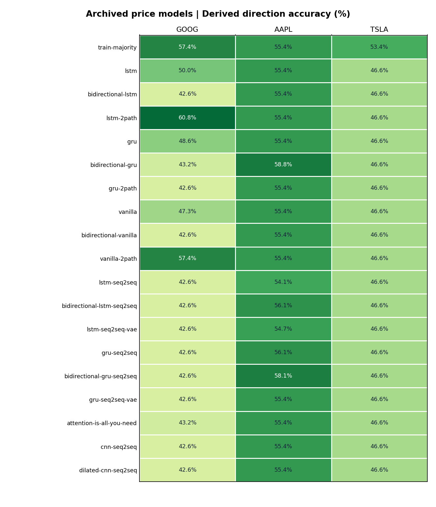

Source: [neural-direction-comparison.csv](runs/neural-direction-comparison.csv).

<details>
<summary>Show all 57 price-derived direction rows</summary>

| Stock | Model | Val. acc | Correct / days | Balanced acc | Pred. up |
| --- | --- | ---: | ---: | ---: | ---: |
| GOOG | `train-majority` | 49.7% | 85/148 (57.4%) | 50.0% | 100.0% |
| GOOG | `lstm` | 53.1% | 74/148 (50.0%) | 53.6% | 26.4% |
| GOOG | `bidirectional-lstm` | 52.4% | 63/148 (42.6%) | 50.0% | 0.0% |
| GOOG | `lstm-2path` | 49.7% | 90/148 (60.8%) | 56.0% | 83.1% |
| GOOG | `gru` | 50.3% | 72/148 (48.6%) | 52.6% | 23.6% |
| GOOG | `bidirectional-gru` | 53.7% | 64/148 (43.2%) | 50.6% | 0.7% |
| GOOG | `gru-2path` | 53.1% | 63/148 (42.6%) | 50.0% | 0.0% |
| GOOG | `vanilla` | 53.7% | 70/148 (47.3%) | 51.4% | 22.3% |
| GOOG | `bidirectional-vanilla` | 54.4% | 63/148 (42.6%) | 50.0% | 0.0% |
| GOOG | `vanilla-2path` | 49.7% | 85/148 (57.4%) | 50.0% | 100.0% |
| GOOG | `lstm-seq2seq` | 53.1% | 63/148 (42.6%) | 50.0% | 0.0% |
| GOOG | `bidirectional-lstm-seq2seq` | 53.7% | 63/148 (42.6%) | 50.0% | 0.0% |
| GOOG | `lstm-seq2seq-vae` | 51.7% | 63/148 (42.6%) | 50.0% | 0.0% |
| GOOG | `gru-seq2seq` | 51.7% | 63/148 (42.6%) | 50.0% | 0.0% |
| GOOG | `bidirectional-gru-seq2seq` | 50.3% | 63/148 (42.6%) | 50.0% | 0.0% |
| GOOG | `gru-seq2seq-vae` | 50.3% | 63/148 (42.6%) | 50.0% | 0.0% |
| GOOG | `attention-is-all-you-need` | 51.0% | 64/148 (43.2%) | 50.4% | 2.0% |
| GOOG | `cnn-seq2seq` | 53.1% | 63/148 (42.6%) | 50.0% | 0.0% |
| GOOG | `dilated-cnn-seq2seq` | 53.7% | 63/148 (42.6%) | 50.0% | 0.0% |
| AAPL | `train-majority` | 52.4% | 82/148 (55.4%) | 50.0% | 100.0% |
| AAPL | `lstm` | 52.4% | 82/148 (55.4%) | 50.0% | 100.0% |
| AAPL | `bidirectional-lstm` | 52.4% | 82/148 (55.4%) | 50.0% | 100.0% |
| AAPL | `lstm-2path` | 52.4% | 82/148 (55.4%) | 50.0% | 100.0% |
| AAPL | `gru` | 52.4% | 82/148 (55.4%) | 50.0% | 100.0% |
| AAPL | `bidirectional-gru` | 52.4% | 87/148 (58.8%) | 54.1% | 93.9% |
| AAPL | `gru-2path` | 52.4% | 82/148 (55.4%) | 50.0% | 100.0% |
| AAPL | `vanilla` | 52.4% | 82/148 (55.4%) | 50.0% | 100.0% |
| AAPL | `bidirectional-vanilla` | 52.4% | 82/148 (55.4%) | 50.0% | 100.0% |
| AAPL | `vanilla-2path` | 52.4% | 82/148 (55.4%) | 50.0% | 100.0% |
| AAPL | `lstm-seq2seq` | 52.4% | 80/148 (54.1%) | 52.2% | 67.6% |
| AAPL | `bidirectional-lstm-seq2seq` | 52.4% | 83/148 (56.1%) | 50.8% | 99.3% |
| AAPL | `lstm-seq2seq-vae` | 52.4% | 81/148 (54.7%) | 52.6% | 69.6% |
| AAPL | `gru-seq2seq` | 52.4% | 83/148 (56.1%) | 51.6% | 91.2% |
| AAPL | `bidirectional-gru-seq2seq` | 52.4% | 86/148 (58.1%) | 53.5% | 93.2% |
| AAPL | `gru-seq2seq-vae` | 52.4% | 82/148 (55.4%) | 50.0% | 100.0% |
| AAPL | `attention-is-all-you-need` | 52.4% | 82/148 (55.4%) | 50.0% | 100.0% |
| AAPL | `cnn-seq2seq` | 52.4% | 82/148 (55.4%) | 50.0% | 100.0% |
| AAPL | `dilated-cnn-seq2seq` | 52.4% | 82/148 (55.4%) | 50.0% | 100.0% |
| TSLA | `train-majority` | 47.6% | 79/148 (53.4%) | 50.0% | 100.0% |
| TSLA | `lstm` | 56.5% | 69/148 (46.6%) | 50.0% | 0.0% |
| TSLA | `bidirectional-lstm` | 54.4% | 69/148 (46.6%) | 50.0% | 0.0% |
| TSLA | `lstm-2path` | 57.1% | 69/148 (46.6%) | 50.0% | 0.0% |
| TSLA | `gru` | 57.1% | 69/148 (46.6%) | 50.0% | 0.0% |
| TSLA | `bidirectional-gru` | 50.3% | 69/148 (46.6%) | 50.0% | 0.0% |
| TSLA | `gru-2path` | 53.7% | 69/148 (46.6%) | 50.0% | 0.0% |
| TSLA | `vanilla` | 54.4% | 69/148 (46.6%) | 50.0% | 0.0% |
| TSLA | `bidirectional-vanilla` | 49.0% | 69/148 (46.6%) | 50.0% | 0.0% |
| TSLA | `vanilla-2path` | 52.4% | 69/148 (46.6%) | 50.0% | 0.0% |
| TSLA | `lstm-seq2seq` | 55.1% | 69/148 (46.6%) | 50.0% | 0.0% |
| TSLA | `bidirectional-lstm-seq2seq` | 53.1% | 69/148 (46.6%) | 50.0% | 0.0% |
| TSLA | `lstm-seq2seq-vae` | 53.1% | 69/148 (46.6%) | 50.0% | 0.0% |
| TSLA | `gru-seq2seq` | 53.7% | 69/148 (46.6%) | 50.0% | 0.0% |
| TSLA | `bidirectional-gru-seq2seq` | 53.1% | 69/148 (46.6%) | 50.0% | 0.0% |
| TSLA | `gru-seq2seq-vae` | 52.4% | 69/148 (46.6%) | 50.0% | 0.0% |
| TSLA | `attention-is-all-you-need` | 49.7% | 69/148 (46.6%) | 50.0% | 0.0% |
| TSLA | `cnn-seq2seq` | 52.4% | 69/148 (46.6%) | 50.0% | 0.0% |
| TSLA | `dilated-cnn-seq2seq` | 52.4% | 69/148 (46.6%) | 50.0% | 0.0% |

</details>

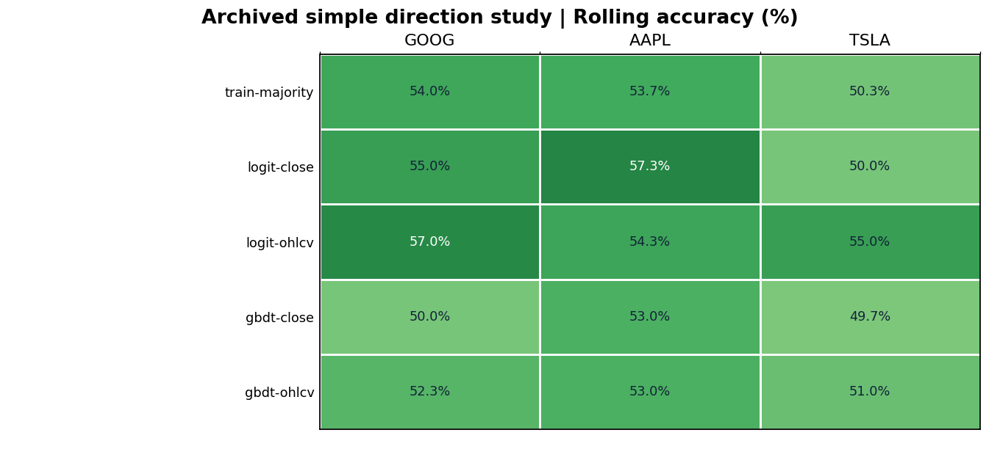

Sources: [GOOG](runs/direction-study/rolling/goog/rolling_metrics.csv) · [AAPL](runs/direction-study/rolling/aapl/rolling_metrics.csv) · [TSLA](runs/direction-study/rolling/tsla/rolling_metrics.csv).

<details>
<summary>Show all 15 earlier direction-study rows</summary>

| Stock | Model | Correct / days | Brier ↓ | Mean balanced acc |
| --- | --- | ---: | ---: | ---: |
| GOOG | `train-majority` | 162/300 (54.0%) | 0.2484 | 50.0% |
| GOOG | `logit-close` | 165/300 (55.0%) | 0.2464 | 54.1% |
| GOOG | `logit-ohlcv` | 171/300 (57.0%) | 0.2452 | 56.5% |
| GOOG | `gbdt-close` | 150/300 (50.0%) | 0.2597 | 49.8% |
| GOOG | `gbdt-ohlcv` | 157/300 (52.3%) | 0.2541 | 52.1% |
| AAPL | `train-majority` | 161/300 (53.7%) | 0.2487 | 50.0% |
| AAPL | `logit-close` | 172/300 (57.3%) | 0.2469 | 54.9% |
| AAPL | `logit-ohlcv` | 163/300 (54.3%) | 0.2499 | 52.1% |
| AAPL | `gbdt-close` | 159/300 (53.0%) | 0.2550 | 52.5% |
| AAPL | `gbdt-ohlcv` | 159/300 (53.0%) | 0.2550 | 52.7% |
| TSLA | `train-majority` | 151/300 (50.3%) | 0.2500 | 50.0% |
| TSLA | `logit-close` | 150/300 (50.0%) | 0.2516 | 49.8% |
| TSLA | `logit-ohlcv` | 165/300 (55.0%) | 0.2492 | 55.5% |
| TSLA | `gbdt-close` | 149/300 (49.7%) | 0.2612 | 50.3% |
| TSLA | `gbdt-ohlcv` | 153/300 (51.0%) | 0.2636 | 51.9% |

</details>

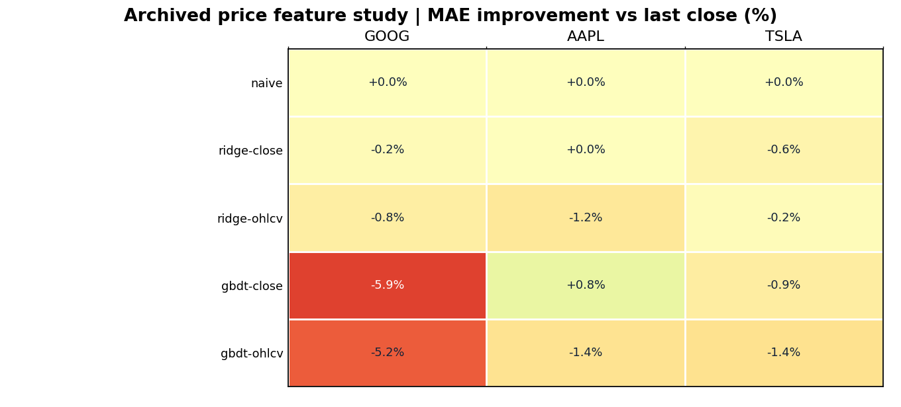

Sources: [GOOG](runs/feature-study/rolling/goog/rolling_metrics.csv) · [AAPL](runs/feature-study/rolling/aapl/rolling_metrics.csv) · [TSLA](runs/feature-study/rolling/tsla/rolling_metrics.csv).

<details>
<summary>Show all 15 earlier price-feature rows</summary>

| Stock | Model | Mean val. MAE | Mean test MAE | vs last-close | Folds beating baseline |
| --- | --- | ---: | ---: | ---: | ---: |
| GOOG | `naive` | 2.450 | 2.983 | +0.00% | 0/3 |
| GOOG | `ridge-close` | 2.401 | 2.990 | -0.24% | 2/3 |
| GOOG | `ridge-ohlcv` | 2.430 | 3.008 | -0.84% | 2/3 |
| GOOG | `gbdt-close` | 2.473 | 3.160 | -5.93% | 0/3 |
| GOOG | `gbdt-ohlcv` | 2.567 | 3.139 | -5.24% | 1/3 |
| AAPL | `naive` | 2.782 | 2.700 | +0.00% | 0/3 |
| AAPL | `ridge-close` | 2.775 | 2.699 | +0.04% | 2/3 |
| AAPL | `ridge-ohlcv` | 2.798 | 2.732 | -1.17% | 1/3 |
| AAPL | `gbdt-close` | 2.805 | 2.678 | +0.84% | 2/3 |
| AAPL | `gbdt-ohlcv` | 2.843 | 2.738 | -1.41% | 1/3 |
| TSLA | `naive` | 9.209 | 10.435 | +0.00% | 0/3 |
| TSLA | `ridge-close` | 9.244 | 10.493 | -0.55% | 1/3 |
| TSLA | `ridge-ohlcv` | 9.224 | 10.454 | -0.18% | 1/3 |
| TSLA | `gbdt-close` | 9.370 | 10.530 | -0.91% | 1/3 |
| TSLA | `gbdt-ohlcv` | 9.551 | 10.586 | -1.44% | 1/3 |

</details>

#### Earlier close-only price rolling study

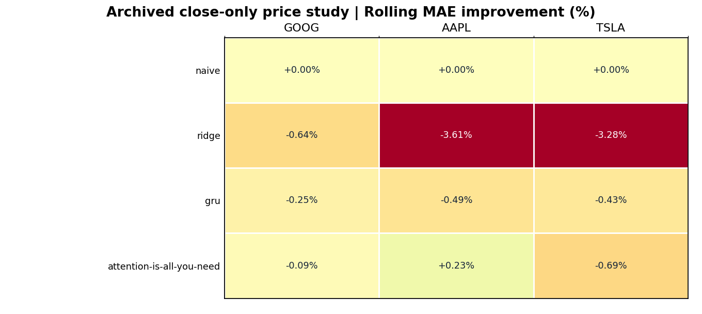

Positive values mean lower MAE than the last-close baseline. Sources: [GOOG](runs/rolling-goog/fold_metrics.csv) · [AAPL](runs/rolling-aapl/fold_metrics.csv) · [TSLA](runs/rolling-tsla/fold_metrics.csv).

<details>
<summary>Show all 12 rolling price aggregates and 36 fold rows</summary>

| Stock | Model | Mean val. MAE | Mean test MAE | Fold MAE std. | vs last-close |
| --- | --- | ---: | ---: | ---: | ---: |
| GOOG | `attention-is-all-you-need` | 2.415 | 2.985 | 0.438 | -0.09% |
| GOOG | `gru` | 2.424 | 2.990 | 0.440 | -0.25% |
| GOOG | `ridge` | 2.446 | 3.002 | 0.444 | -0.64% |
| GOOG | `naive` | 2.450 | 2.983 | 0.457 | +0.00% |
| AAPL | `attention-is-all-you-need` | 2.766 | 2.694 | 0.500 | +0.23% |
| AAPL | `naive` | 2.782 | 2.700 | 0.505 | +0.00% |
| AAPL | `gru` | 2.791 | 2.714 | 0.480 | -0.49% |
| AAPL | `ridge` | 2.829 | 2.798 | 0.494 | -3.61% |
| TSLA | `attention-is-all-you-need` | 9.144 | 10.507 | 1.258 | -0.69% |
| TSLA | `gru` | 9.164 | 10.480 | 1.271 | -0.43% |
| TSLA | `naive` | 9.209 | 10.435 | 1.389 | +0.00% |
| TSLA | `ridge` | 9.260 | 10.777 | 1.125 | -3.28% |

| Stock | Fold | Model | Val. MAE | Test MAE | RMSE | MAPE | vs last-close MAE |
| --- | ---: | --- | ---: | ---: | ---: | ---: | ---: |
| GOOG | 1 | `attention-is-all-you-need` | 1.847 | 2.817 | 3.716 | 1.54% | -1.16% |
| GOOG | 1 | `gru` | 1.852 | 2.812 | 3.711 | 1.53% | -0.97% |
| GOOG | 1 | `ridge` | 1.876 | 2.796 | 3.690 | 1.52% | -0.40% |
| GOOG | 1 | `naive` | 1.908 | 2.785 | 3.692 | 1.52% | +0.00% |
| GOOG | 2 | `gru` | 2.776 | 2.668 | 3.512 | 1.59% | -0.36% |
| GOOG | 2 | `ridge` | 2.779 | 2.698 | 3.546 | 1.61% | -1.49% |
| GOOG | 2 | `attention-is-all-you-need` | 2.782 | 2.656 | 3.503 | 1.58% | +0.08% |
| GOOG | 2 | `naive` | 2.785 | 2.658 | 3.507 | 1.59% | +0.00% |
| GOOG | 3 | `attention-is-all-you-need` | 2.617 | 3.483 | 4.910 | 1.29% | +0.65% |
| GOOG | 3 | `gru` | 2.643 | 3.491 | 4.921 | 1.30% | +0.40% |
| GOOG | 3 | `naive` | 2.658 | 3.506 | 4.958 | 1.30% | +0.00% |
| GOOG | 3 | `ridge` | 2.683 | 3.512 | 5.036 | 1.31% | -0.18% |
| AAPL | 1 | `attention-is-all-you-need` | 2.459 | 2.621 | 3.558 | 1.12% | -0.01% |
| AAPL | 1 | `naive` | 2.485 | 2.621 | 3.549 | 1.12% | +0.00% |
| AAPL | 1 | `gru` | 2.531 | 2.636 | 3.542 | 1.13% | -0.57% |
| AAPL | 1 | `ridge` | 2.630 | 2.781 | 3.609 | 1.18% | -6.12% |
| AAPL | 2 | `gru` | 2.619 | 3.228 | 5.210 | 1.59% | +0.38% |
| AAPL | 2 | `attention-is-all-you-need` | 2.620 | 3.227 | 5.209 | 1.59% | +0.41% |
| AAPL | 2 | `naive` | 2.621 | 3.240 | 5.210 | 1.60% | +0.00% |
| AAPL | 2 | `ridge` | 2.638 | 3.300 | 5.231 | 1.63% | -1.84% |
| AAPL | 3 | `ridge` | 3.218 | 2.312 | 3.193 | 0.91% | -3.21% |
| AAPL | 3 | `attention-is-all-you-need` | 3.220 | 2.235 | 3.109 | 0.88% | +0.23% |
| AAPL | 3 | `gru` | 3.224 | 2.277 | 3.194 | 0.90% | -1.67% |
| AAPL | 3 | `naive` | 3.240 | 2.240 | 3.143 | 0.88% | +0.00% |
| TSLA | 1 | `ridge` | 5.844 | 12.035 | 15.309 | 3.54% | -0.00% |
| TSLA | 1 | `attention-is-all-you-need` | 5.984 | 11.959 | 15.443 | 3.53% | +0.62% |
| TSLA | 1 | `gru` | 6.038 | 11.947 | 15.487 | 3.52% | +0.73% |
| TSLA | 1 | `naive` | 6.067 | 12.034 | 15.498 | 3.55% | +0.00% |
| TSLA | 2 | `attention-is-all-you-need` | 11.907 | 9.809 | 13.255 | 3.35% | -2.97% |
| TSLA | 2 | `gru` | 11.919 | 9.690 | 13.145 | 3.31% | -1.72% |
| TSLA | 2 | `naive` | 12.034 | 9.526 | 13.040 | 3.26% | +0.00% |
| TSLA | 2 | `ridge` | 12.099 | 9.868 | 13.356 | 3.38% | -3.59% |
| TSLA | 3 | `naive` | 9.526 | 9.745 | 12.152 | 2.31% | +0.00% |
| TSLA | 3 | `gru` | 9.534 | 9.804 | 12.212 | 2.33% | -0.60% |
| TSLA | 3 | `attention-is-all-you-need` | 9.542 | 9.754 | 12.158 | 2.32% | -0.09% |
| TSLA | 3 | `ridge` | 9.837 | 10.429 | 13.019 | 2.47% | -7.02% |

</details>

<!-- END GENERATED README RESULTS -->

### 2026 年旧实验归档摘要

在补充 CSV 删除前，还做过 184 个交易日（2026-01-02—2026-09-25）的旧版特征实验。它们与上面的 28 类网络实验不是同一批模型，也已经被查看过。公开仓库只记录汇总数字，不放入该段逐日价格与预测归档。

| 股票 | 价格任务：验证选中模型 MAE / 昨日价格 MAE | 旧版涨跌任务：正确天数 / 多数方向基线 | 旧版涨跌任务：Brier / 基线 Brier |
| --- | ---: | ---: | ---: |
| GOOG | 4.890 / 4.890 | 87/184 / 87/184 | 0.253 / 0.253 |
| AAPL | 3.531 / 3.541 | 95/184 / 98/184 | 0.251 / 0.249 |
| TSLA | 8.692 / 8.469 | 100/184 / 93/184 | 0.252 / 0.250 |

价格任务的 MAE 越低越好；AAPL 的改善约 0.26%，TSLA 所选模型比基线差约 2.63%。旧版涨跌任务的 TSLA 多对 7 天，但 Brier 概率误差仍略高于基线。详情和局限见[价格分析](docs/archive/ANALYSIS.md)与[方向结果](docs/archive/DIRECTION_RESULTS.md)。

**逐日记录与完整解释：**上方图表和可展开表格已展示全部网络的测试指标与滚动各折明细；[指标索引](docs/results/RESULTS_INDEX.md)另提供各组 `metrics.csv`、`predictions.csv`、`confusion.csv`、`calibration.csv` 的集中入口。价格任务解读见[价格网络比较](docs/archive/NEURAL_COMPARISON.md)与[价格分析](docs/archive/ANALYSIS.md)；GRU 特征/窗口/种子对照见[改进报告](docs/results/IMPROVEMENT_REPORT.md)。

### 结果图示例

图像同时显示混淆矩阵、预测上涨比例与概率校准。校准图中某概率区间的点表示：模型在这些日子平均报了多少上涨概率，实际有多少天上涨；样本少的区间不能过度解读。

| GOOG：主要候选与基线 | GOOG：注意力 GRU 单模型 |
| --- | --- |
|  |  |

| GOOG：现代结构 | RMD：外部股票检查 |
| --- | --- |
|  |  |

[全部结果图像目录](docs/results/RESULTS_GALLERY.md)可点击查看公开仓库中的每一张图，包括全部模型与滚动各折图；不需要重新训练即可阅读。

## 本地运行与复现

已在 Windows 的 Conda `pytorch` 环境验证：Python 3.11.9、PyTorch 2.6.0+cu118、NVIDIA GeForce RTX 4060 Laptop GPU（8 GB）。新机器可建立 Python 3.11 环境并安装[依赖清单](requirements.txt)；GPU 版 PyTorch 请按[官方安装说明](https://pytorch.org/get-started/locally/)选择与本机驱动匹配的版本。已有适用环境时，直接激活该环境即可。

```powershell
conda create -n stocklab python=3.11 -y
conda activate stocklab
pip install -r requirements.txt
python scripts/download_data.py
python scripts/download_data.py --tickers ACN RMD --output-dir data/external-check
python -m unittest discover -s tests -v
python -m scripts.verify_direction_reports
python -m scripts.verify_modern_direction
```

下载后先核对[冻结数据哈希](FUTURE_BASE_HASHES.json)及各报告 `summary.json` 中的来源哈希。验证脚本会检查逐日概率、正确天数、混淆矩阵、校准分箱、图像与来源文件；若来源历史数据变化，应保留旧报告并明确标记“当前数据无法精确复现”，不要直接覆盖旧结果。

只运行一只股票的模型示例：

```powershell
python -m stocklab.neural_direction --mode fixed-2025 --tickers GOOG
python -m stocklab.modern_direction --mode fixed-2025 --tickers GOOG
python -m stocklab.ablation_study
```

训练全部网络需要更久；原始权重文件不提交到仓库，已保存的指标、逐日预测和图像足以审阅历史测试。旧版收盘价预测可从 `python -m stocklab.cli list-models` 和 `python -m stocklab.cli compare --ticker GOOG` 入手。各命令的参数与完整实验解释见[20 类网络报告](docs/results/NEURAL_CLASSIFIERS.md)、[现代结构报告](docs/results/MODERN_DIRECTION_MODELS.md)和[结果索引](docs/results/RESULTS_INDEX.md)。

未来真正未见交易日的评测已按[冻结规则](FUTURE_EVAL_PROTOCOL.md)预先写定，并以[代码与数据哈希](FUTURE_CODE_HASHES.json)锁定。`python -m stocklab.prospective_check` 只检查是否已积累足够新交易日；条件满足后才按协议执行一次评测。这里不把已查看的 2025/2026 年成绩说成新证据。

## 项目结构与来源

| 路径 | 内容 |
| --- | --- |
| `stocklab/` | 数据处理、网络、训练、时间切分和评测。 |
| `scripts/`、`tests/` | 下载、报告核验、汇总与测试。 |
| `data/` | 来源记录与数据说明；股票 CSV 在本地下载，不随公开仓库分发。 |
| `runs/` | 已保存的指标、逐日预测、混淆矩阵、概率校准、图像和配置；权重文件不公开。 |
| `docs/results/` | [完整指标](docs/results/RESULTS_INDEX.md)、[全部图像](docs/results/RESULTS_GALLERY.md)与当前模型报告。 |
| `docs/archive/` | 较早的价格预测、方向换算和 2026 年回顾性分析。 |
| `docs/methods/` | [外部股票检查规则](docs/methods/EXTERNAL_CHECK_PROTOCOL.md)和[后续计划](docs/methods/ROADMAP.md)。 |
| 根目录的三个技术说明 | [数据口径](DATA_PROVENANCE.md)、[未来评测规则](FUTURE_EVAL_PROTOCOL.md)、[冻结记录](FUTURE_FREEZE_CHANGELOG.md)；它们的路径与内容由哈希清单固定。 |

本项目从 [huseinzol05/Stock-Prediction-Models](https://github.com/huseinzol05/Stock-Prediction-Models) 的教学思路出发；早期笔记本原项目采用 Apache-2.0，见[许可证](LICENSE)。当前 PyTorch 模型、统一评测与报告是独立整理的教学实现。原始旧笔记本未放入这个公开仓库，可在上游查看。日线来源、`Close` 与 `Adj Close` 的区别，以及历史价格可能修订的局限，见[数据来源与口径](DATA_PROVENANCE.md)。
