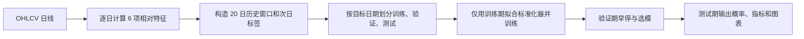

# 股票价格预测模型实验室 / Stock Price Forecasting Lab

用小规模股票日线数据学习**时间序列建模与正确评测**。任务：利用截至今天的过去 20 个交易日，预测**下一交易日的收盘价是否严格上涨**，同时输出上涨概率。相等归入“未上涨”，判断阈值为 50%。旧版预测下一日收盘价的实验也保留，便于比较 MAE 等价格误差。

> 详细资料：[全部测试结果与指标](docs/results/RESULTS_INDEX.md) · [全部结果图像](docs/results/RESULTS_GALLERY.md)

## 任务内容

| 项目 | 定义 |
| --- | --- |
| 输入 | 过去 20 个交易日的 6 个相对特征：收盘对数收益、隔夜跳空、日内收益、最高价延伸、最低价延伸、成交量对数变化。5/20 日与仅收盘收益率的组合另做受控对照。 |
| 标签 | 下一交易日 `Close` > 当日 `Close` 为“涨”，否则为“不涨”；使用的是来源保存的 `Close`，不含股息总回报。 |
| 输出 | 上涨概率；概率 ≥ 0.5 判为“涨”。 |
| 主要指标 | **正确天数 / 测试天数（准确率）**；并看平衡准确率、Brier 概率误差、预测上涨比例、混淆矩阵和概率校准。 |
| 简单基线 | 只依据训练期更常见的方向，每天都猜该方向。复杂模型必须与它比较。 |
| 选模 | 网络训练轮次由验证期 Brier 决定；候选由验证期准确率决定，同分再看验证期 Brier。测试数据只用来报告结果。 |

### 数据与时间划分

| 股票 | 用途 | 日线日期 | 每只行数 | 固定测试 |
| --- | --- | --- | ---: | --- |
| GOOG、AAPL、TSLA | 主实验 | 2022-01-03—2025-12-31 | 1003 | 2025-06-02—2025-12-31，每只 148 日 |
| ACN、RMD | 固定规则后的换股票检查 | 2022-01-03—2025-12-31 | 1003 | 同上，每只 148 日 |

主实验固定划分有 688 个训练目标（2022-02-01—2024-10-25）、147 个验证目标（2024-10-28—2025-05-30）和 148 个测试目标。另做三轮按时间向前的滚动测试：每轮扩大训练期、用紧邻测试期的 100 日验证，再测互不重叠的 100 日；三轮合计每只 300 个测试日，范围是 2024-10-21—2025-12-31。归一化只在每轮训练期拟合。**固定测试与滚动测试有重叠日期，不是两次独立验证。**

数据来自 [Pubmarks Datasets](https://github.com/Pubmarks/datasets) 的日线文件。公开仓库保存来源记录、哈希与结果，**不再分发原始股票 CSV**；运行前按[数据说明](data/README.md)下载 2022—2025 年的小切片。上游若修订历史行，新下载文件可能与冻结哈希不同，旧结果就不能精确重算。此前用于早期分析的 2026 年补充 CSV 已按要求删除，其逐日历史归档也不放入公开仓库；2026 年已看过的结果不能充当新模型的首次样本外测试。

## 技术流程



1. **特征与标签**：对第 `t` 天计算 `log(Cₜ/Cₜ₋₁)`、`log(Oₜ/Cₜ₋₁)`、`log(Cₜ/Oₜ)`、`log(Hₜ/max(Oₜ,Cₜ))`、`log(min(Oₜ,Cₜ)/Lₜ)` 和 `log(1+Vₜ)−log(1+Vₜ₋₁)`；`O/H/L/C/V` 分别是开高低收与成交量。样本输入为截至第 `t` 天的 **20×6** 矩阵，标签是 `1[Cₜ₊₁>Cₜ]`。窗口首日的收益、跳空和成交量变化会引用前一交易日的数据；第 `t+1` 天的信息不进入输入。实现见[数据构造](stocklab/neural_direction_data.py)。
2. **时间与标准化**：以标签对应的目标日期划分，训练日早于验证日，验证日早于测试日；滚动实验在每轮重新划分。六项特征的均值、标准差只用该轮训练期可观察的逐日数据计算，再应用到验证和测试窗口；测试期不参与参数拟合或选模。
3. **训练与选择**：20 类教学网络使用二元交叉熵、AdamW；默认隐藏宽度 32、最多 20 轮、批量 64、验证期 Brier 连续 5 轮不改善即早停。每个网络取验证期 Brier 最低的轮次；固定六候选再按验证准确率选模型，同分比较 Brier。输出标量经 Sigmoid 得上涨概率。传统模型用同一历史窗口的**摘要特征**（最后一天、最近 5 天均值、全窗口均值与标准差），并非直接接收 20×6 张量。实现见[训练与评测](stocklab/neural_direction.py)。
4. **测试报告**：测试期只用于报告，不参与训练、早停或选模。仓库保存各候选的逐日概率、方向与指标，以及混淆矩阵、校准分箱和图像。现代结构的八模型实验单独报告，不参与事先固定的六候选结论。

## 模型网络

方向任务共有 **20 类教学网络、8 类现代结构改编和 3 个简单比较对象**。前 20 类共用输入 `20×6`、输出一个上涨 logit；其中原项目的 18 类也支持旧版价格任务。以下说明对应[当前代码](stocklab/models.py)的实际结构，不表示复现了旧 TensorFlow 权重或原论文的完整配置。

| 网络组 | 数量 | 当前实现如何处理 20 日历史 |
| --- | ---: | --- |
| RNN、GRU、LSTM | 9 | 每种分别有单向、双向和双路径版本。双向只在**已观察的 20 日窗口内**双向编码；双路径另对首个特征的日间变化编码，然后合并两路末状态。 |
| LSTM/GRU Seq2Seq | 6 | 每种有普通、双向编码器和 VAE 版本；编码历史后只解码**一步**，VAE 版本增加潜变量及 KL 损失，不是多日生成模型。 |
| `attention-is-all-you-need` | 1 | 输入投影加可学习位置向量，经过一层四头 Transformer 编码器，用末位置表示分类。 |
| `cnn-seq2seq`、`dilated-cnn-seq2seq` | 2 | 两层时间卷积后做全局平均池化；后者用膨胀卷积。名称沿袭原项目，**当前实现没有显式 Seq2Seq 解码器**。 |
| `tcn-residual`、`gru-attention` | 2 | 前者用膨胀率 1/2/4 的因果残差卷积并读取末时刻；后者用 GRU 编码，按注意力权重汇总各天，再与末状态一起分类。只用于方向任务。 |

八类现代结构单独组成回顾性教学实验，均缩小为适合 20 日、6 特征的二分类网络：

| 结构 | 当前分类改编的核心操作 |
| --- | --- |
| `dlinear-direction`、`tsmixer-direction` | 前者分解趋势与季节残差后线性映射；后者交替混合时间维和特征维。 |
| `patchtst-direction`、`itransformer-direction` | 前者按特征切重叠时间片，再对时间片做注意力；后者把每个特征的整段历史当作一个 token，在特征间做注意力。 |
| `nhits-direction`、`tide-direction` | 前者多尺度池化并逐块回投残差；后者用特征投影、密集残差编码/解码与线性跳连。 |
| `timesnet-direction`、`mamba-style-direction` | 前者用候选周期重排时间序列并做二维卷积；后者用深度卷积与逐步选择性状态更新。后者是纯 PyTorch 的 Mamba 风格教学实现，**不是官方 Mamba**。 |

同日期比较对象是 `train-majority`（训练期多数方向及其上涨频率）、`logit-window`（逻辑回归）和 `gbdt-window`（梯度提升树）。现代结构的原论文链接、实现差异和逐项成绩见[现代结构说明](docs/results/MODERN_DIRECTION_MODELS.md)。主要结论事先固定比较六个候选：`train-majority`、`logit-window`、`gbdt-window`、`gru`、`tcn-residual`、`gru-attention`。其余网络用于认识结构和观察现象；不要根据测试成绩反选赢家。

## 主要测试结果

**指标读法**：准确率是猜对天数 ÷ 测试天数；平衡准确率是“实际上涨日的猜对率”和“实际未上涨日的猜对率”的平均值，可以看出模型是否只偏向多数类。Brier 误差是所有日期的 `(上涨概率−实际标签)²` 的平均值，越小越好；它衡量概率预测误差，但单个 Brier 值不能代替校准图。预测上涨比例是模型判“涨”的天数比例；混淆矩阵分别列出实际涨/不涨被判成涨/不涨的天数。

下表是**每次仅用验证集从固定六候选中选一个**后的测试表现。滚动列汇总三轮各自所选模型的正确天数，不代表同一组权重连续预测 300 天。

| 股票 | 固定期所选候选 | 固定期准确率 | 同期多数基线 | 滚动三轮准确率 | 同期多数基线 |
| --- | --- | ---: | ---: | ---: | ---: |
| GOOG | `gru-attention` | **92/148 = 62.2%** | 85/148 = 57.4% | 161/300 = 53.7% | 162/300 = 54.0% |
| AAPL | `gbdt-window` | 67/148 = 45.3% | 82/148 = 55.4% | 159/300 = 53.0% | 161/300 = 53.7% |
| TSLA | `logit-window` | 76/148 = 51.4% | 79/148 = 53.4% | 145/300 = 48.3% | 151/300 = 50.3% |

换股票检查沿用相同六候选与选模规则：ACN 为 68/148 = 45.9%（基线 71/148 = 48.0%），RMD 为 74/148 = 50.0%（基线 73/148 = 49.3%）。GOOG 固定期多猜对 7 天，但滚动合计少猜对 1 天；新股票一负一正。目前**没有跨股票、跨时期稳定超过简单基线的证据**。成对 5 日区块重抽样的描述性区间见[改进报告](docs/results/IMPROVEMENT_REPORT.md)，不是未来收益保证。

8 种现代结构属于看过 2025 年结果后补充的回顾性教学实验。验证选模的固定期正确天数为 GOOG 90、AAPL 79、TSLA 67（同期基线 85、82、79）；滚动三轮合计为 167、165、157（同期基线 162、161、151）。这些数字不能替代未来未见日期的独立检验，也不改变已冻结的六候选评测规则。

### 2026 年旧实验归档摘要

在补充 CSV 删除前，还做过 184 个交易日（2026-01-02—2026-09-25）的旧版特征实验。它们与上面的 28 类网络实验不是同一批模型，也已经被查看过。公开仓库只记录汇总数字，不放入该段逐日价格与预测归档。

| 股票 | 价格任务：验证选中模型 MAE / 昨日价格 MAE | 旧版涨跌任务：正确天数 / 多数方向基线 |
| --- | ---: | ---: |
| GOOG | 4.890 / 4.890 | 87/184 / 87/184 |
| AAPL | 3.531 / 3.541 | 95/184 / 98/184 |
| TSLA | 8.692 / 8.469 | 100/184 / 93/184 |

价格任务的 MAE 越低越好；AAPL 的改善约 0.26%，TSLA 所选模型比基线差约 2.63%。旧版涨跌任务的 TSLA 多对 7 天，但 Brier 概率误差仍略高于基线。详情和局限见[价格分析](docs/archive/ANALYSIS.md)与[方向结果](docs/archive/DIRECTION_RESULTS.md)。

**查看全部数值：**[指标索引](docs/results/RESULTS_INDEX.md)列出每只股票、每个模型的准确率、平衡准确率、Brier、预测上涨比例与对应图像，并链接所有逐轮 `metrics.csv`、`predictions.csv`、`confusion.csv`、`calibration.csv`。原有价格预测的 MAE、RMSE、MAPE 见[价格网络比较](docs/archive/NEURAL_COMPARISON.md)与[价格分析](docs/archive/ANALYSIS.md)；GRU 特征/窗口/种子对照见[改进报告](docs/results/IMPROVEMENT_REPORT.md)。

### 结果图示例

图像同时显示混淆矩阵、预测上涨比例与概率校准。校准图中某概率区间的点表示：模型在这些日子平均报了多少上涨概率，实际有多少天上涨；样本少的区间不能过度解读。

| GOOG：主要候选与基线 | GOOG：注意力 GRU 单模型 |
| --- | --- |
|  |  |

| GOOG：现代结构 | RMD：外部股票检查 |
| --- | --- |
|  |  |

[全部结果图像目录](docs/results/RESULTS_GALLERY.md)可点击查看公开仓库中的每一张图，包括全部模型与滚动各折图；不需要重新训练即可阅读。

## 本地运行与复现

已在 Windows 的 Conda `pytorch` 环境验证：Python 3.11.9、PyTorch 2.6.0+cu118、NVIDIA GeForce RTX 4060 Laptop GPU（8 GB）。新机器可建立 Python 3.11 环境并安装[依赖清单](requirements.txt)；GPU 版 PyTorch 请按[官方安装说明](https://pytorch.org/get-started/locally/)选择与本机驱动匹配的版本。已有适用环境时，直接激活该环境即可。

```powershell
conda create -n stocklab python=3.11 -y
conda activate stocklab
pip install -r requirements.txt
python scripts/download_data.py
python scripts/download_data.py --tickers ACN RMD --output-dir data/external-check
python -m unittest discover -s tests -v
python -m scripts.verify_direction_reports
python -m scripts.verify_modern_direction
```

下载后先核对[冻结数据哈希](FUTURE_BASE_HASHES.json)及各报告 `summary.json` 中的来源哈希。验证脚本会检查逐日概率、正确天数、混淆矩阵、校准分箱、图像与来源文件；若来源历史数据变化，应保留旧报告并明确标记“当前数据无法精确复现”，不要直接覆盖旧结果。

只运行一只股票的模型示例：

```powershell
python -m stocklab.neural_direction --mode fixed-2025 --tickers GOOG
python -m stocklab.modern_direction --mode fixed-2025 --tickers GOOG
python -m stocklab.ablation_study
```

训练全部网络需要更久；原始权重文件不提交到仓库，已保存的指标、逐日预测和图像足以审阅历史测试。旧版收盘价预测可从 `python -m stocklab.cli list-models` 和 `python -m stocklab.cli compare --ticker GOOG` 入手。各命令的参数与完整实验解释见[20 类网络报告](docs/results/NEURAL_CLASSIFIERS.md)、[现代结构报告](docs/results/MODERN_DIRECTION_MODELS.md)和[结果索引](docs/results/RESULTS_INDEX.md)。

未来真正未见交易日的评测已按[冻结规则](FUTURE_EVAL_PROTOCOL.md)预先写定，并以[代码与数据哈希](FUTURE_CODE_HASHES.json)锁定。`python -m stocklab.prospective_check` 只检查是否已积累足够新交易日；条件满足后才按协议执行一次评测。这里不把已查看的 2025/2026 年成绩说成新证据。

## 项目结构与来源

| 路径 | 内容 |
| --- | --- |
| `stocklab/` | 数据处理、网络、训练、时间切分和评测。 |
| `scripts/`、`tests/` | 下载、报告核验、汇总与测试。 |
| `data/` | 来源记录与数据说明；股票 CSV 在本地下载，不随公开仓库分发。 |
| `runs/` | 已保存的指标、逐日预测、混淆矩阵、概率校准、图像和配置；权重文件不公开。 |
| `docs/results/` | [完整指标](docs/results/RESULTS_INDEX.md)、[全部图像](docs/results/RESULTS_GALLERY.md)与当前模型报告。 |
| `docs/archive/` | 较早的价格预测、方向换算和 2026 年回顾性分析。 |
| `docs/methods/` | [外部股票检查规则](docs/methods/EXTERNAL_CHECK_PROTOCOL.md)和[后续计划](docs/methods/ROADMAP.md)。 |
| 根目录的三个技术说明 | [数据口径](DATA_PROVENANCE.md)、[未来评测规则](FUTURE_EVAL_PROTOCOL.md)、[冻结记录](FUTURE_FREEZE_CHANGELOG.md)；它们的路径与内容由哈希清单固定。 |

本项目从 [huseinzol05/Stock-Prediction-Models](https://github.com/huseinzol05/Stock-Prediction-Models) 的教学思路出发；早期笔记本原项目采用 Apache-2.0，见[许可证](LICENSE)。当前 PyTorch 模型、统一评测与报告是独立整理的教学实现。原始旧笔记本未放入这个公开仓库，可在上游查看。日线来源、`Close` 与 `Adj Close` 的区别，以及历史价格可能修订的局限，见[数据来源与口径](DATA_PROVENANCE.md)。
