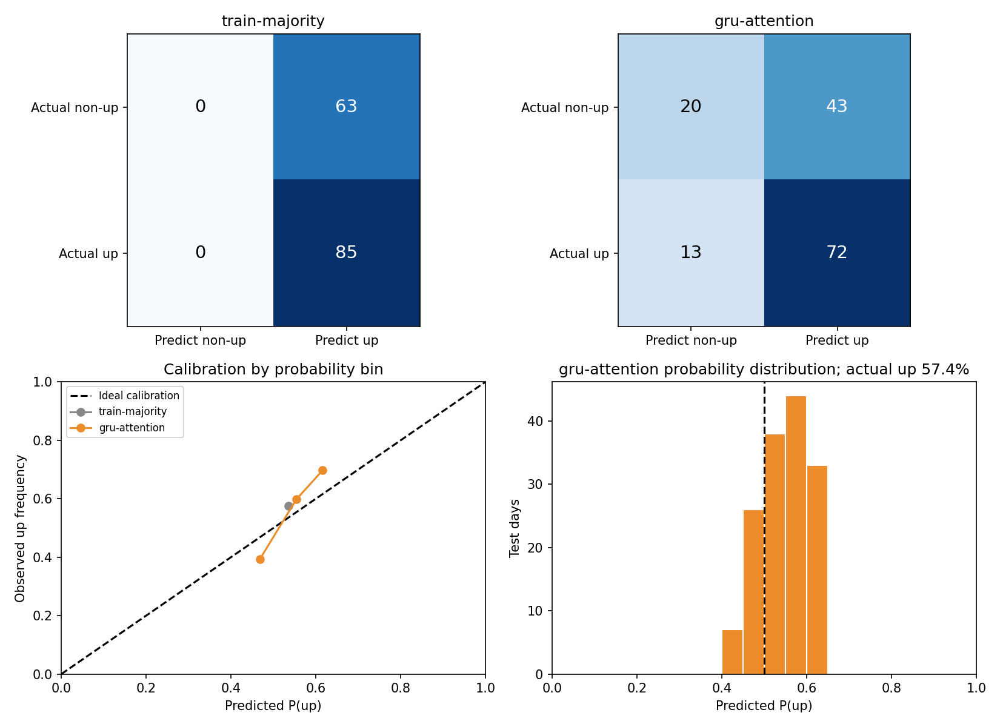
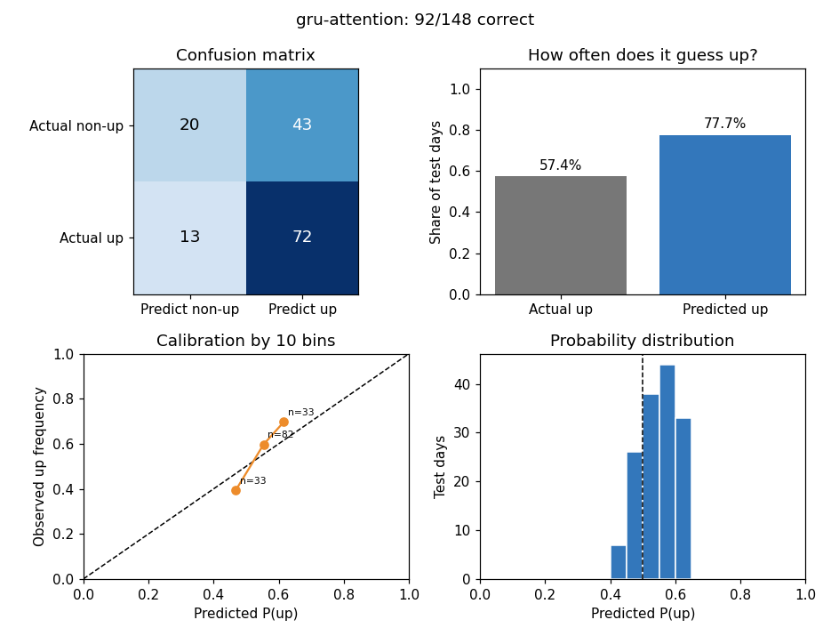
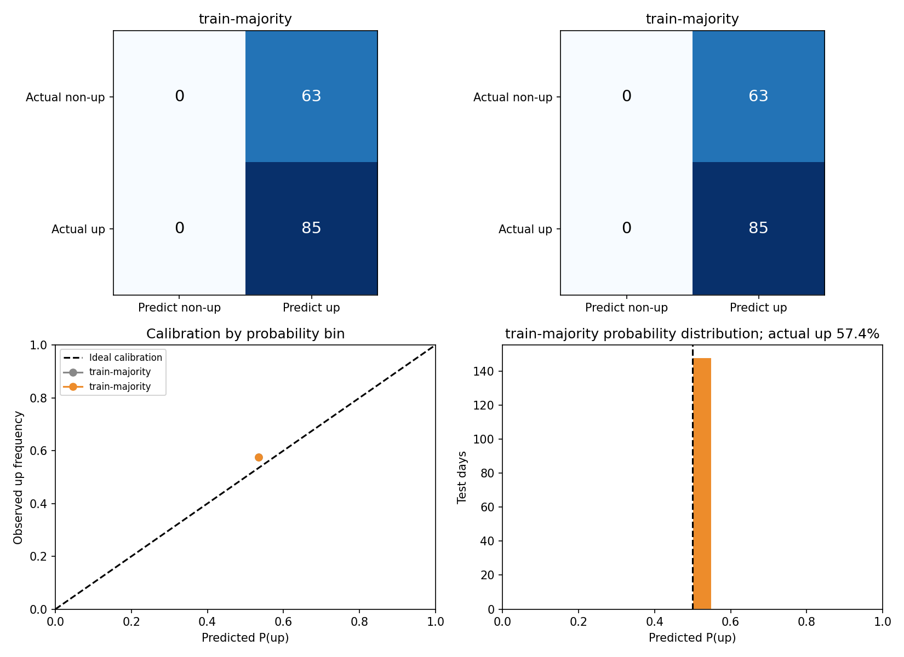
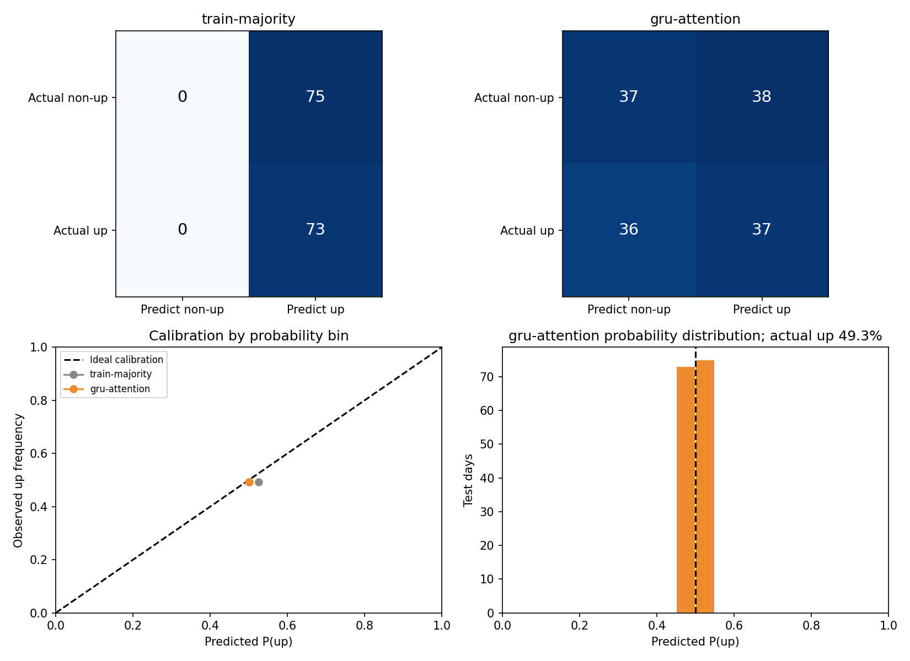

# 股票价格预测模型实验室 / Stock Price Forecasting Lab

用小规模股票日线数据学习**时间序列建模与正确评测**。当前主任务是：已知今天收盘及此前 20 个交易日的历史，预测**下一交易日的收盘价是否严格上涨**，同时输出上涨概率。相等归入“未上涨”，判断阈值为 50%。旧版预测下一日收盘价的实验也保留，便于比较 MAE 等价格误差。

本项目是教学实验，不产生交易信号。历史测试中偶有单一模型超过简单基线，但**按验证集选出的主要候选在三只股票的滚动测试中均未超过多数方向基线**。完整逐模型指标和逐日结果可从下方进入。

> [全部测试结果与指标](RESULTS_INDEX.md) · [全部结果图像](RESULTS_GALLERY.md) · [20 类直接分类网络](NEURAL_CLASSIFIERS.md) · [8 种现代结构](MODERN_DIRECTION_MODELS.md) · [问题诊断与对照实验](IMPROVEMENT_REPORT.md)

## 一眼看懂这个任务

| 项目 | 现在采用的定义 |
| --- | --- |
| 输入 | 过去 20 个交易日的 6 个相对特征：收盘对数收益、隔夜跳空、日内收益、最高价延伸、最低价延伸、成交量对数变化。5/20 日与仅收盘收益率的组合另做受控对照。 |
| 标签 | 下一交易日 `Close` > 当日 `Close` 为“涨”，否则为“不涨”；使用的是来源保存的 `Close`，不含股息总回报。 |
| 输出 | 上涨概率；概率 ≥ 0.5 判为“涨”。 |
| 主要指标 | **正确天数 / 测试天数（准确率）**；并看平衡准确率、Brier 概率误差、预测上涨比例、混淆矩阵和概率校准。 |
| 简单基线 | 只依据训练期更常见的方向，每天都猜该方向。复杂模型必须与它比较。 |
| 选模 | 网络训练轮次由验证期 Brier 决定；候选由验证期准确率决定，同分再看验证期 Brier。测试数据只用来报告结果。 |

### 数据与时间划分

| 股票 | 用途 | 日线日期 | 每只行数 | 固定测试 |
| --- | --- | --- | ---: | --- |
| GOOG、AAPL、TSLA | 主实验 | 2022-01-03—2025-12-31 | 1003 | 2025-06-02—2025-12-31，每只 148 日 |
| ACN、RMD | 固定规则后的换股票检查 | 2022-01-03—2025-12-31 | 1003 | 同上，每只 148 日 |

主实验固定划分有 688 个训练目标（2022-02-01—2024-10-25）、147 个验证目标（2024-10-28—2025-05-30）和 148 个测试目标。另做三轮按时间向前的滚动测试：每轮扩大训练期、用紧邻测试期的 100 日验证，再测互不重叠的 100 日；三轮合计每只 300 个测试日，范围是 2024-10-21—2025-12-31。归一化只在每轮训练期拟合。**固定测试与滚动测试有重叠日期，不是两次独立验证。**

数据来自 [Pubmarks Datasets](https://github.com/Pubmarks/datasets) 的日线文件。公开仓库保存来源记录、哈希与结果，**不再分发原始股票 CSV**；运行前按[数据说明](data/README.md)下载 2022—2025 年的小切片。上游若修订历史行，新下载文件可能与冻结哈希不同，旧结果就不能精确重算。此前用于早期分析的 2026 年补充 CSV 已按要求删除，其逐日历史归档也不放入公开仓库；2026 年已看过的结果不能充当新模型的首次样本外测试。

## 模型网络

| 组别 | 模型 |
| --- | --- |
| 原项目 18 类网络的 PyTorch 教学重实现 | 普通、双向、双路径 RNN/LSTM/GRU；LSTM/GRU Seq2Seq 与 VAE 版本；注意力、CNN Seq2Seq、空洞 CNN Seq2Seq。旧 TensorFlow 实现没有逐行照搬。 |
| 补充的 2 类网络 | `tcn-residual`（残差时间卷积）、`gru-attention`（注意力汇总 GRU）。 |
| 8 类现代结构的轻量分类改编 | `dlinear-direction`、`tsmixer-direction`、`patchtst-direction`、`itransformer-direction`、`nhits-direction`、`tide-direction`、`timesnet-direction`、`mamba-style-direction`。这些改编不等于原论文完整实现，最后一种也不是官方 Mamba。 |
| 同日期比较对象 | `train-majority`（多数方向）、`logit-window`（逻辑回归）、`gbdt-window`（梯度提升树）。 |

现代结构的原论文链接、改编范围和逐项成绩见[现代结构说明](MODERN_DIRECTION_MODELS.md)。主要结论事先固定比较六个候选：`train-majority`、`logit-window`、`gbdt-window`、`gru`、`tcn-residual`、`gru-attention`。其余网络用于认识结构和观察现象；不要根据测试成绩反选赢家。

## 主要测试结果

下表是**每次仅用验证集从固定六候选中选一个**后的测试表现。滚动列汇总三轮各自所选模型的正确天数，不代表同一组权重连续预测 300 天。

| 股票 | 固定期所选候选 | 固定期准确率 | 同期多数基线 | 滚动三轮准确率 | 同期多数基线 |
| --- | --- | ---: | ---: | ---: | ---: |
| GOOG | `gru-attention` | **92/148 = 62.2%** | 85/148 = 57.4% | 161/300 = 53.7% | 162/300 = 54.0% |
| AAPL | `gbdt-window` | 67/148 = 45.3% | 82/148 = 55.4% | 159/300 = 53.0% | 161/300 = 53.7% |
| TSLA | `logit-window` | 76/148 = 51.4% | 79/148 = 53.4% | 145/300 = 48.3% | 151/300 = 50.3% |

换股票检查沿用相同六候选与选模规则：ACN 为 68/148 = 45.9%（基线 71/148 = 48.0%），RMD 为 74/148 = 50.0%（基线 73/148 = 49.3%）。GOOG 固定期多猜对 7 天，但滚动合计少猜对 1 天；新股票一负一正。目前**没有跨股票、跨时期稳定超过简单基线的证据**。成对 5 日区块重抽样的描述性区间见[改进报告](IMPROVEMENT_REPORT.md)，不是未来收益保证。

8 种现代结构属于看过 2025 年结果后补充的回顾性教学实验。验证选模的固定期正确天数为 GOOG 90、AAPL 79、TSLA 67（同期基线 85、82、79）；滚动三轮合计为 167、165、157（同期基线 162、161、151）。这些数字不能替代未来未见日期的独立检验，也不改变已冻结的六候选评测规则。

### 2026 年旧实验归档摘要

在补充 CSV 删除前，还做过 184 个交易日（2026-01-02—2026-09-25）的旧版特征实验。它们与上面的 28 类网络实验不是同一批模型，也已经被查看过。公开仓库只记录汇总数字，不放入该段逐日价格与预测归档。

| 股票 | 价格任务：验证选中模型 MAE / 昨日价格 MAE | 旧版涨跌任务：正确天数 / 多数方向基线 |
| --- | ---: | ---: |
| GOOG | 4.890 / 4.890 | 87/184 / 87/184 |
| AAPL | 3.531 / 3.541 | 95/184 / 98/184 |
| TSLA | 8.692 / 8.469 | 100/184 / 93/184 |

价格任务的 MAE 越低越好；AAPL 的改善约 0.26%，TSLA 所选模型比基线差约 2.63%。旧版涨跌任务的 TSLA 多对 7 天，但 Brier 概率误差仍略高于基线。详情和局限见[价格分析](ANALYSIS.md)与[方向结果](DIRECTION_RESULTS.md)。

**查看全部数值：**[指标索引](RESULTS_INDEX.md)列出每只股票、每个模型的准确率、平衡准确率、Brier、预测上涨比例与对应图像，并链接所有逐轮 `metrics.csv`、`predictions.csv`、`confusion.csv`、`calibration.csv`。原有价格预测的 MAE、RMSE、MAPE 见[价格网络比较](NEURAL_COMPARISON.md)与[价格分析](ANALYSIS.md)；GRU 特征/窗口/种子对照见[改进报告](IMPROVEMENT_REPORT.md)。

### 结果图示例

图像同时显示混淆矩阵、预测上涨比例与概率校准。校准图中某概率区间的点表示：模型在这些日子平均报了多少上涨概率，实际有多少天上涨；样本少的区间不能过度解读。

| GOOG：主要候选与基线 | GOOG：注意力 GRU 单模型 |
| --- | --- |
|  |  |

| GOOG：现代结构 | RMD：外部股票检查 |
| --- | --- |
|  |  |

[全部结果图像目录](RESULTS_GALLERY.md)可点击查看公开仓库中的每一张图，包括全部模型与滚动各折图；不需要重新训练即可阅读。

## 本地运行与复现

已在 Windows 的 Conda `pytorch` 环境验证：Python 3.11.9、PyTorch 2.6.0+cu118、NVIDIA GeForce RTX 4060 Laptop GPU（8 GB）。其他机器使用 Python 3.11 并安装[依赖清单](requirements.txt)；GPU 版 PyTorch 请按[官方安装说明](https://pytorch.org/get-started/locally/)选择合适版本。

```powershell
conda activate pytorch
pip install -r requirements.txt
python scripts/download_data.py
python scripts/download_data.py --tickers ACN RMD --output-dir data/external-check
python -m unittest discover -s tests -v
python -m scripts.verify_direction_reports
python -m scripts.verify_modern_direction
```

下载后先核对[冻结数据哈希](FUTURE_BASE_HASHES.json)及各报告 `summary.json` 中的来源哈希。验证脚本会检查逐日概率、正确天数、混淆矩阵、校准分箱、图像与来源文件；若来源历史数据变化，应保留旧报告并明确标记“当前数据无法精确复现”，不要直接覆盖旧结果。

只运行一只股票的模型示例：

```powershell
python -m stocklab.neural_direction --mode fixed-2025 --tickers GOOG
python -m stocklab.modern_direction --mode fixed-2025 --tickers GOOG
python -m stocklab.ablation_study
```

训练全部网络需要更久；原始权重文件不提交到仓库，已保存的指标、逐日预测和图像足以审阅历史测试。旧版收盘价预测可从 `python -m stocklab.cli list-models` 和 `python -m stocklab.cli compare --ticker GOOG` 入手。各命令的参数与完整实验解释见[20 类网络报告](NEURAL_CLASSIFIERS.md)、[现代结构报告](MODERN_DIRECTION_MODELS.md)和[结果索引](RESULTS_INDEX.md)。

未来真正未见交易日的评测已按[冻结规则](FUTURE_EVAL_PROTOCOL.md)预先写定，并以[代码与数据哈希](FUTURE_CODE_HASHES.json)锁定。`python -m stocklab.prospective_check` 只检查是否已积累足够新交易日；条件满足后才按协议执行一次评测。这里不把已查看的 2025/2026 年成绩说成新证据。

## 项目结构与来源

| 路径 | 内容 |
| --- | --- |
| `stocklab/` | 数据处理、网络、训练、时间切分和评测。 |
| `scripts/`、`tests/` | 下载、报告核验、汇总与测试。 |
| `data/` | 来源记录与数据说明；股票 CSV 在本地下载，不随公开仓库分发。 |
| `runs/` | 已保存的指标、逐日预测、混淆矩阵、概率校准、图像和配置；权重文件不公开。 |
| 根目录的报告 | [全部结果](RESULTS_INDEX.md)、[图像](RESULTS_GALLERY.md)、[数据口径](DATA_PROVENANCE.md)、[改进分析](IMPROVEMENT_REPORT.md)、[路线图](ROADMAP.md)。 |

本项目从 [huseinzol05/Stock-Prediction-Models](https://github.com/huseinzol05/Stock-Prediction-Models) 的教学思路出发；早期笔记本原项目采用 Apache-2.0，见[许可证](LICENSE)。当前 PyTorch 模型、统一评测与报告是独立整理的教学实现。原始旧笔记本未放入这个公开仓库，可在上游查看。日线来源、`Close` 与 `Adj Close` 的区别，以及历史价格可能修订的局限，见[数据来源与口径](DATA_PROVENANCE.md)。
